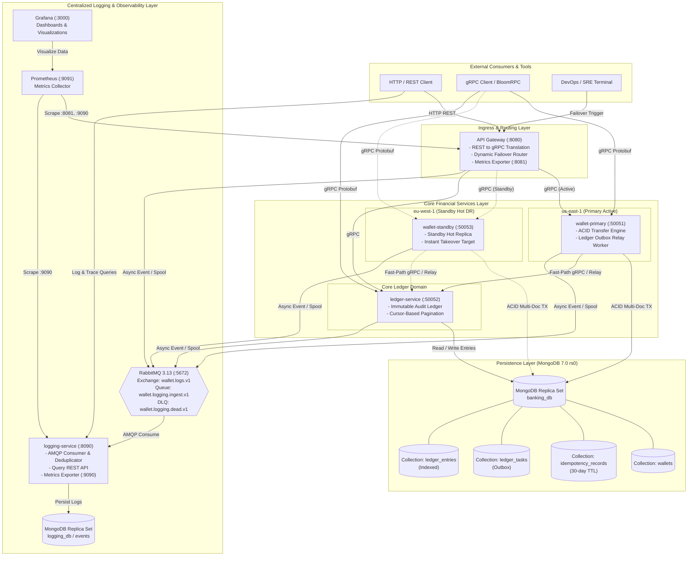
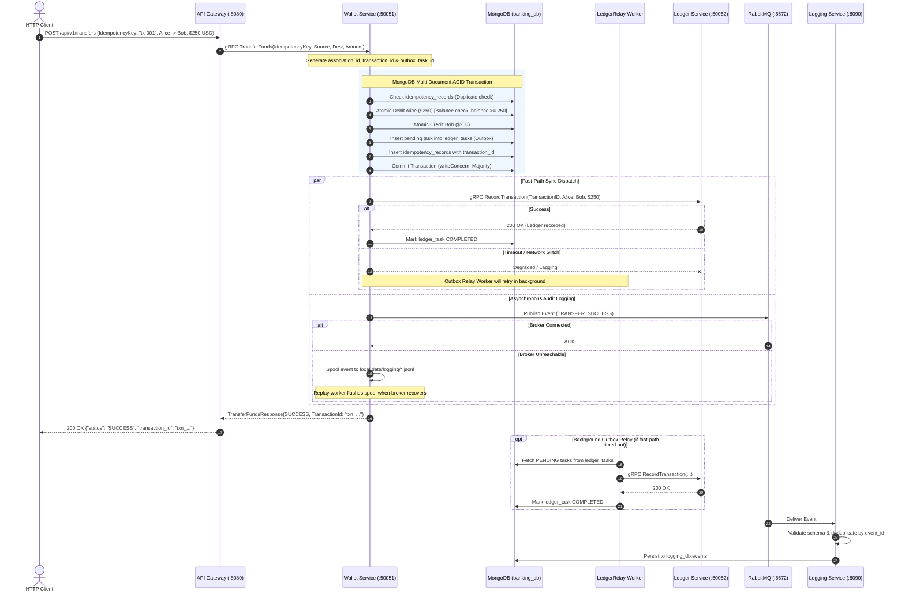
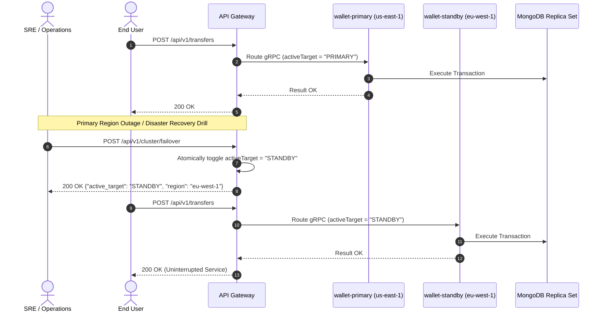
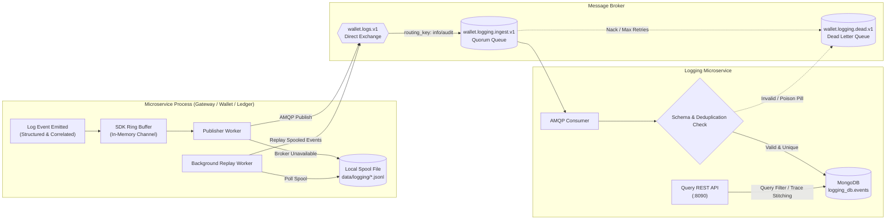
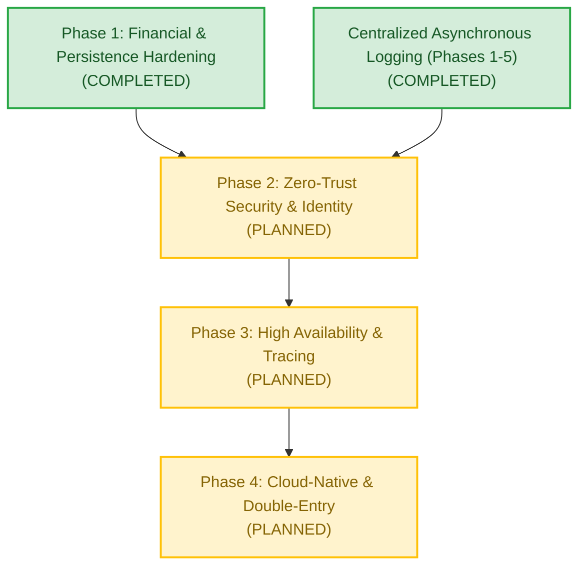

# Global Multi-Currency Digital Wallet & Ledger Service

[](LICENSE)
[](https://golang.org)
[](https://grpc.io)
[](https://www.mongodb.com)
[](https://www.rabbitmq.com)
[](https://prometheus.io)

A production-grade, distributed microservices platform for atomic multi-currency digital wallet operations, transactional ledger recording, centralized asynchronous event logging, and disaster recovery failover built in **Go**.

---

## Table of Contents

- [System Overview](#system-overview)
- [Pictorial Architecture & Flow Representations](#pictorial-architecture--flow-representations)
  - [1. High-Level System Architecture](#1-high-level-system-architecture)
  - [2. End-to-End Atomic Transfer & Transactional Outbox Flow](#2-end-to-end-atomic-transfer--transactional-outbox-flow)
  - [3. Multi-Region Active-Standby Failover Flow](#3-multi-region-active-standby-failover-flow)
  - [4. Asynchronous Centralized Logging & Resilient Disk Spooling](#4-asynchronous-centralized-logging--resilient-disk-spooling)
- [Microservice Directory & Port Matrix](#microservice-directory--port-matrix)
- [Implementation Status & Production Readiness Roadmap](#implementation-status--production-readiness-roadmap)
  - [Completed Implementations](#completed-implementations)
  - [Planned Roadmap (Yet to be Implemented)](#planned-roadmap-yet-to-be-implemented)
- [Quickstart & Deployment Guide](#quickstart--deployment-guide)
  - [Prerequisites](#prerequisites)
  - [Starting the Modular Stacks](#starting-the-modular-stacks)
  - [Makefile Shortcuts](#makefile-shortcuts)
- [Interactive API Verification Guide (cURL)](#interactive-api-verification-guide-curl)
- [Documentation Sitemap](#documentation-sitemap)
- [License](#license)

---

## System Overview

The **Global Multi-Currency Digital Wallet & Ledger Service** is engineered to demonstrate the architectural and financial rigor required for mission-critical core banking infrastructure:

* **Strict Financial Consistency**: Multi-document ACID transactions via MongoDB Replica Set (`writeconcern.Majority()`, `readconcern.Snapshot()`) preventing overdrafts, race conditions, and phantom balance anomalies.
* **Transactional Outbox Decoupling**: Eliminates synchronous cross-service network calls within database transactions, delivering immutable ledger journal entries via guaranteed at-least-once outbox relay.
* **Idempotency Guarantees**: Cryptographic deduplication using client-supplied idempotency keys with automated 30-day TTL lifecycle management.
* **Active-Standby Multi-Region Disaster Recovery**: Simulated multi-region architecture (`us-east-1` Primary Active, `eu-west-1` Standby Hot DR) featuring dynamic routing switchover at the API Gateway.
* **Resilient Centralized Logging Ecosystem**: Non-blocking asynchronous event emission to RabbitMQ with automatic local JSONL disk spooling and backpressure-aware background replay workers.
* **Operational Tracing & Observability**: Correlation IDs (`association_id`, `idempotency_key`, `transaction_id`) propagated across gRPC metadata and HTTP headers, with a dedicated Log Query API, Prometheus metrics, and preconfigured Grafana dashboards.

---

## Pictorial Architecture & Flow Representations

### 1. High-Level System Architecture

The following diagram illustrates the complete microservice landscape, network boundaries, protocols, and data stores:



---

### 2. End-to-End Atomic Transfer & Transactional Outbox Flow

This sequence depicts a transfer from Alice to Bob, illustrating how the **Transactional Outbox Pattern** completely decouples the database transaction from cross-service network I/O:



---

### 3. Multi-Region Active-Standby Failover Flow

The API Gateway maintains routing state to support zero-downtime regional disaster recovery drills:



---

### 4. Asynchronous Centralized Logging & Resilient Disk Spooling

Every service incorporates an asynchronous logger with an embedded disk-spooling fallback to guarantee zero event loss and zero latency overhead on the critical banking path:



---

## Microservice Directory & Port Matrix

| Service | Container Name | Protocol / Ports | Role & Responsibilities |
|---|---|---|---|
| **API Gateway** | `wallet_api_gateway` | HTTP `:8080`<br/>Prometheus `:8081` | REST ingress, request validation, gRPC reverse proxy, active-standby failover router. |
| **Wallet Service (Primary)** | `wallet_primary_active` | gRPC `:50051` | Primary active banking engine (`us-east-1`). ACID multi-doc transactions, balance management, `LedgerRelay` outbox worker. |
| **Wallet Service (Standby)** | `wallet_standby_hot_dr` | gRPC `:50053` | Hot standby disaster recovery replica (`eu-west-1`). Identical engine ready for instant promotion. |
| **Ledger Service** | `wallet_ledger_service` | gRPC `:50052` | Immutable financial ledger, transaction journal recording, reverse-chronological cursor-based queries. |
| **Logging Service** | `wallet_logging_service` | HTTP `:8090`<br/>Prometheus `:9090` | AMQP log consumer, validation, deduplication, Log Search API (`/api/v1/logs`), Trace Reconstruction (`/api/v1/traces/{id}`). |
| **MongoDB** | `wallet_mongodb` | TCP `:27017` | Multi-document ACID transactional datastore running replica set `rs0`. Hosts `banking_db` and `logging_db`. |
| **RabbitMQ** | `wallet_rabbitmq` | AMQP `:5672`<br/>Management `:15672` | High-throughput asynchronous message broker with management UI, direct exchange, and dead-letter exchanges. |
| **Prometheus** | `wallet_prometheus` | HTTP `:9091` | Time-series metrics collection server scraping gateway, logging, and infrastructure metrics. |
| **Grafana** | `wallet_grafana` | HTTP `:3000` | Observability dashboards auto-provisioned with logging health, throughput, and error metrics. |

---

## Implementation Status & Production Readiness Roadmap

An exhaustive production readiness audit was performed in [docs/PRODUCTION_READINESS_AUDIT.md](docs/PRODUCTION_READINESS_AUDIT.md). The platform transition is structured into 4 remediation phases:



### Completed Implementations

#### 1. Core Financial & Persistence Hardening (Phase 1)
- [x] **Decoupled Database Transactions from Network I/O (GAP-FIN-01)**: Completely removed synchronous cross-service gRPC calls from inside MongoDB `session.WithTransaction()`. Implemented the **Transactional Outbox Pattern** (`ledger_tasks` collection) and a background `LedgerRelay` worker for resilient fallback delivery.
- [x] **Eliminated Database Collection Scans (GAP-DB-01)**: Created unique index on `idempotency_key` and compound query indexes on `{source_wallet_id: 1, timestamp: -1}` and `{destination_wallet_id: 1, timestamp: -1}` on `ledger_entries` collection, terminating COLLSCAN latencies.
- [x] **Automated Data Lifecycle (GAP-DB-03)**: Enforced a 30-day MongoDB TTL expiration index on `idempotency_records` (`created_at`).
- [x] **Bounded Ledger Queries & Pagination (GAP-DB-02)**: Implemented cursor-based pagination with configurable limit bounds (default 50, max 200) and reverse-chronological sorting.
- [x] **Strict Currency Scale & Validation (GAP-FIN-04)**: Standardized currency parsing against strict ISO-4217 currency dictionaries.

#### 2. Centralized Asynchronous Logging Subsystem (Phases 1–5)
- [x] **Correlation Context Propagation (Phase 1)**: Context propagation across gRPC metadata (`x-association-id`, `x-idempotency-key`, `x-transaction-id`).
- [x] **Resilient AMQP Publisher with Disk Spooling (Phase 2)**: Non-blocking buffered channel publisher with automatic fallback to local JSONL spool files and backpressure-aware background replay.
- [x] **Standalone Logging Microservice (Phase 3)**: Dedicated consumer microservice with schema validation, deduplication via MongoDB unique index, and dead-letter queuing (`wallet.logging.dead.v1`).
- [x] **Operational Log & Trace Query REST API (Phase 4)**: Added `/api/v1/logs` with rich multi-field filtering and `/api/v1/traces/{association_id}` to reconstruct the full distributed 12-step transaction timeline with latency metrics.
- [x] **Production Hardening & Monitoring (Phase 5)**: Configured TLS transport, quorum queue support, scheduled data retention cleaner, API key access control, Prometheus metrics exporter (`:9090`), Grafana dashboards, and audit-critical transactional outbox.

---

### Planned Roadmap (Yet to be Implemented)

#### Phase 2: Zero-Trust Security & Identity (Upcoming)
- [ ] **JWT / OAuth2 / OIDC Gateway Authentication (GAP-SEC-01)**: Secure all client-facing REST endpoints with token validation and claim inspection.
- [ ] **Fine-Grained RBAC & Tenant Authorization (GAP-SEC-01)**: Enforce scopes (`wallet:read`, `wallet:transfer`, `cluster:admin`, `ledger:audit`) and verify subject ownership against wallet identity.
- [ ] **Mutual TLS (mTLS) for Inter-Service gRPC (GAP-SEC-02)**: Replace `insecure.NewCredentials()` with mutual TLS authentication and x509 certificate validation.
- [ ] **Secured Cluster Administration (GAP-SEC-03)**: Protect `/api/v1/cluster/failover` with administrative RBAC, audit trailing, and cryptographic approval.
- [ ] **Gateway Defense-in-Depth (GAP-SEC-05)**: Implement distributed token-bucket rate limiting, request body bounds (`http.MaxBytesReader`), and standard HTTP security headers (HSTS, CSP, X-Frame-Options).
- [ ] **Vault & Secrets Management (GAP-SEC-04)**: Eliminate cleartext credentials from Compose files; integrate HashiCorp Vault / Kubernetes Secrets and enable MongoDB `SCRAM-SHA-256` authentication.

#### Phase 3: High Availability, Resilience & Tracing (Upcoming)
- [ ] **Graceful Process Lifecycle (GAP-REL-01)**: Implement OS signal interception (`SIGTERM`/`SIGINT`) with connection draining on HTTP servers and `grpcServer.GracefulStop()` across all services.
- [ ] **Distributed Failover Consensus (GAP-HA-01)**: Replace the single-process in-memory `activeTarget` state with a distributed coordination store (Consul KV / etcd / Raft) or service mesh routing.
- [ ] **OpenTelemetry Distributed Tracing (GAP-OBS-01)**: Integrate the official OpenTelemetry Go SDK with W3C TraceContext propagation (`traceparent`, `tracestate`) exporting to Jaeger/Tempo.
- [ ] **Standard gRPC Health Probes (GAP-REL-03)**: Implement `grpc.health.v1.Health` protocol across all gRPC services for Kubernetes liveness and readiness monitoring.
- [ ] **Core Service Prometheus Exporters (GAP-OBS-02)**: Expose `:9090/metrics` on `wallet-service` and `ledger-service` exporting gRPC latency histograms and database connection pool statistics.
- [ ] **High-Concurrency Automated Test Suite (GAP-QA-01)**: Add automated stress and race testing (50+ concurrent transfers against identical wallets) verifying atomic balance constraints under extreme load.

#### Phase 4: Cloud-Native Infrastructure & True Double-Entry (Upcoming)
- [ ] **GAAP/IFRS True Double-Entry Bookkeeping (GAP-FIN-02)**: Transition ledger to multi-asset chart of accounts with balanced journal postings ($\sum \text{Debits} == \sum \text{Credits}$) and cryptographic hash chaining.
- [ ] **Foreign Exchange (FX) Engine (GAP-FIN-03)**: Support cross-currency transfers with guaranteed quote validity windows (30–60s) and atomic multi-currency journal legs.
- [ ] **Hardened Non-Root Container Images (GAP-OPS-01)**: Update Dockerfile stages to create and run as unprivileged `appuser` (UID 10001).
- [ ] **Production Kubernetes Hardening (GAP-OPS-03)**: Upgrade manifests with explicit CPU/memory requests and limits, PodDisruptionBudgets, HorizontalPodAutoscalers, and Ingress with cert-manager TLS.
- [ ] **High-Availability MongoDB Cluster (GAP-HA-03)**: Replace single-node MongoDB with a multi-node StatefulSet across multiple availability zones.

---

## Quickstart & Deployment Guide

### Prerequisites
* [Docker Desktop](https://www.docker.com/) (Engine 24.0+, Compose v2.20+)
* [Go 1.23+](https://golang.org/dl/) (for native local development)
* [curl](https://curl.se/) or [BloomRPC / Postman](docs/BLOOMRPC_GUIDE.md)

### Starting the Modular Stacks

The project uses modular Docker Compose stacks connected via a shared external network (`wallet_shared_net`):

```bash
# 1. Create the shared network and volume
docker network create wallet_shared_net 2>/dev/null || true
docker volume create global-wallet-microservices_mongo_data >/dev/null 2>&1 || true

# 2. Start the MongoDB 7.0 Replica Set (rs0)
docker compose -f docker-compose.mongodb.yml up -d

# 3. Start RabbitMQ Message Broker
docker compose -f docker-compose.rabbitmq.yml up -d

# 4. Start Core Application Microservices (Gateway, Primary Wallet, Standby Wallet, Ledger)
docker compose -f docker-compose.yml up --build -d

# 5. Start Centralized Logging Microservice
docker compose -f docker-compose.logging.yml up --build -d

# 6. Start Observability Monitoring (Prometheus & Grafana)
docker compose -f docker-compose.monitoring.yml up -d
```

Verify that all containers are healthy:
```bash
docker ps --format "table {{.Names}}\t{{.Status}}\t{{.Ports}}"
```

### Makefile Shortcuts

A convenient `Makefile` is provided in the repository root:

```bash
make up          # Start all stacks in dependency order
make down        # Stop application services safely
make test        # Run Go unit and race detector tests
make e2e         # Execute automated end-to-end integration test
make status      # Check container health and status
```

---

## Interactive API Verification Guide (cURL)

### 1. Create Wallets
Create accounts for Alice and Bob in USD:

```bash
# Create Alice's Wallet ($1,000 USD)
curl -s -X POST http://localhost:8080/api/v1/wallets \
  -H "Content-Type: application/json" \
  -d '{"wallet_id":"alice","currency":"USD","initial_balance":1000}' | jq .

# Create Bob's Wallet ($500 USD)
curl -s -X POST http://localhost:8080/api/v1/wallets \
  -H "Content-Type: application/json" \
  -d '{"wallet_id":"bob","currency":"USD","initial_balance":500}' | jq .
```

### 2. Execute Idempotent Atomic Transfer
Execute an atomic transfer of $250 USD from Alice to Bob:

```bash
curl -s -X POST http://localhost:8080/api/v1/transfers \
  -H "Content-Type: application/json" \
  -d '{
    "idempotency_key": "tx-prod-001",
    "source_wallet_id": "alice",
    "destination_wallet_id": "bob",
    "amount": 250,
    "currency": "USD"
  }' | jq .
```

*Response:*
```json
{
  "status": "SUCCESS",
  "transaction_id": "txn_6a8e1b2c3d4e",
  "message": "Transfer processed successfully"
}
```

### 3. Verify Idempotency Protection
Re-send the exact same transfer request with idempotency key `"tx-prod-001"`. The system returns the cached transaction response without executing duplicate debits or credits:

```bash
curl -s -X POST http://localhost:8080/api/v1/transfers \
  -H "Content-Type: application/json" \
  -d '{
    "idempotency_key": "tx-prod-001",
    "source_wallet_id": "alice",
    "destination_wallet_id": "bob",
    "amount": 250,
    "currency": "USD"
  }' | jq .
```

### 4. Regional Disaster Recovery Failover Simulation
Trigger failover from `wallet-primary` (`us-east-1`) to `wallet-standby` (`eu-west-1`):

```bash
curl -s -X POST http://localhost:8080/api/v1/cluster/failover | jq .
```

*Response:*
```json
{
  "status": "FAILOVER_SUCCESS",
  "active_target": "STANDBY",
  "region": "eu-west-1 (Standby Hot DR)",
  "timestamp": "2026-09-17T18:00:00Z"
}
```

Subsequent transfer requests will immediately route to `wallet-standby` on port `50053` with zero service interruption.

### 5. Query Audit Ledger with Pagination
Retrieve the immutable transaction history for Alice with cursor pagination:

```bash
curl -s "http://localhost:8080/api/v1/ledger?wallet_id=alice&limit=10" | jq .
```

### 6. Query Centralized Logging Service
Search centralized logs stored in `logging_db` by service or log level:

```bash
# Query all AUDIT level events
curl -s "http://localhost:8090/api/v1/logs?level=AUDIT&limit=5" | jq .

# Query logs specific to wallet-service
curl -s "http://localhost:8090/api/v1/logs?service=wallet-service&limit=5" | jq .
```

### 7. Reconstruct Distributed 12-Step Transaction Timeline
Using the `association_id` returned in the HTTP headers or response metadata, reconstruct the complete lifecycle of a transaction across all microservices:

```bash
curl -s "http://localhost:8090/api/v1/traces/<association_id>" | jq .
```

### 8. View Observability Dashboards
* **Prometheus Targets & Metrics**: [http://localhost:9091](http://localhost:9091)
* **Grafana Dashboards**: [http://localhost:3000](http://localhost:3000) (Credentials: `admin` / `admin`)
* **RabbitMQ Management Console**: [http://localhost:15672](http://localhost:15672) (Credentials: `guest` / `guest`)

---

## Documentation Sitemap

| Document | Description |
|---|---|
| [docs/PRODUCTION_READINESS_AUDIT.md](docs/PRODUCTION_READINESS_AUDIT.md) | Comprehensive 8-pillar production audit, gap catalog, risk analysis, and 4-phase remediation roadmap. |
| [docs/PHASE1_IMPLEMENTATION.md](docs/PHASE1_IMPLEMENTATION.md) | Technical deep-dive on Phase 1: transactional outbox pattern, database indexing, TTL, and pagination. |
| [docs/LOGGING_ARCHITECTURE.md](docs/LOGGING_ARCHITECTURE.md) | Architectural specification for centralized asynchronous logging, correlation IDs, and resilient spooling. |
| [docs/LOGGING_IMPLEMENTATION.md](docs/LOGGING_IMPLEMENTATION.md) | Complete implementation record for logging phases 1 through 5, metric definitions, and dashboard provisioning. |
| [docs/BEGINNER_GUIDE.md](docs/BEGINNER_GUIDE.md) | Step-by-step onboarding guide explaining microservices, gRPC, Protobuf, and request flow from first principles. |
| [docs/LOCAL_DEVELOPMENT.md](docs/LOCAL_DEVELOPMENT.md) | Guide for native local development on Windows/macOS/Linux without full Docker Compose dependencies. |
| [docs/BLOOMRPC_GUIDE.md](docs/BLOOMRPC_GUIDE.md) | Instructions for interacting directly with gRPC microservices using BloomRPC or Postman gRPC client. |
| [SECURITY.md](SECURITY.md) | Security policy, vulnerability reporting guidelines, and development boundaries. |

---

## License

This project is licensed under the **GNU General Public License v3.0 (GPL-3.0)**.

```
Global Multi-Currency Digital Wallet & Ledger Service
Copyright (C) 2026

This program is free software: you can redistribute it and/or modify
it under the terms of the GNU General Public License as published by
the Free Software Foundation, either version 3 of the License, or
(at your option) any later version.

This program is distributed in the hope that it will be useful,
but WITHOUT ANY WARRANTY; without even the implied warranty of
MERCHANTABILITY or FITNESS FOR A PARTICULAR PURPOSE.  See the
GNU General Public License for more details.

You should have received a copy of the GNU General Public License
along with this program.  If not, see <https://www.gnu.org/licenses/>.
```

See the [LICENSE](LICENSE) file for the full license text.
