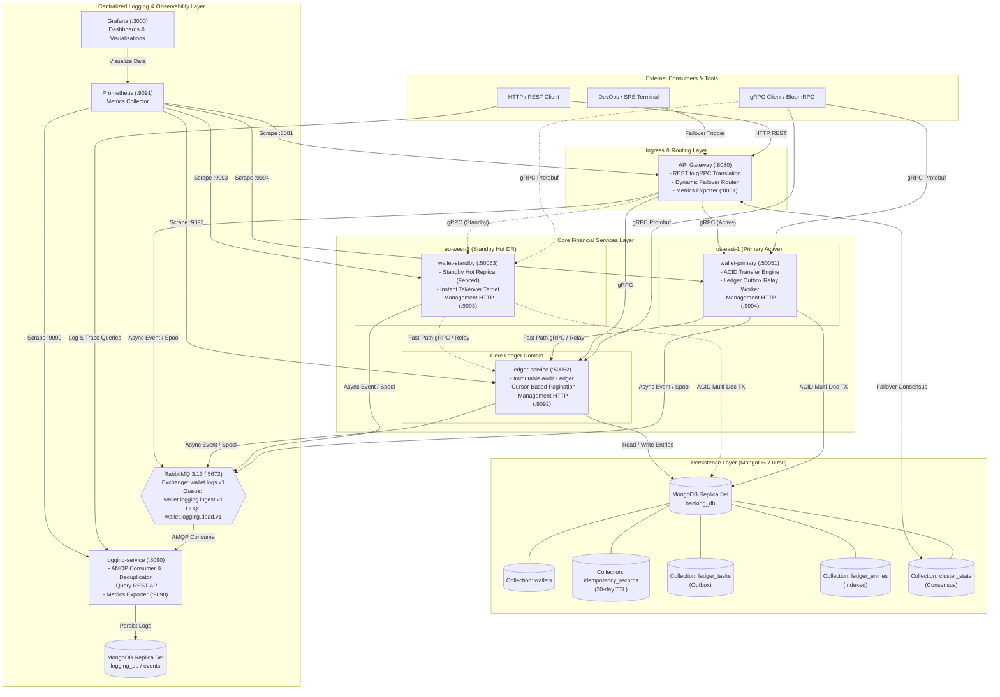
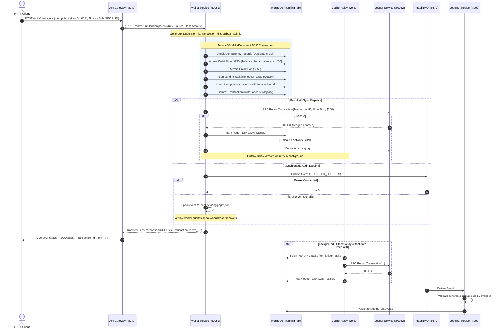
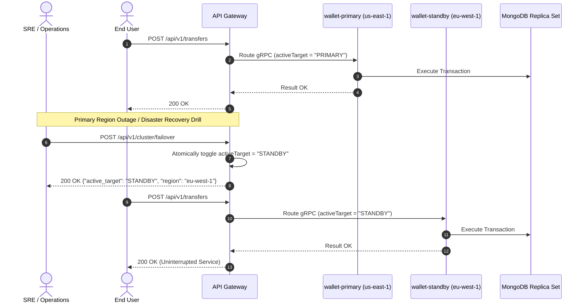
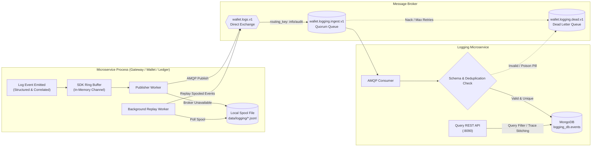
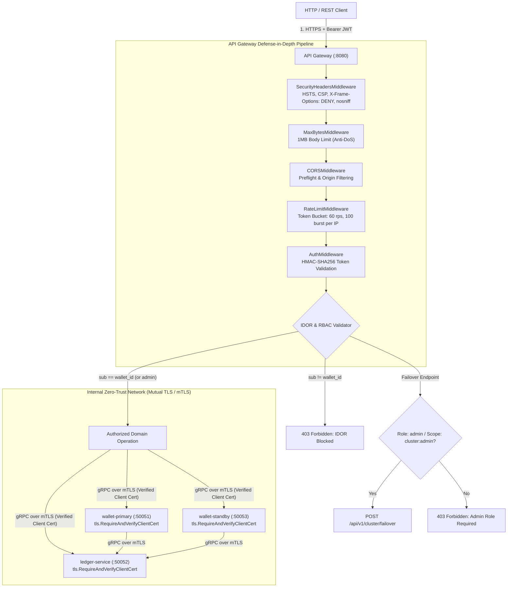
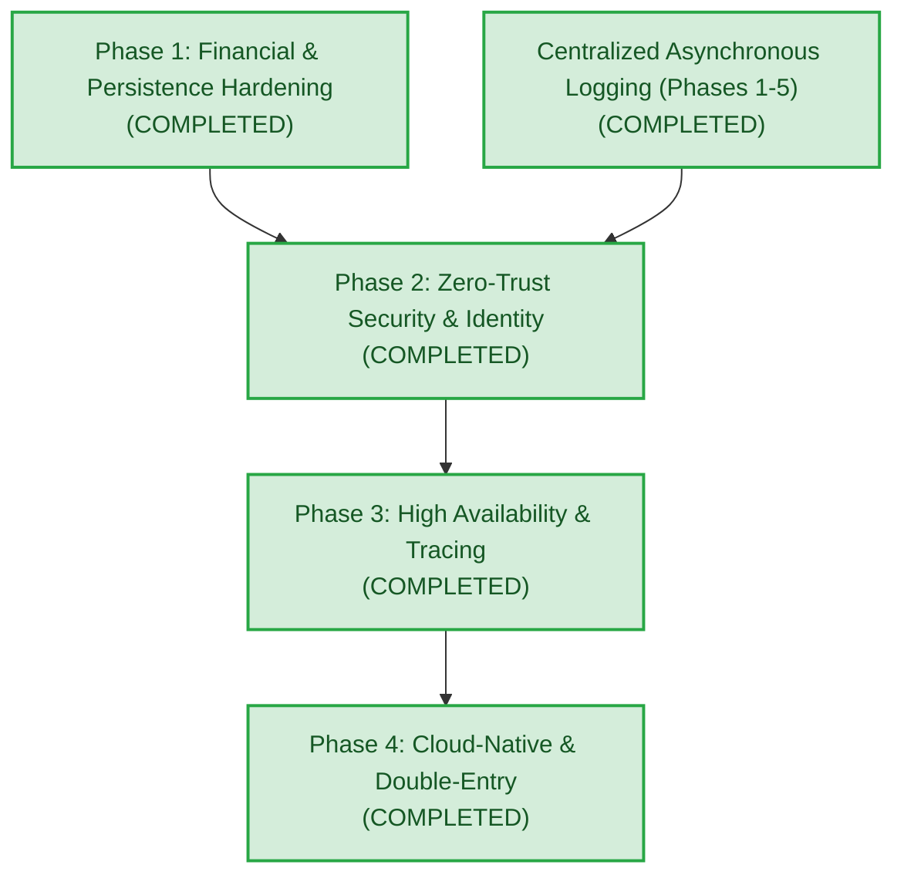

# Global Multi-Currency Digital Wallet & Ledger Service

[](LICENSE)
[](https://golang.org)
[](README.md#key-architectural-pillars)
[](SECURITY.md)
[](https://grpc.io)
[](https://www.mongodb.com)
[](https://www.rabbitmq.com)
[](https://prometheus.io)

A production-grade, distributed microservices platform for atomic multi-currency digital wallet operations, transactional ledger recording, centralized asynchronous event logging, and disaster recovery failover built in **Go**.

---

## Table of Contents

- [System Overview](#system-overview)
- [Key Architectural Pillars](#key-architectural-pillars)
  - [🏛️ Domain-Driven Microservices Architecture](#️-domain-driven-microservices-architecture)
  - [🛡️ Zero-Trust Security & Identity Model](#️-zero-trust-security--identity-model)
- [Pictorial Architecture & Flow Representations](#pictorial-architecture--flow-representations)
  - [1. High-Level System Architecture](#1-high-level-system-architecture)
  - [2. End-to-End Atomic Transfer & Transactional Outbox Flow](#2-end-to-end-atomic-transfer--transactional-outbox-flow)
  - [3. Multi-Region Active-Standby Failover Flow](#3-multi-region-active-standby-failover-flow)
  - [4. Asynchronous Centralized Logging & Resilient Disk Spooling](#4-asynchronous-centralized-logging--resilient-disk-spooling)
  - [5. Zero-Trust Security Architecture & Ingress Defense Pipeline](#5-zero-trust-security-architecture--ingress-defense-pipeline)
- [Microservice Directory & Port Matrix](#microservice-directory--port-matrix)
- [Implementation Status & Production Readiness Roadmap](#implementation-status--production-readiness-roadmap)
  - [Completed Implementations](#completed-implementations)
  - [Planned Roadmap (Yet to be Implemented)](#planned-roadmap-yet-to-be-implemented)
- [Quickstart & Deployment Guide](#quickstart--deployment-guide)
  - [Prerequisites](#prerequisites)
  - [Starting the Modular Stacks](#starting-the-modular-stacks)
  - [Makefile Shortcuts](#makefile-shortcuts)
- [Interactive API Verification Guide (cURL)](#interactive-api-verification-guide-curl)
- [Documentation Sitemap](#documentation-sitemap)
- [License](#license)

---

## System Overview

The **Global Multi-Currency Digital Wallet & Ledger Service** is engineered to demonstrate the architectural and financial rigor required for mission-critical core banking infrastructure:

* **Strict Financial Consistency**: Multi-document ACID transactions via MongoDB Replica Set (`writeconcern.Majority()`, `readconcern.Snapshot()`) preventing overdrafts, race conditions, and phantom balance anomalies.
* **Transactional Outbox Decoupling**: Eliminates synchronous cross-service network calls within database transactions, delivering immutable ledger journal entries via guaranteed at-least-once outbox relay.
* **Idempotency Guarantees**: Cryptographic deduplication using client-supplied idempotency keys with automated 30-day TTL lifecycle management.
* **Active-Standby Multi-Region Disaster Recovery**: Simulated multi-region architecture (`us-east-1` Primary Active, `eu-west-1` Standby Hot DR) featuring dynamic routing switchover at the API Gateway.
* **Resilient Centralized Logging Ecosystem**: Non-blocking asynchronous event emission to RabbitMQ with automatic local JSONL disk spooling and backpressure-aware background replay workers.
* **Operational Tracing & Observability**: Correlation IDs (`association_id`, `idempotency_key`, `transaction_id`) propagated across gRPC metadata and HTTP headers, with a dedicated Log Query API, Prometheus metrics, and preconfigured Grafana dashboards.

---

## Key Architectural Pillars

> [!IMPORTANT]
> The platform is built around two foundational design paradigms: **Independent Event-Driven Microservices** for domain isolation and horizontal scalability, and a **Zero-Trust Security Model** enforcing continuous verification across both public and inter-service boundaries.

### 🏛️ Domain-Driven Microservices Architecture

The system decomposes financial operations into autonomous, loosely-coupled microservices with clearly bounded contexts:

| Microservice Component | Protocol & Ports | Architectural Role | Bounded Context & Persistence |
|---|---|---|---|
| **API Gateway** | HTTP `:8080`<br>Prometheus `:8081` | • Edge ingress & HTTP REST-to-gRPC translation<br>• 6-layer defense-in-depth security pipeline<br>• Distributed `FailoverCoordinator` dynamic router | Stateless |
| **Wallet Service (Primary)** | gRPC `:50051`<br>Management `:9094` | • Core banking engine for `us-east-1-primary`<br>• Multi-document ACID transactions (`Majority`/`Snapshot`)<br>• Atomic Transactional Outbox relay for ledger decoupling<br>• OTel W3C tracing, gRPC health, Prometheus metrics | `banking_db.wallets`<br>`banking_db.idempotency_records`<br>`banking_db.ledger_tasks` (Outbox) |
| **Wallet Service (Standby)** | gRPC `:50053`<br>Management `:9093` | • Hot disaster recovery replica for `eu-west-1-standby`<br>• Real-time takeover target with Standby Write Fencing<br>• OTel W3C tracing, gRPC health, Prometheus metrics | Shared replica set `rs0`<br>(instant failover target) |
| **Ledger Service** | gRPC `:50052`<br>Management `:9092` | • Immutable financial journal & audit ledger<br>• Reverse-chronological cursor-based queries<br>• Compound and unique indexing eliminating COLLSCAN<br>• OTel W3C tracing, gRPC health, Prometheus metrics | `banking_db.ledger_entries` |
| **Logging Service** | HTTP `:8090`<br>Prometheus `:9090` | • High-throughput AMQP event consumer & deduplicator<br>• Operational log search API & trace reconstruction<br>• Dead-letter queue governance (`wallet.logging.dead.v1`) | `logging_db.events` |

* **Strict Contract-First Communication**: Internal inter-service communication operates exclusively over gRPC using Protobuf v3 contracts (`proto/wallet/wallet.proto` and `proto/ledger/ledger.proto`), guaranteeing type safety, high throughput, and backward compatibility.
* **Decoupled Transactional Outbox Pattern**: Prevents distributed transaction deadlocks by eliminating cross-service RPCs from inside database transactions. Debit/credit updates and an outbox task are committed atomically; an asynchronous relay delivers ledger records with guaranteed at-least-once semantics.
* **Resilient Asynchronous Messaging**: Event logging is completely offloaded from the transactional path via RabbitMQ direct exchanges and durable quorum queues, featuring local disk-spooling fallback to withstand broker outages.

---

### 🛡️ Zero-Trust Security & Identity Model

Operating under the foundational principle of **"Never Trust, Always Verify"**, the system enforces end-to-end cryptographic authentication, fine-grained access control, and transport encryption across all actors and network hops:

```
┌─────────────────────────────────────────────────────────────────────────────────────────────┐
│                               ZERO-TRUST ENFORCEMENT MATRIX                                 │
├─────────────────────────┬─────────────────────────────┬─────────────────────────────────────┤
│ Security Vector         │ Enforcement Mechanism       │ Technical Implementation            │
├─────────────────────────┼─────────────────────────────┼─────────────────────────────────────┤
│ 1. External AuthN       │ Cryptographic HMAC-SHA256   │ Validates token signature, issuer,  │
│                         │ JSON Web Tokens (JWT)       │ audience, and expiration on all APIs│
├─────────────────────────┼─────────────────────────────┼─────────────────────────────────────┤
│ 2. Data Access (IDOR)   │ Subject Ownership Check     │ Enforces claims.sub == wallet_id;   │
│                         │ (AuthZ)                     │ cross-account access yields 403     │
├─────────────────────────┼─────────────────────────────┼─────────────────────────────────────┤
│ 3. Operations Control   │ Administrative RBAC         │ /cluster/failover requires role:    │
│                         │ & Scope Verification        │ 'admin' or scope: 'cluster:admin'   │
├─────────────────────────┼─────────────────────────────┼─────────────────────────────────────┤
│ 4. Internal Transport   │ Mutual TLS (mTLS)           │ Bidirectional x509 cert validation  │
│                         │ for gRPC                    │ (tls.RequireAndVerifyClientCert)    │
├─────────────────────────┼─────────────────────────────┼─────────────────────────────────────┤
│ 5. Perimeter Protection │ Defense-in-Depth Middleware │ Rate limiting (60 rps/100 burst),   │
│                         │ Pipeline                    │ 1MB max body, HSTS, CSP, nosniff    │
├─────────────────────────┼─────────────────────────────┼─────────────────────────────────────┤
│ 6. Account Integrity    │ Atomic Uniqueness Guard     │ InsertOne duplicate rejection (409  │
│                         │                             │ Conflict) prevents account overwrite│
└─────────────────────────┴─────────────────────────────┴─────────────────────────────────────┘
```

1. **Perimeter Defense-in-Depth**: Every incoming request must traverse a comprehensive middleware pipeline at the API Gateway: Security Headers (HSTS, CSP, X-Frame-Options: DENY, X-Content-Type-Options: nosniff), MaxBytes (1MB payload limit), CORS, Token-Bucket Rate Limiter (60 req/s, 100 burst), and JWT Bearer validation.
2. **Insecure Direct Object Reference (IDOR) Immunity**: Callers can only perform balance checks, fund transfers, or ledger queries on wallets matching their authenticated JWT subject (`sub`). Attempts to manipulate another party's wallet are immediately rejected with `403 Forbidden` unless the caller possesses verified administrative privileges.
3. **Internal Zero-Trust Mesh via Mutual TLS (mTLS)**: Cleartext gRPC is eliminated. The API Gateway and all core microservices mandate bidirectional x509 certificate verification (`tls.RequireAndVerifyClientCert`) with dedicated Root CA verification, preventing MITM attacks and pod-to-pod impersonation.
4. **Resilience & Anti-Abuse**: Explicit server timeouts (`ReadHeaderTimeout: 3s`, `ReadTimeout: 10s`) neutralize Slowloris attacks; token-bucket algorithms mitigate brute-force and DoS floods.


---

## Pictorial Architecture & Flow Representations

### 1. High-Level System Architecture

The following diagram illustrates the complete microservice landscape, network boundaries, protocols, and data stores:



---

### 2. End-to-End Atomic Transfer & Transactional Outbox Flow

This sequence depicts a transfer from Alice to Bob, illustrating how the **Transactional Outbox Pattern** completely decouples the database transaction from cross-service network I/O:



---

### 3. Multi-Region Active-Standby Failover Flow

The API Gateway maintains routing state to support zero-downtime regional disaster recovery drills:



---

### 4. Asynchronous Centralized Logging & Resilient Disk Spooling

Every service incorporates an asynchronous logger with an embedded disk-spooling fallback to guarantee zero event loss and zero latency overhead on the critical banking path:



---

### 5. Zero-Trust Security Architecture & Ingress Defense Pipeline

The following diagram illustrates how every inbound request is authenticated and verified through the **Gateway Defense-in-Depth Pipeline** and routed across the internal **Zero-Trust Mutual TLS (mTLS) Mesh**:



---

## Microservice Directory & Port Matrix

| Service | Container Name | Protocol / Ports | Role & Responsibilities |
|---|---|---|---|
| **API Gateway** | `wallet_api_gateway` | HTTP `:8080`<br/>Prometheus `:8081` | REST ingress, request validation, gRPC reverse proxy, distributed failover coordinator router. |
| **Wallet Service (Primary)** | `wallet_primary_active` | gRPC `:50051`<br/>Management `:9094` | Primary active banking engine (`us-east-1`). ACID multi-doc transactions, balance management, `LedgerRelay` outbox worker, gRPC health probe, Prometheus `/metrics` and `/healthz`. |
| **Wallet Service (Standby)** | `wallet_standby_hot_dr` | gRPC `:50053`<br/>Management `:9093` | Hot standby disaster recovery replica (`eu-west-1`). Identical engine with Standby Write Fencing ready for instant promotion, gRPC health probe, Prometheus `/metrics` and `/healthz`. |
| **Ledger Service** | `wallet_ledger_service` | gRPC `:50052`<br/>Management `:9092` | Immutable financial ledger, transaction journal recording, reverse-chronological cursor-based queries, gRPC health probe, Prometheus `/metrics` and `/healthz`. |
| **Logging Service** | `wallet_logging_service` | HTTP `:8090`<br/>Prometheus `:9090` | AMQP log consumer, validation, deduplication, Log Search API (`/api/v1/logs`), Trace Reconstruction (`/api/v1/traces/{id}`). |
| **MongoDB** | `wallet_mongodb` | TCP `:27017` | Multi-document ACID transactional datastore running replica set `rs0`. Hosts `banking_db` (including `cluster_state`) and `logging_db`. |
| **RabbitMQ** | `wallet_rabbitmq` | AMQP `:5672`<br/>Management `:15672` | High-throughput asynchronous message broker with management UI, direct exchange, and dead-letter exchanges. |
| **Prometheus** | `wallet_prometheus` | HTTP `:9091` | Time-series metrics collection server scraping gateway (:8081), primary wallet (:9094), standby wallet (:9093), ledger (:9092), and logging (:9090). |
| **Grafana** | `wallet_grafana` | HTTP `:3000` | Observability dashboards auto-provisioned with logging health, throughput, and error metrics. |

---

## Implementation Status & Production Readiness Roadmap

An exhaustive production readiness audit was performed in [docs/PRODUCTION_READINESS_AUDIT.md](docs/PRODUCTION_READINESS_AUDIT.md). The platform transition is structured into 4 remediation phases:



### Completed Implementations

#### 1. Core Financial & Persistence Hardening (Phase 1)
- [x] **Decoupled Database Transactions from Network I/O (GAP-FIN-01)**: Completely removed synchronous cross-service gRPC calls from inside MongoDB `session.WithTransaction()`. Implemented the **Transactional Outbox Pattern** (`ledger_tasks` collection) and a background `LedgerRelay` worker for resilient fallback delivery.
- [x] **Eliminated Database Collection Scans (GAP-DB-01)**: Created unique index on `idempotency_key` and compound query indexes on `{source_wallet_id: 1, timestamp: -1}` and `{destination_wallet_id: 1, timestamp: -1}` on `ledger_entries` collection, terminating COLLSCAN latencies.
- [x] **Automated Data Lifecycle (GAP-DB-03)**: Enforced a 30-day MongoDB TTL expiration index on `idempotency_records` (`created_at`).
- [x] **Bounded Ledger Queries & Pagination (GAP-DB-02)**: Implemented cursor-based pagination with configurable limit bounds (default 50, max 200) and reverse-chronological sorting.
- [x] **Strict Currency Scale & Validation (GAP-FIN-04)**: Standardized currency parsing against strict ISO-4217 currency dictionaries.

#### 2. Centralized Asynchronous Logging Subsystem (Phases 1–5)
- [x] **Correlation Context Propagation (Phase 1)**: Context propagation across gRPC metadata (`x-association-id`, `x-idempotency-key`, `x-transaction-id`).
- [x] **Resilient AMQP Publisher with Disk Spooling (Phase 2)**: Non-blocking buffered channel publisher with automatic fallback to local JSONL spool files and backpressure-aware background replay.
- [x] **Standalone Logging Microservice (Phase 3)**: Dedicated consumer microservice with schema validation, deduplication via MongoDB unique index, and dead-letter queuing (`wallet.logging.dead.v1`).
- [x] **Operational Log & Trace Query REST API (Phase 4)**: Added `/api/v1/logs` with rich multi-field filtering and `/api/v1/traces/{association_id}` to reconstruct the full distributed 12-step transaction timeline with latency metrics.
- [x] **Production Hardening & Monitoring (Phase 5)**: Configured TLS transport, quorum queue support, scheduled data retention cleaner, API key access control, Prometheus metrics exporter (`:9090`), Grafana dashboards, and audit-critical transactional outbox.

#### 3. Zero-Trust Security & Identity (Phase 2)
- [x] **JWT Gateway Authentication & Token Minting (GAP-SEC-01)**: Implemented cryptographic HMAC-SHA256 JWT validation at API Gateway with claims schema (`sub`, `roles`, `scopes`, `exp`). Added dev minting endpoint `/api/v1/auth/token`.
- [x] **Insecure Direct Object Reference (IDOR) Protection (GAP-SEC-01)**: Enforced identity ownership (`sub == wallet_id`) across transfers, balance inquiries, and ledger queries. Cross-account access is strictly rejected with HTTP 403 Forbidden unless caller possesses `admin` role.
- [x] **Administrative Access Control for Failover (GAP-SEC-03)**: Restricted `POST /api/v1/cluster/failover` behind administrative RBAC requiring role `admin` or scope `cluster:admin`.
- [x] **Mutual TLS (mTLS) for Inter-Service gRPC (GAP-SEC-02)**: Configured bidirectional TLS verification with `tls.RequireAndVerifyClientCert` and root CA pools across `api-gateway`, `wallet-service`, and `ledger-service`. Activated dynamically via `GRPC_TLS_ENABLED=true` with standalone cert generator script (`scripts/generate_certs.go`).
- [x] **Gateway Defense-in-Depth (GAP-SEC-05 & GAP-REL-02)**: Token-bucket rate limiting (60 rps, 100 burst), 1MB payload limits (`http.MaxBytesReader`), standard security headers (`HSTS`, `CSP`, `X-Frame-Options: DENY`, `X-Content-Type-Options: nosniff`), and Slowloris timeout protection (`ReadHeaderTimeout: 3s`).
- [x] **Duplicate Wallet Prevention**: Enforced strict `InsertOne` semantics with `codes.AlreadyExists` / HTTP 409 Conflict preventing account balance overwrites.
- [x] **Secrets & Configuration Management (GAP-SEC-04)**: Externalized all configuration and certificate paths into `.env.example`.

#### 4. High Availability, Resilience & Distributed Tracing (Phase 3)
- [x] **Graceful Process Lifecycle & Request Draining (GAP-REL-01)**: Implemented OS signal capture (`SIGTERM`/`SIGINT`) with HTTP `server.Shutdown()` (15s drain window) and `grpcServer.GracefulStop()` across `api-gateway`, `wallet-service`, and `ledger-service`. Decoupled background `LedgerRelay` workers safely shut down via `relay.Stop()`.
- [x] **Distributed Failover Coordination (GAP-HA-01)**: Replaced single-process in-memory state with a pluggable `FailoverCoordinator` backed by MongoDB `cluster_state` collection (`_id: "active_target"`) featuring 1-second TTL cache for sub-microsecond gateway routing. Atomic updates propagate immediately across all gateway replicas and persist across restarts.
- [x] **Standby Write Fencing & Role Consensus (GAP-HA-02)**: Enforced write fencing on standby wallet instances. Mutation RPCs (`CreateWallet`, `TransferFunds`) are rejected on standby with `codes.FailedPrecondition`, while read queries (`GetBalance`) and health checks remain fully accessible.
- [x] **Standard gRPC Health Probes (GAP-REL-03)**: Implemented official `grpc.health.v1.Health` protocol on `wallet-service` (Primary & Standby) and `ledger-service`. Integrated API Gateway `/readyz` endpoint with live gRPC health validation of the active target node.
- [x] **OpenTelemetry Distributed Tracing (GAP-OBS-01)**: Integrated official OpenTelemetry Go SDK (`go.opentelemetry.io/otel`) with global W3C `TraceContext` propagator. Added `TraceHTTPMiddleware` (injecting `X-Trace-ID` and `traceparent` headers) and gRPC client/server interceptors for end-to-end distributed span propagation.
- [x] **Core Service Prometheus Exporters (GAP-OBS-02)**: Exposed dedicated management HTTP servers on `:9094` (`wallet-primary`), `:9093` (`wallet-standby`), and `:9092` (`ledger-service`), serving Prometheus `/metrics` (gRPC latency histograms, request counters, active target gauge) and `/healthz`. Configured automated Prometheus scrape jobs.
- [x] **High-Concurrency Automated Test Suite (GAP-QA-01)**: Implemented race-verified concurrency tests (`cmd/wallet-service/concurrency_test.go`) covering 50-thread concurrent overdraft debit races ($100 balance, exactly 10 succeed, 40 fail, ending balance strictly $0.00 with zero leakage), 20-thread idempotent replays, standby write fencing, and gRPC health checks. 100% race-free under `go test -race ./...`.

---

#### 5. Container Hardening, Kubernetes Suite, Double-Entry & Account Controls (Phase 4)
- [x] **Hardened Non-Root Container Images (GAP-OPS-01 & GAP-OPS-02)**: Multi-stage Docker build running under unprivileged `appuser:appgroup` (UID 10001, GID 10001) with deterministic dependency caching (`COPY go.mod go.sum` -> `RUN go mod download`) and explicit management port declarations.
- [x] **Production Kubernetes Manifest Suite (GAP-OPS-03 & GAP-HA-03)**: Comprehensive 10-manifest suite covering a 3-node HA MongoDB StatefulSet with headless DNS, automated `rs0` replica-set initiation, dynamic PVCs, resource requests/limits, securityContexts, liveness/readiness probes, RabbitMQ, Logging Service, NGINX Ingress with TLS, ConfigMaps/Secrets, HPA, and PDB.
- [x] **GAAP/IFRS True Double-Entry Bookkeeping (GAP-FIN-02)**: Implemented balanced journal postings ($\sum \text{Debits} == \sum \text{Credits}$) for all financial movements, rejecting unbalanced legs before persistence.
- [x] **Cryptographic SHA-256 Audit Chaining & Verification (GAP-FIN-02)**: Every ledger entry cryptographically chains its SHA-256 hash back to `GenesisHash` (`0000...0000`). Management HTTP endpoint `GET /audit/verify?wallet_id=<id>` on port `:9092` verifies entry equilibrium and flags any historical audit tampering.
- [x] **Wallet Account Status & Operational Fencing (GAP-FIN-05)**: Added operational account states (`ACTIVE`, `FROZEN`, `CLOSED`). Prohibits transfers to or from frozen/closed accounts. Added management HTTP endpoint `GET|POST|PUT /admin/wallet/status` on ports `:9094`/`:9093` for live operational freeze/unfreeze actions.

---

### Future Enhancements Roadmap

- [ ] **Foreign Exchange (FX) Engine (GAP-FIN-03)**: Support cross-currency transfers with guaranteed quote validity windows (30–60s) and multi-currency journal legs.
- [ ] **Circuit Breaking & Mesh Telemetry (GAP-REL-04)**: Dynamic circuit breaking (e.g., `sony/gobreaker` or Envoy service mesh) for automatic fast-failing during degraded downstream network conditions.

---

## Quickstart & Deployment Guide

### Prerequisites
* [Docker Desktop](https://www.docker.com/) (Engine 24.0+, Compose v2.20+)
* [Go 1.23+](https://golang.org/dl/) (for native local development)
* [curl](https://curl.se/) or [BloomRPC / Postman](docs/BLOOMRPC_GUIDE.md)

### Starting the Modular Stacks

The project uses modular Docker Compose stacks connected via a shared external network (`wallet_shared_net`):

```bash
# 1. Create the shared network and volume
docker network create wallet_shared_net 2>/dev/null || true
docker volume create global-wallet-microservices_mongo_data >/dev/null 2>&1 || true

# 2. Start the MongoDB 7.0 Replica Set (rs0)
docker compose -f docker-compose.mongodb.yml up -d

# 3. Start RabbitMQ Message Broker
docker compose -f docker-compose.rabbitmq.yml up -d

# 4. Start Core Application Microservices (Gateway, Primary Wallet, Standby Wallet, Ledger)
docker compose -f docker-compose.yml up --build -d

# 5. Start Centralized Logging Microservice
docker compose -f docker-compose.logging.yml up --build -d

# 6. Start Observability Monitoring (Prometheus & Grafana)
docker compose -f docker-compose.monitoring.yml up -d
```

Verify that all containers are healthy:
```bash
docker ps --format "table {{.Names}}\t{{.Status}}\t{{.Ports}}"
```

### Makefile Shortcuts

A convenient `Makefile` is provided in the repository root:

```bash
make up          # Start all stacks in dependency order
make down        # Stop application services safely
make test        # Run Go unit and race detector tests
make e2e         # Execute automated end-to-end integration test
make status      # Check container health and status
```

---

## Interactive API Verification Guide (cURL)

### 0. Mint JWT Authentication Tokens (Phase 2)
Generate signed test tokens for Alice (user) and Ops Admin:

```bash
# Mint user token for Alice
ALICE_TOKEN=$(curl -s -X POST "http://localhost:8080/api/v1/auth/token?sub=alice&role=user" | jq -r .token)

# Mint admin token for Ops
ADMIN_TOKEN=$(curl -s -X POST "http://localhost:8080/api/v1/auth/token?sub=ops-admin&role=admin" | jq -r .token)
```

### 1. Create Wallets
Create accounts for Alice and Bob in USD:

```bash
# Create Alice's Wallet ($1,000 USD)
curl -s -X POST http://localhost:8080/api/v1/wallets \
  -H "Authorization: Bearer $ALICE_TOKEN" \
  -H "Content-Type: application/json" \
  -d '{"wallet_id":"alice","currency":"USD","initial_balance":1000}' | jq .

# Create Bob's Wallet ($500 USD)
curl -s -X POST http://localhost:8080/api/v1/wallets \
  -H "Authorization: Bearer $ADMIN_TOKEN" \
  -H "Content-Type: application/json" \
  -d '{"wallet_id":"bob","currency":"USD","initial_balance":500}' | jq .
```

### 2. Execute Idempotent Atomic Transfer
Execute an atomic transfer of $250 USD from Alice to Bob:

```bash
curl -s -X POST http://localhost:8080/api/v1/transfers \
  -H "Authorization: Bearer $ALICE_TOKEN" \
  -H "Content-Type: application/json" \
  -d '{
    "idempotency_key": "tx-prod-001",
    "source_wallet_id": "alice",
    "destination_wallet_id": "bob",
    "amount": 250,
    "currency": "USD"
  }' | jq .
```

*Response:*
```json
{
  "status": "SUCCESS",
  "transaction_id": "txn_6a8e1b2c3d4e",
  "message": "Transfer processed successfully"
}
```

### 3. Verify Idempotency Protection
Re-send the exact same transfer request with idempotency key `"tx-prod-001"`. The system returns the cached transaction response without executing duplicate debits or credits:

```bash
curl -s -X POST http://localhost:8080/api/v1/transfers \
  -H "Authorization: Bearer $ALICE_TOKEN" \
  -H "Content-Type: application/json" \
  -d '{
    "idempotency_key": "tx-prod-001",
    "source_wallet_id": "alice",
    "destination_wallet_id": "bob",
    "amount": 250,
    "currency": "USD"
  }' | jq .
```

### 4. Regional Disaster Recovery Failover Simulation
Trigger failover from `wallet-primary` (`us-east-1`) to `wallet-standby` (`eu-west-1`) using the Admin token:

```bash
curl -s -X POST http://localhost:8080/api/v1/cluster/failover \
  -H "Authorization: Bearer $ADMIN_TOKEN" | jq .
```

*Response:*
```json
{
  "status": "FAILOVER_SUCCESS",
  "active_target": "STANDBY",
  "region": "eu-west-1 (Standby Hot DR)",
  "timestamp": "2026-09-17T18:00:00Z"
}
```

Subsequent transfer requests will immediately route to `wallet-standby` on port `50053` with zero service interruption.

### 5. Query Audit Ledger with Pagination
Retrieve the immutable transaction history for Alice with cursor pagination:

```bash
curl -s "http://localhost:8080/api/v1/ledger?wallet_id=alice&limit=10" | jq .
```

### 6. Query Centralized Logging Service
Search centralized logs stored in `logging_db` by service or log level:

```bash
# Query all AUDIT level events
curl -s "http://localhost:8090/api/v1/logs?level=AUDIT&limit=5" | jq .

# Query logs specific to wallet-service
curl -s "http://localhost:8090/api/v1/logs?service=wallet-service&limit=5" | jq .
```

### 7. Reconstruct Distributed 12-Step Transaction Timeline
Using the `association_id` returned in the HTTP headers or response metadata, reconstruct the complete lifecycle of a transaction across all microservices:

```bash
curl -s "http://localhost:8090/api/v1/traces/<association_id>" | jq .
```

### 8. View Observability Dashboards
* **Prometheus Targets & Metrics**: [http://localhost:9091](http://localhost:9091)
* **Grafana Dashboards**: [http://localhost:3000](http://localhost:3000) (Credentials: `admin` / `admin`)
* **RabbitMQ Management Console**: [http://localhost:15672](http://localhost:15672) (Credentials: `guest` / `guest`)

### 9. Automated Testing with Postman, Bruno & BloomRPC
A comprehensive 35-test automated regression suite covering all Phase 1, Phase 2, Phase 3, and Phase 4 capabilities is included in the `postman/` directory:
* **Postman/Bruno Collection**: `postman/Global_Wallet_Microservices.postman_collection.json`
* **Local Environment**: `postman/Global_Wallet_Local.postman_environment.json`
* **BloomRPC Test Presets**: `postman/BloomRPC_Test_Presets.json` (see [docs/BLOOMRPC_GUIDE.md](docs/BLOOMRPC_GUIDE.md))

Both Postman and Bruno test runners validate:
1. System Health & Probes (`/healthz`, `/readyz` live gRPC active node check, `/api/v1/cluster/status`)
2. Auth & Token Minting (`/api/v1/auth/token` with claims validation)
3. Zero-Trust Security Gates (Missing token 401, Invalid token 401, IDOR rejection 403, Rate limiter 429)
4. Wallet Lifecycle (Alice USD $1000, Bob USD $500, Duplicate wallet 409 Conflict)
5. Transfers & Idempotency (Atomic fund transfers, duplicate key replay, insufficient funds)
6. Disaster Recovery Failover (Admin-only failover, distributed `cluster_state` verification, route reset)
7. Phase 3 Management Metrics (`:9094/metrics`, `:9093/metrics`, `:9092/metrics`, `:9090/metrics`)
8. OpenTelemetry W3C distributed tracing context propagation (`traceparent` and `X-Trace-ID` verification)
9. Phase 4 True Double-Entry Bookkeeping & SHA-256 Cryptographic Hash Chain Verification (`/audit/verify`)
10. Phase 4 Wallet Account Operational Status Fencing (`ACTIVE`, `FROZEN`, `CLOSED`) via `/admin/wallet/status`

---

## Documentation Sitemap

| Document | Description |
|---|---|
| [docs/PRODUCTION_READINESS_AUDIT.md](docs/PRODUCTION_READINESS_AUDIT.md) | Comprehensive 8-pillar production audit, gap catalog, risk analysis, and 4-phase remediation roadmap. |
| [docs/PHASE1_IMPLEMENTATION.md](docs/PHASE1_IMPLEMENTATION.md) | Technical deep-dive on Phase 1: transactional outbox pattern, database indexing, TTL, and pagination. |
| [docs/PHASE2_IMPLEMENTATION.md](docs/PHASE2_IMPLEMENTATION.md) | Technical deep-dive on Phase 2: JWT authentication, RBAC, IDOR protection, inter-service mTLS, rate limiting, and security headers. |
| [docs/PHASE3_IMPLEMENTATION.md](docs/PHASE3_IMPLEMENTATION.md) | Technical deep-dive on Phase 3: distributed failover coordination, standby write fencing, graceful shutdown, standard gRPC health probes, OpenTelemetry W3C distributed tracing, Prometheus metrics, and high-concurrency race suites. |
| [docs/PHASE4_IMPLEMENTATION.md](docs/PHASE4_IMPLEMENTATION.md) | Technical deep-dive on Phase 4: non-root Docker hardening, complete 10-manifest Kubernetes suite, true double-entry bookkeeping, SHA-256 cryptographic audit chaining, and wallet account status controls. |
| [docs/LOGGING_ARCHITECTURE.md](docs/LOGGING_ARCHITECTURE.md) | Architectural specification for centralized asynchronous logging, correlation IDs, and resilient spooling. |
| [docs/LOGGING_IMPLEMENTATION.md](docs/LOGGING_IMPLEMENTATION.md) | Complete implementation record for logging phases 1 through 5, metric definitions, and dashboard provisioning. |
| [docs/BEGINNER_GUIDE.md](docs/BEGINNER_GUIDE.md) | Step-by-step onboarding guide explaining microservices, gRPC, Protobuf, and request flow from first principles. |
| [docs/LOCAL_DEVELOPMENT.md](docs/LOCAL_DEVELOPMENT.md) | Guide for native local development on Windows/macOS/Linux without full Docker Compose dependencies. |
| [docs/BLOOMRPC_GUIDE.md](docs/BLOOMRPC_GUIDE.md) | Instructions for interacting directly with gRPC microservices using BloomRPC or Postman gRPC client. |
| [postman/](postman/) | Automated 28-test integration collection, environment, and BloomRPC JSON presets. |
| [SECURITY.md](SECURITY.md) | Security policy, vulnerability reporting guidelines, and development boundaries. |


---

## License

This project is licensed under the **GNU General Public License v3.0 (GPL-3.0)**.

```
Global Multi-Currency Digital Wallet & Ledger Service
Copyright (C) 2026

This program is free software: you can redistribute it and/or modify
it under the terms of the GNU General Public License as published by
the Free Software Foundation, either version 3 of the License, or
(at your option) any later version.

This program is distributed in the hope that it will be useful,
but WITHOUT ANY WARRANTY; without even the implied warranty of
MERCHANTABILITY or FITNESS FOR A PARTICULAR PURPOSE.  See the
GNU General Public License for more details.

You should have received a copy of the GNU General Public License
along with this program.  If not, see <https://www.gnu.org/licenses/>.
```

See the [LICENSE](LICENSE) file for the full license text.
