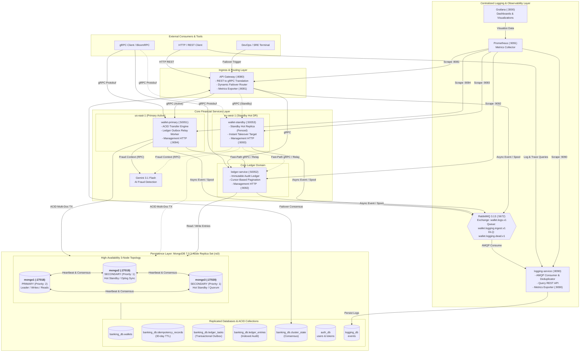
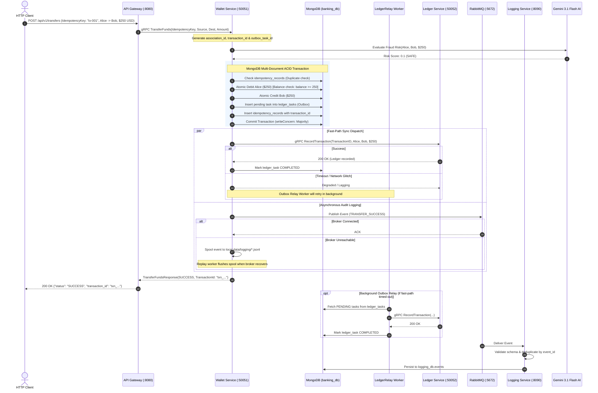
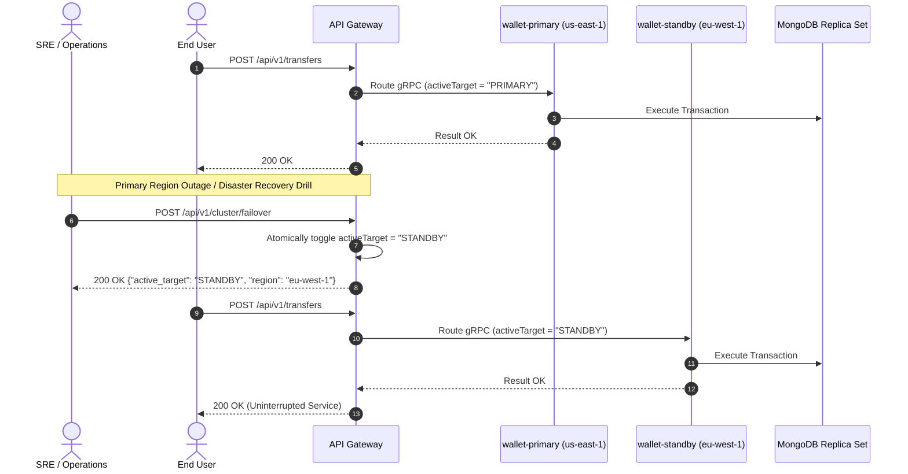
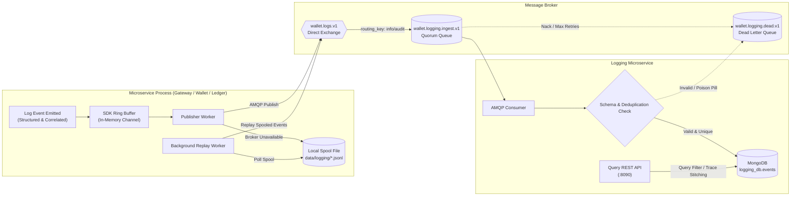
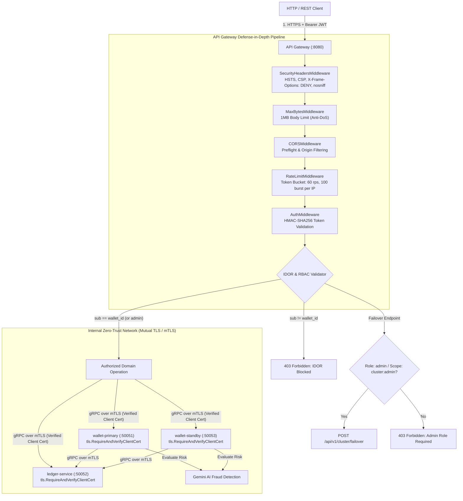

# Global Multi-Currency Digital Wallet & Ledger Service

[](LICENSE)
[](https://github.com/bkojha74/global-wallet-microservices/actions/workflows/ci.yml)
[](https://golang.org)
[](README.md#key-architectural-pillars)
[](SECURITY.md)
[](https://grpc.io)
[](https://www.mongodb.com)
[](https://www.rabbitmq.com)
[](https://prometheus.io)

A production-grade, distributed microservices platform for atomic multi-currency digital wallet operations, transactional ledger recording, centralized asynchronous event logging, and disaster recovery failover built in **Go**.

---

## Table of Contents

- [System Overview](#system-overview)
- [Key Architectural Pillars](#key-architectural-pillars)
  - [🏛️ Domain-Driven Microservices Architecture](#️-domain-driven-microservices-architecture)
  - [🛡️ Zero-Trust Security & Identity Model](#️-zero-trust-security--identity-model)
- [Pictorial Architecture & Flow Representations](#pictorial-architecture--flow-representations)
  - [1. High-Level System Architecture](#1-high-level-system-architecture)
  - [2. End-to-End Atomic Transfer & Transactional Outbox Flow](#2-end-to-end-atomic-transfer--transactional-outbox-flow)
  - [3. Multi-Region Active-Standby Failover Flow](#3-multi-region-active-standby-failover-flow)
  - [4. Asynchronous Centralized Logging & Resilient Disk Spooling](#4-asynchronous-centralized-logging--resilient-disk-spooling)
  - [5. Zero-Trust Security Architecture & Ingress Defense Pipeline](#5-zero-trust-security-architecture--ingress-defense-pipeline)
- [Microservice Directory & Port Matrix](#microservice-directory--port-matrix)
- [Implementation Status & Production Readiness Roadmap](#implementation-status--production-readiness-roadmap)
  - [Completed Implementations](#completed-implementations)
  - [Planned Roadmap (Yet to be Implemented)](#planned-roadmap-yet-to-be-implemented)
- [CI/CD Pipeline & Automated Deployment](#cicd-pipeline--automated-deployment)
  - [Pipeline Architecture & Workflows](#pipeline-architecture--workflows)
  - [Pipeline Stages](#pipeline-stages)
  - [Secrets & Configuration](#secrets--configuration)
  - [Container Registry & Images](#container-registry--images)
- [Quickstart & Deployment Guide](#quickstart--deployment-guide)
  - [Prerequisites](#prerequisites)
  - [Starting the Modular Stacks](#starting-the-modular-stacks)
  - [Makefile Shortcuts](#makefile-shortcuts)
- [Interactive API Verification Guide (cURL)](#interactive-api-verification-guide-curl)
- [Documentation Sitemap](#documentation-sitemap)
- [License](#license)

---

## System Overview

The **Global Multi-Currency Digital Wallet & Ledger Service** is engineered to demonstrate the architectural and financial rigor required for mission-critical core banking infrastructure:

* **Strict Financial Consistency**: Multi-document ACID transactions via MongoDB Replica Set (`writeconcern.Majority()`, `readconcern.Snapshot()`) preventing overdrafts, race conditions, and phantom balance anomalies.
* **Transactional Outbox Decoupling**: Eliminates synchronous cross-service network calls within database transactions, delivering immutable ledger journal entries via guaranteed at-least-once outbox relay.
* **Idempotency Guarantees**: Cryptographic deduplication using client-supplied idempotency keys with automated 30-day TTL lifecycle management.
* **Active-Standby Multi-Region Disaster Recovery**: Simulated multi-region architecture (`us-east-1` Primary Active, `eu-west-1` Standby Hot DR) featuring dynamic routing switchover at the API Gateway.
* **Resilient Centralized Logging Ecosystem**: Non-blocking asynchronous event emission to RabbitMQ with automatic local JSONL disk spooling and backpressure-aware background replay workers.
* **Intelligent AI Fraud Detection**: Real-time contextual transaction analysis leveraging Google's `gemini-3.1-flash-lite` to intercept and block anomalous financial activity, utilizing a resilient Fail-Open architecture to ensure high availability.
* **Operational Tracing & Observability**: Correlation IDs (`association_id`, `idempotency_key`, `transaction_id`) propagated across gRPC metadata and HTTP headers, with a dedicated Log Query API, Prometheus metrics, and preconfigured Grafana dashboards.

---

## Key Architectural Pillars

> [!IMPORTANT]
> The platform is built around two foundational design paradigms: **Independent Event-Driven Microservices** for domain isolation and horizontal scalability, and a **Zero-Trust Security Model** enforcing continuous verification across both public and inter-service boundaries.

### 🏛️ Domain-Driven Microservices Architecture

The system decomposes financial operations into autonomous, loosely-coupled microservices with clearly bounded contexts:

| Microservice Component | Protocol & Ports | Architectural Role | Bounded Context & Persistence |
|---|---|---|---|
| **API Gateway** | HTTP `:8080`<br>Prometheus `:8081` | • Edge ingress & HTTP REST-to-gRPC translation<br>• 6-layer defense-in-depth security pipeline<br>• Distributed `FailoverCoordinator` dynamic router | Stateless |
| **Auth Service (global-auth-service)** | gRPC `:50054`<br>Management `:9095` | • Standalone SaaS-ready authentication & IAM service<br>• Pluggable Identity Providers (Keycloak OIDC + Local MongoDB)<br>• Token issuance, signature verification, token revocation blocklist | `auth_db.users`<br>`auth_db.token_revocations` |
| **Keycloak IdP (global-auth-service)** | HTTP `:8085` | • OpenID Connect (OIDC) / OAuth 2.0 Identity Provider<br>• Realm `wallet-realm`, user/role management, JWKS public key distribution | Embedded H2 / Postgres |
| **Wallet Service (Primary)** | gRPC `:50051`<br>Management `:9094` | • Core banking engine for `us-east-1-primary`<br>• Multi-document ACID transactions (`Majority`/`Snapshot`)<br>• Atomic Transactional Outbox relay for ledger decoupling<br>• OTel W3C tracing, gRPC health, Prometheus metrics | `banking_db.wallets`<br>`banking_db.idempotency_records`<br>`banking_db.ledger_tasks` (Outbox) |
| **Wallet Service (Standby)** | gRPC `:50053`<br>Management `:9093` | • Hot disaster recovery replica for `eu-west-1-standby`<br>• Real-time takeover target with Standby Write Fencing<br>• OTel W3C tracing, gRPC health, Prometheus metrics | Shared replica set `rs0`<br>(instant failover target) |
| **Ledger Service** | gRPC `:50052`<br>Management `:9092` | • Immutable financial journal & audit ledger<br>• 4-leg multi-currency FX settlement double-entry postings<br>• Reverse-chronological cursor-based queries<br>• OTel W3C tracing, gRPC health, Prometheus metrics | `banking_db.ledger_entries` |
| **FX Engine Service (global-fx-service)** | gRPC `:50055`<br>B2B HTTP `:8086`<br>Prometheus `:9096` | • Standalone SaaS & B2B Foreign Exchange Engine<br>• Live 3rd-party rate sync (Frankfurter ECB, Open ExchangeRate-API)<br>• ISO-4217 catalog, USD triangulation, Bid/Ask spread (bps), Banker's Rounding<br>• RFQ fixed-rate quote locking (`fxq_...`) & idempotent conversion | `fx_db.exchange_rates`<br>`fx_db.fx_quotes`<br>`fx_db.fx_conversions` |
| **Logging Service (global-logging-service)** | HTTP `:8090`<br>Prometheus `:9090` | • Standalone SaaS centralized logging & tracing service<br>• High-throughput AMQP consumer, deduplicator & retention scheduler<br>• Log Search API, Trace Reconstruction (`/api/v1/traces`), optional API key auth | `logging_db.events` |

* **Strict Contract-First Communication**: Internal inter-service communication operates exclusively over gRPC using Protobuf v3 contracts (`proto/wallet/wallet.proto` and `proto/ledger/ledger.proto`), guaranteeing type safety, high throughput, and backward compatibility.
* **Decoupled Transactional Outbox Pattern**: Prevents distributed transaction deadlocks by eliminating cross-service RPCs from inside database transactions. Debit/credit updates and an outbox task are committed atomically; an asynchronous relay delivers ledger records with guaranteed at-least-once semantics.
* **Resilient Asynchronous Messaging**: Event logging is completely offloaded from the transactional path via RabbitMQ direct exchanges and durable quorum queues, featuring local disk-spooling fallback to withstand broker outages.

---

### 🛡️ Zero-Trust Security & Identity Model

Operating under the foundational principle of **"Never Trust, Always Verify"**, the system enforces end-to-end cryptographic authentication, fine-grained access control, and transport encryption across all actors and network hops:

```
┌─────────────────────────────────────────────────────────────────────────────────────────────┐
│                               ZERO-TRUST ENFORCEMENT MATRIX                                 │
├─────────────────────────┬─────────────────────────────┬─────────────────────────────────────┤
│ Security Vector         │ Enforcement Mechanism       │ Technical Implementation            │
├─────────────────────────┼─────────────────────────────┼─────────────────────────────────────┤
│ 1. External AuthN       │ Cryptographic HMAC-SHA256   │ Validates token signature, issuer,  │
│                         │ JSON Web Tokens (JWT)       │ audience, and expiration on all APIs│
├─────────────────────────┼─────────────────────────────┼─────────────────────────────────────┤
│ 2. Data Access (IDOR)   │ Subject Ownership Check     │ Enforces claims.sub == wallet_id;   │
│                         │ (AuthZ)                     │ cross-account access yields 403     │
├─────────────────────────┼─────────────────────────────┼─────────────────────────────────────┤
│ 3. Operations Control   │ Administrative RBAC         │ /cluster/failover requires role:    │
│                         │ & Scope Verification        │ 'admin' or scope: 'cluster:admin'   │
├─────────────────────────┼─────────────────────────────┼─────────────────────────────────────┤
│ 4. Internal Transport   │ Mutual TLS (mTLS)           │ Bidirectional x509 cert validation  │
│                         │ for gRPC                    │ (tls.RequireAndVerifyClientCert)    │
├─────────────────────────┼─────────────────────────────┼─────────────────────────────────────┤
│ 5. Perimeter Protection │ Defense-in-Depth Middleware │ Rate limiting (60 rps/100 burst),   │
│                         │ Pipeline                    │ 1MB max body, HSTS, CSP, nosniff    │
├─────────────────────────┼─────────────────────────────┼─────────────────────────────────────┤
│ 6. Account Integrity    │ Atomic Uniqueness Guard     │ InsertOne duplicate rejection (409  │
│                         │                             │ Conflict) prevents account overwrite│
└─────────────────────────┴─────────────────────────────┴─────────────────────────────────────┘
```

1. **Perimeter Defense-in-Depth**: Every incoming request must traverse a comprehensive middleware pipeline at the API Gateway: Security Headers (HSTS, CSP, X-Frame-Options: DENY, X-Content-Type-Options: nosniff), MaxBytes (1MB payload limit), CORS, Token-Bucket Rate Limiter (60 req/s, 100 burst), and JWT Bearer validation.
2. **Insecure Direct Object Reference (IDOR) Immunity**: Callers can only perform balance checks, fund transfers, or ledger queries on wallets matching their authenticated JWT subject (`sub`). Attempts to manipulate another party's wallet are immediately rejected with `403 Forbidden` unless the caller possesses verified administrative privileges.
3. **Internal Zero-Trust Mesh via Mutual TLS (mTLS)**: Cleartext gRPC is eliminated. The API Gateway and all core microservices mandate bidirectional x509 certificate verification (`tls.RequireAndVerifyClientCert`) with dedicated Root CA verification, preventing MITM attacks and pod-to-pod impersonation.
4. **Resilience & Anti-Abuse**: Explicit server timeouts (`ReadHeaderTimeout: 3s`, `ReadTimeout: 10s`) neutralize Slowloris attacks; token-bucket algorithms mitigate brute-force and DoS floods.


---

### 🧠 Intelligent AI Fraud Detection (Powered by Gemini)

To protect against sophisticated financial exploits and anomalous transfer patterns, the platform integrates a **Real-Time AI Fraud Detection Layer** directly into the core transaction lifecycle.

* **Contextual Transfer Analysis**: Leverages Google's `gemini-3.1-flash-lite` model via the `github.com/google/genai-alpha-go` SDK to evaluate the context, intent, and risk of every transfer *before* database execution.
* **Proactive Interception**: Transactions assigned a high AI Risk Score (e.g., `> 0.60`) are instantly blocked and rejected with an HTTP `403 Forbidden` response, preventing funds from ever leaving the account.
* **Fail-Open Resiliency**: Designed for mission-critical availability, the system utilizes a strict timeout mechanism. If the AI provider experiences an outage, rate-limiting, or elevated latency, the system safely "Fails-Open" to ensure legitimate transactions are never dropped.
* **CI/CD Quality Gates**: Automated End-to-End integration tests explicitly trigger fraudulent attack scenarios during the GitHub Actions pipeline, ensuring the AI model is actively enforcing security policies before any code is merged to production.

---

## Pictorial Architecture & Flow Representations

### 1. High-Level System Architecture

The following diagram illustrates the complete microservice landscape, network boundaries, protocols, and data stores:


```mermaid
flowchart TB
    subgraph Clients["External Consumers & Tools"]
        REST[HTTP / REST Client]
        RPC[gRPC Client / BloomRPC]
        Ops[DevOps / SRE Terminal]
    end

    subgraph Ingress["Ingress & Routing Layer"]
        GW["API Gateway (:8080)<br/>- REST to gRPC Translation<br/>- Dynamic Failover Router<br/>- Metrics Exporter (:8081)"]
    end

    subgraph CoreServices["Core Financial Services Layer"]
        subgraph PrimaryRegion["us-east-1 (Primary Active)"]
            WP["wallet-primary (:50051)<br/>- ACID Transfer Engine<br/>- Ledger Outbox Relay Worker<br/>- Management HTTP (:9094)"]
        end
        subgraph StandbyRegion["eu-west-1 (Standby Hot DR)"]
            WS["wallet-standby (:50053)<br/>- Standby Hot Replica (Fenced)<br/>- Instant Takeover Target<br/>- Management HTTP (:9093)"]
        end
        subgraph CoreLedger["Core Ledger Domain"]
            LS["ledger-service (:50052)<br/>- Immutable Audit Ledger<br/>- Cursor-Based Pagination<br/>- Management HTTP (:9092)"]
        end
        AI["Gemini 3.1 Flash<br/>AI Fraud Detection"]
    end

    subgraph Persistence["Persistence Layer: MongoDB 7.0 3-Node Replica Set (rs0)"]
        direction TB
        subgraph RSCluster["High-Availability 3-Node Topology"]
            direction LR
            MDB1[("<b>mongo1 (:27018)</b><br/>PRIMARY (Priority: 2)<br/>Leader / Writes / Reads")]
            MDB2[("<b>mongo2 (:27019)</b><br/>SECONDARY (Priority: 1)<br/>Hot Standby / Oplog Sync")]
            MDB3[("<b>mongo3 (:27020)</b><br/>SECONDARY (Priority: 1)<br/>Hot Standby / Quorum")]
            MDB1 <--->|"Heartbeat & Consensus"| MDB2
            MDB2 <--->|"Heartbeat & Consensus"| MDB3
            MDB1 <--->|"Heartbeat & Consensus"| MDB3
        end
        subgraph Collections["Replicated Databases & ACID Collections"]
            MDB_W[("banking_db.wallets")]
            MDB_I[("banking_db.idempotency_records<br/>(30-day TTL)")]
            MDB_O[("banking_db.ledger_tasks<br/>(Transactional Outbox)")]
            MDB_L[("banking_db.ledger_entries<br/>(Indexed Audit)")]
            MDB_C[("banking_db.cluster_state<br/>(Consensus)")]
            MDB_A[("auth_db<br/>users & tokens")]
            MDB_LOG[("logging_db<br/>events")]
        end
        RSCluster --- Collections
    end

    subgraph ObservabilityLayer["Centralized Logging & Observability Layer"]
        RMQ{{"RabbitMQ 3.13 (:5672)<br/>Exchange: wallet.logs.v1<br/>Queue: wallet.logging.ingest.v1<br/>DLQ: wallet.logging.dead.v1"}}
        LOG_SVC["logging-service (:8090)<br/>- AMQP Consumer & Deduplicator<br/>- Query REST API<br/>- Metrics Exporter (:9090)"]
        PROM["Prometheus (:9091)<br/>Metrics Collector"]
        GRAF["Grafana (:3000)<br/>Dashboards & Visualizations"]
    end

    REST -->|"HTTP REST"| GW
    RPC -->|"gRPC Protobuf"| WP
    RPC -.->|"gRPC Protobuf"| WS
    RPC -->|"gRPC Protobuf"| LS
    Ops -->|"Failover Trigger"| GW

    GW -->|"gRPC (Active)"| WP
    GW -.->|"gRPC (Standby)"| WS
    GW -->|"gRPC"| LS
    GW <-->|"Failover Consensus"| MDB_C

    WP -->|"Fraud Context (RPC)"| AI
    WS -.->|"Fraud Context (RPC)"| AI
    WP -->|"ACID Multi-Doc TX"| RSCluster
    WS -.->|"ACID Multi-Doc TX"| RSCluster
    WP -->|"Fast-Path gRPC / Relay"| LS
    WS -.->|"Fast-Path gRPC / Relay"| LS
    LS -->|"Read / Write Entries"| RSCluster

    WP -->|"Async Event / Spool"| RMQ
    WS -->|"Async Event / Spool"| RMQ
    LS -->|"Async Event / Spool"| RMQ
    GW -->|"Async Event / Spool"| RMQ

    RMQ -->|"AMQP Consume"| LOG_SVC
    LOG_SVC -->|"Persist Logs"| MDB_LOG
    REST -->|"Log & Trace Queries"| LOG_SVC

    PROM -->|"Scrape :8081"| GW
    PROM -->|"Scrape :9094"| WP
    PROM -->|"Scrape :9093"| WS
    PROM -->|"Scrape :9092"| LS
    PROM -->|"Scrape :9090"| LOG_SVC
    GRAF -->|"Visualize Data"| PROM
```

---

### 2. End-to-End Atomic Transfer & Transactional Outbox Flow

This sequence depicts a transfer from Alice to Bob, illustrating how the **Transactional Outbox Pattern** completely decouples the database transaction from cross-service network I/O:


```mermaid
sequenceDiagram
    autonumber
    actor Client as HTTP Client
    participant GW as API Gateway (:8080)
    participant WS as Wallet Service (:50051)
    participant MDB as MongoDB (banking_db)
    participant Relay as LedgerRelay Worker
    participant LS as Ledger Service (:50052)
    participant RMQ as RabbitMQ (:5672)
    participant LogSvc as Logging Service (:8090)

    Client->>GW: POST /api/v1/transfers (IdempotencyKey: "tx-001", Alice -> Bob, $250 USD)
    GW->>WS: gRPC TransferFunds(IdempotencyKey, Source, Dest, Amount)
    
    Note over WS: Generate association_id, transaction_id & outbox_task_id

    participant AI as Gemini 3.1 Flash AI
    WS->>AI: Evaluate Fraud Risk(Alice, Bob, $250)
    AI-->>WS: Risk Score: 0.1 (SAFE)

    rect rgb(238, 246, 255)
        Note over WS,MDB: MongoDB Multi-Document ACID Transaction
        WS->>MDB: Check idempotency_records (Duplicate check)
        WS->>MDB: Atomic Debit Alice ($250) [Balance check: balance >= 250]
        WS->>MDB: Atomic Credit Bob ($250)
        WS->>MDB: Insert pending task into ledger_tasks (Outbox)
        WS->>MDB: Insert idempotency_records with transaction_id
        WS->>MDB: Commit Transaction (writeConcern: Majority)
    end

    par Fast-Path Sync Dispatch
        WS->>LS: gRPC RecordTransaction(TransactionID, Alice, Bob, $250)
        alt Success
            LS-->>WS: 200 OK (Ledger recorded)
            WS->>MDB: Mark ledger_task COMPLETED
        else Timeout / Network Glitch
            WS--xLS: Degraded / Lagging
            Note over WS,Relay: Outbox Relay Worker will retry in background
        end
    and Asynchronous Audit Logging
        WS->>RMQ: Publish Event (TRANSFER_SUCCESS)
        alt Broker Connected
            RMQ-->>WS: ACK
        else Broker Unreachable
            WS->>WS: Spool event to local data/logging/*.jsonl
            Note over WS: Replay worker flushes spool when broker recovers
        end
    end

    WS-->>GW: TransferFundsResponse(SUCCESS, TransactionId: "txn_...")
    GW-->>Client: 200 OK {"status": "SUCCESS", "transaction_id": "txn_..."}

    opt Background Outbox Relay (if fast-path timed out)
        Relay->>MDB: Fetch PENDING tasks from ledger_tasks
        Relay->>LS: gRPC RecordTransaction(...)
        LS-->>Relay: 200 OK
        Relay->>MDB: Mark ledger_task COMPLETED
    end

    RMQ->>LogSvc: Deliver Event
    LogSvc->>LogSvc: Validate schema & deduplicate by event_id
    LogSvc->>MDB: Persist to logging_db.events
```

---

### 3. Multi-Region Active-Standby Failover Flow

The API Gateway maintains routing state to support zero-downtime regional disaster recovery drills:


```mermaid
sequenceDiagram
    autonumber
    actor Ops as SRE / Operations
    actor Client as End User
    participant GW as API Gateway
    participant Primary as wallet-primary (us-east-1)
    participant Standby as wallet-standby (eu-west-1)
    participant DB as MongoDB Replica Set

    Client->>GW: POST /api/v1/transfers
    GW->>Primary: Route gRPC (activeTarget = "PRIMARY")
    Primary->>DB: Execute Transaction
    Primary-->>GW: Result OK
    GW-->>Client: 200 OK

    Note over Ops,GW: Primary Region Outage / Disaster Recovery Drill
    Ops->>GW: POST /api/v1/cluster/failover
    GW->>GW: Atomically toggle activeTarget = "STANDBY"
    GW-->>Ops: 200 OK {"active_target": "STANDBY", "region": "eu-west-1"}

    Client->>GW: POST /api/v1/transfers
    GW->>Standby: Route gRPC (activeTarget = "STANDBY")
    Standby->>DB: Execute Transaction
    Standby-->>GW: Result OK
    GW-->>Client: 200 OK (Uninterrupted Service)
```

---

### 4. Asynchronous Centralized Logging & Resilient Disk Spooling

Every service incorporates an asynchronous logger with an embedded disk-spooling fallback to guarantee zero event loss and zero latency overhead on the critical banking path:


```mermaid
flowchart LR
    subgraph Microservice["Microservice Process (Gateway / Wallet / Ledger)"]
        Emit["Log Event Emitted<br/>(Structured & Correlated)"]
        Queue["SDK Ring Buffer<br/>(In-Memory Channel)"]
        Worker["Publisher Worker"]
        DiskSpool[("Local Spool File<br/>data/logging/*.jsonl")]
        ReplayWorker["Background Replay Worker"]
        
        Emit --> Queue
        Queue --> Worker
        Worker -->|Broker Unavailable| DiskSpool
        ReplayWorker -->|Poll Spool| DiskSpool
    end

    subgraph MessageBroker["Message Broker"]
        Exchange{{"wallet.logs.v1<br/>Direct Exchange"}}
        MainQ[("wallet.logging.ingest.v1<br/>Quorum Queue")]
        DeadQ[("wallet.logging.dead.v1<br/>Dead Letter Queue")]
        Exchange -->|routing_key: info/audit| MainQ
        MainQ -.->|Nack / Max Retries| DeadQ
    end

    subgraph LoggingSubsystem["Logging Microservice"]
        Consumer["AMQP Consumer"]
        Validator{"Schema & Deduplication Check"}
        LogStore[("MongoDB<br/>logging_db.events")]
        QueryAPI["Query REST API<br/>(:8090)"]
    end

    Worker -->|AMQP Publish| Exchange
    ReplayWorker -->|Replay Spooled Events| Exchange
    MainQ --> Consumer
    Consumer --> Validator
    Validator -->|Valid & Unique| LogStore
    Validator -.->|Invalid / Poison Pill| DeadQ
    QueryAPI -->|Query Filter / Trace Stitching| LogStore
```

---

### 5. Zero-Trust Security Architecture & Ingress Defense Pipeline

The following diagram illustrates how every inbound request is authenticated and verified through the **Gateway Defense-in-Depth Pipeline** and routed across the internal **Zero-Trust Mutual TLS (mTLS) Mesh**:


```mermaid
graph TD
    Client["HTTP / REST Client"] -->|"1. HTTPS + Bearer JWT"| GW["API Gateway (:8080)"]

    subgraph IngressDefense["API Gateway Defense-in-Depth Pipeline"]
        GW --> M1["SecurityHeadersMiddleware<br/>HSTS, CSP, X-Frame-Options: DENY, nosniff"]
        M1 --> M2["MaxBytesMiddleware<br/>1MB Body Limit (Anti-DoS)"]
        M2 --> M3["CORSMiddleware<br/>Preflight & Origin Filtering"]
        M3 --> M4["RateLimitMiddleware<br/>Token Bucket: 60 rps, 100 burst per IP"]
        M4 --> M5["AuthMiddleware<br/>HMAC-SHA256 Token Validation"]
        M5 --> M6{"IDOR & RBAC Validator"}
    end

    M6 -->|"sub == wallet_id (or admin)"| Allow["Authorized Domain Operation"]
    M6 -->|"sub != wallet_id"| DenyIDOR["403 Forbidden: IDOR Blocked"]
    M6 -->|"Failover Endpoint"| CheckAdmin{"Role: admin / Scope: cluster:admin?"}
    CheckAdmin -->|Yes| ExecFailover["POST /api/v1/cluster/failover"]
    CheckAdmin -->|No| DenyAdmin["403 Forbidden: Admin Role Required"]

    subgraph ZeroTrustMesh["Internal Zero-Trust Network (Mutual TLS / mTLS)"]
        Allow -->|"gRPC over mTLS (Verified Client Cert)"| WP["wallet-primary (:50051)<br/>tls.RequireAndVerifyClientCert"]
        Allow -->|"gRPC over mTLS (Verified Client Cert)"| WS["wallet-standby (:50053)<br/>tls.RequireAndVerifyClientCert"]
        Allow -->|"gRPC over mTLS (Verified Client Cert)"| LS["ledger-service (:50052)<br/>tls.RequireAndVerifyClientCert"]
        
        WP -->|"Evaluate Risk"| AI["Gemini AI Fraud Detection"]
        WS -->|"Evaluate Risk"| AI
        
        WP -->|"gRPC over mTLS"| LS
        WS -->|"gRPC over mTLS"| LS
    end
```

---

## Microservice Directory & Port Matrix

The platform is structured into **7 modular Docker Compose projects** that can be started, stopped, or scaled independently:

| Service | Docker Compose Project | Container Name | Protocol / Ports | Role & Responsibilities |
|---|---|---|---|---|
| **API Gateway** | `global-wallet-microservices` | `wallet_api_gateway` | HTTP `:8080`<br/>Prometheus `:8081` | REST ingress, request validation, gRPC reverse proxy, distributed failover coordinator router, `/api/v1/fx/*` gateway endpoints. |
| **Wallet Service (Primary)** | `global-wallet-microservices` | `wallet_primary_active` | gRPC `:50051`<br/>Management `:9094` | Primary active banking engine (`us-east-1`). ACID multi-doc transactions, cross-currency FX conversion via `fx-service`, `LedgerRelay` outbox worker, gRPC health probe, Prometheus `/metrics` and `/healthz`. |
| **Wallet Service (Standby)** | `global-wallet-microservices` | `wallet_standby_hot_dr` | gRPC `:50053`<br/>Management `:9093` | Hot standby disaster recovery replica (`eu-west-1`). Identical engine with Standby Write Fencing ready for instant promotion, gRPC health probe, Prometheus `/metrics` and `/healthz`. |
| **Ledger Service** | `global-wallet-microservices` | `wallet_ledger_service` | gRPC `:50052`<br/>Management `:9092` | Immutable financial ledger, 2-leg same-currency & 4-leg multi-currency FX settlement double-entry postings, reverse-chronological cursor-based queries, gRPC health probe, Prometheus `/metrics` and `/healthz`. |
| **FX Engine Service** | `global-fx-service` | `wallet_fx_service` | gRPC `:50055`<br/>B2B HTTP `:8086`<br/>Metrics `:9096` | Standalone Foreign Exchange microservice (`docker-compose.fx.yml`). Live 3rd-party rate sync (Frankfurter ECB, Open ExchangeRate-API), ISO-4217 catalog, USD triangulation, RFQ quote lock (`fxq_...`), idempotent conversion (`fxc_...`). |
| **Auth Service** | `global-auth-service` | `wallet_auth_service` | gRPC `:50054`<br/>Metrics `:9095` | Standalone SaaS-ready authentication microservice. Pluggable hybrid identity provider, MongoDB user repository, HMAC/RSA token engine, TTL token blocklist. |
| **Keycloak IdP** | `global-auth-service` | `wallet_keycloak` | HTTP `:8085` | Enterprise OIDC / OAuth2 Identity Provider. Self-service account portal, admin console, realm import, and JWKS public key distribution. |
| **Logging Service** | `global-logging-service` | `wallet_logging_service` | HTTP `:8090`<br/>Prometheus `:9090` | Standalone SaaS-ready centralized logging microservice. AMQP log consumer, validation, deduplication, Log Search API (`/api/v1/logs`), Trace Reconstruction (`/api/v1/traces/{id}`), retention scheduler. |
| **Async Queue (RabbitMQ)** | `global-async-queue` | `wallet_rabbitmq` | AMQP `:5672`<br/>Management `:15672` | High-throughput asynchronous message broker (`docker-compose.rabbitmq.yml`). Direct and dead-letter exchanges, quorum queues, and management UI. |
| **Prometheus** | `global-monitoring` | `wallet_prometheus` | HTTP `:9091` | Time-series metrics collection server (`docker-compose.monitoring.yml`) scraping gateway, primary/standby wallets, ledger, logging, and rabbitmq. |
| **Grafana** | `global-monitoring` | `wallet_grafana` | HTTP `:3000` | Observability dashboards auto-provisioned with metrics visualization (`docker-compose.monitoring.yml`). |
| **MongoDB Replica Set** | `wallet-mongodb` | `wallet_mongodb_1`<br/>`wallet_mongodb_2`<br/>`wallet_mongodb_3` | TCP `:27018` (Primary)<br/>TCP `:27019` (Secondary)<br/>TCP `:27020` (Secondary) | 3-node High-Availability ACID transactional replica set `rs0` (`docker-compose.mongodb.yml`) with automated failover & consensus. Hosts `banking_db`, `fx_db`, `auth_db`, and `logging_db`. |

---


## CI/CD Pipeline & Automated Deployment

The platform implements an automated CI/CD pipeline powered by **GitHub Actions** ([`.github/workflows/ci.yml`](.github/workflows/ci.yml)) providing end-to-end quality assurance, container image publication to Docker Hub, and zero-downtime continuous deployment to self-hosted environments.

### Pipeline Architecture & Workflows


```mermaid
flowchart TD
    subgraph Triggers["Trigger Events"]
        PR["Pull Request<br/>(main, develop)"]
        Push["Git Push<br/>(main, develop)"]
        Tag["Release Tag<br/>(v*)"]
        Manual["workflow_dispatch<br/>(Manual Trigger)"]
    end

    subgraph CI_Pipeline["Automated Quality & Verification Gates"]
        Env["1. env-setup-check<br/>• Toolchain & Go cache verification"]
        Standards["2. code-standards<br/>• gofmt + golangci-lint<br/>• GoSec SAST + SonarQube Scanner"]
        Unit["3. unit-tests<br/>• go test -count=1 + -race<br/>• Coverage profiling"]
        Integ["4. integration-tests<br/>• MongoDB Replica + RabbitMQ services<br/>• Cross-service integration flows"]
        Sys["5. system-tests<br/>• Full E2E API Gateway testing<br/>• Health & readiness checks"]
        Vuln["6. security-audit<br/>• govulncheck vulnerability database"]
        Build["7. build-artifacts<br/>• Microservice binary builds<br/>• Protobuf contract verification"]
    end

    subgraph CD_Build["Packaging & Release"]
        Pub["8. docker-publish<br/>• Parallel Matrix (5 Microservices)<br/>• Docker Hub + GHA layer caching"]
    end

    subgraph CD_Deploy["Continuous Deployment"]
        Deploy["9. deploy<br/>• Self-Hosted Windows runner<br/>• Pre-flight Docker daemon probe<br/>• Zero-downtime rolling compose updates"]
    end

    Triggers --> Env
    Env --> Standards
    Standards --> Unit
    Unit --> Integ
    Integ --> Sys
    Sys --> Vuln
    Vuln --> Build
    Build --> Pub
    Pub --> Deploy
```

### Pipeline Stages

The platform utilizes a comprehensive 9-stage CI/CD pipeline configured in [`.github/workflows/ci.yml`](.github/workflows/ci.yml):

1. **`env-setup-check` (Environment Setup Check)**: Validates Go toolchain versions, downloads Go modules, and verifies module tidy cleanliness (`go mod tidy && git diff --exit-code go.mod go.sum`).
2. **`code-standards` (Coding Standards & SAST Scanning)**: Enforces code format (`gofmt`), static analysis (`golangci-lint`), containerized static application security testing (`securego/gosec`), and automated SonarQube LTS quality gate analysis (`sonarsource/sonar-scanner-cli`).
3. **`unit-tests` (Unit Testing & Concurrency Safety)**: Compiles Protobuf contracts and executes all unit tests under the Go race detector (`go test -race ./... -count=1`) while generating `coverage.out`.
4. **`integration-tests` (Integration Testing)**: Spawns real containerized service dependencies (`mongo:7.0` replica set and `rabbitmq:3.13` broker) to test transactional outbox relays and message delivery.
5. **`system-tests` (System End-to-End Testing)**: Boots microservice test instances to validate edge-to-core flows through the API Gateway, including token generation, balance inquiries, and failover status.
6. **`security-audit` (Vulnerability Auditing)**: Runs `govulncheck ./...` against the official Go Vulnerability Database to prevent known CVEs from entering production.
7. **`build-artifacts` (Binary Build Verification)**: Natively compiles all microservice binaries (`api-gateway`, `wallet-service`, `ledger-service`, `fx-service`, `auth-service`, `logging-service`) to catch link-time or architectural compile errors.
8. **`docker-publish` (Multi-Target Container Packaging)**: Compiles and publishes hardened production container images to Docker Hub in parallel using Buildx and GitHub Actions layer caching (`type=gha`).
9. **`deploy` (Continuous Deployment to Self-Hosted Environment)**: Executes on a self-hosted Windows runner with pre-flight Docker daemon health verification and rolling stack restarts.

### Secrets & Configuration

To enable automated image publishing and quality scans, configure the following secrets in **GitHub Repository Settings -> Secrets and variables -> Actions**:

| Secret Name | Description | Required For |
|---|---|---|
| `DOCKERHUB_USERNAME` | Docker Hub username or organization handle (e.g. `bkojha74`) | Registry authentication and image namespace |
| `DOCKERHUB_TOKEN` | Docker Hub Personal Access Token (PAT) with `Read & Write` scope | Automated image pushing and pulling |
| `SONAR_TOKEN` | SonarQube / SonarCloud User Authentication Token | Code quality scan submission and quality gate checks |
| `SONAR_HOST_URL` | Optional SonarQube Host URL (defaults to `http://sonarqube:9000` or SonarCloud) | Remote SonarQube server endpoint |

### Container Registry & Images

All microservices are published to Docker Hub and can be referenced directly or overridden via environment variables:

| Microservice Component | Docker Hub Repository | Compose Image Reference |
|---|---|---|
| **API Gateway** | `bkojha74/wallet-api-gateway` | `${DOCKERHUB_USERNAME:-bkojha74}/wallet-api-gateway:latest` |
| **Wallet Service (Primary & Standby)** | `bkojha74/wallet-service` | `${DOCKERHUB_USERNAME:-bkojha74}/wallet-service:latest` |
| **Ledger Service** | `bkojha74/wallet-ledger-service` | `${DOCKERHUB_USERNAME:-bkojha74}/wallet-ledger-service:latest` |
| **FX Engine Service** | `bkojha74/wallet-fx-service` | `${DOCKERHUB_USERNAME:-bkojha74}/wallet-fx-service:latest` |
| **Auth Service** | `bkojha74/wallet-auth-service` | `${DOCKERHUB_USERNAME:-bkojha74}/wallet-auth-service:latest` |
| **Logging Service** | `bkojha74/wallet-logging-service` | `${DOCKERHUB_USERNAME:-bkojha74}/wallet-logging-service:latest` |

```bash
# Example: Manually pull and run any microservice container
docker pull bkojha74/wallet-api-gateway:latest
```

---

## Quickstart & Deployment Guide

### Prerequisites
* [Docker Desktop](https://www.docker.com/) (Engine 24.0+, Compose v2.20+)
* [Go 1.23+](https://golang.org/dl/) (for native local development)
* [curl](https://curl.se/) or [BloomRPC / Postman](docs/BLOOMRPC_GUIDE.md)

### Starting the Modular Stacks

The project uses modular Docker Compose stacks connected via a shared external network (`wallet_shared_net`):

```bash
# 1. Create the shared network
docker network create wallet_shared_net 2>/dev/null || true

# 2. Start MongoDB 3-Node Replica Set (Project: wallet-mongodb)
docker compose -f docker-compose.mongodb.yml up -d

# 3. Start Async Message Queue (Project: global-async-queue)
docker compose -f docker-compose.rabbitmq.yml up -d

# 4. Start Identity & Auth Service (Project: global-auth-service)
docker compose -f docker-compose.auth.yml up --build -d

# 5. Start Foreign Exchange (FX) Engine Service (Project: global-fx-service)
docker compose -f docker-compose.fx.yml up --build -d

# 6. Start Centralized Logging Microservice (Project: global-logging-service)
docker compose -f docker-compose.logging.yml up --build -d

# 7. Start Observability & Telemetry Monitoring (Project: global-monitoring)
docker compose -f docker-compose.monitoring.yml up -d

# 8. Start Code Quality & SonarQube Server (Project: global-quality)
docker compose -f docker-compose.quality.yml up -d

# 9. Start Core Application Microservices (Project: global-wallet-microservices)
docker compose -f docker-compose.yml up --build -d
```

Verify that all containers are healthy:
```bash
docker ps --format "table {{.Names}}\t{{.Status}}\t{{.Ports}}"
```

### Makefile Shortcuts

A convenient `Makefile` is provided in the repository root:

```bash
make up            # Start all stacks in dependency order (MongoDB -> Queue -> Auth -> FX -> Logging -> Core App)
make up-queue      # Start standalone global-async-queue (RabbitMQ)
make up-auth       # Start standalone global-auth-service (Keycloak + Auth Service)
make up-fx         # Start standalone global-fx-service (FX Engine on :50055 / :8086)
make up-logging    # Start standalone global-logging-service
make up-monitoring # Start standalone global-monitoring (Prometheus & Grafana)
make up-mongodb    # Start MongoDB replica set
make up-app        # Start core wallet application microservices
make down          # Stop all application, platform, and infrastructure stacks safely
make down-queue    # Stop async queue stack
make down-auth     # Stop auth service stack
make down-fx       # Stop FX Engine service stack
make down-logging  # Stop logging service stack
make down-monitoring # Stop monitoring stack
make test          # Run Go unit and race detector tests
make e2e           # Execute automated end-to-end integration test
make clean         # Tear down containers, networks, and persistent volumes
```

---

## Interactive API Verification Guide (cURL)

### 0. Obtain JWT Authentication Tokens
Authenticate credentials against `global-auth-service` via API Gateway for Alice (Keycloak OIDC user) and Admin:

```bash
# Obtain token for Alice (Keycloak user)
ALICE_TOKEN=$(curl -s -X POST "http://localhost:8080/api/v1/auth/login" \
  -H "Content-Type: application/json" \
  -d '{"username":"alice","password":"alice123"}' | jq -r .access_token)

# Obtain token for Admin (change-me-in-production)
ADMIN_TOKEN=$(curl -s -X POST "http://localhost:8080/api/v1/auth/login" \
  -H "Content-Type: application/json" \
  -d '{"username":"admin","password":"change-me-in-production"}' | jq -r .access_token)
```

### 1. Create Wallets
Create accounts for Alice and Bob in USD:

```bash
# Create Alice's Wallet ($1,000 USD)
curl -s -X POST http://localhost:8080/api/v1/wallets \
  -H "Authorization: Bearer $ALICE_TOKEN" \
  -H "Content-Type: application/json" \
  -d '{"wallet_id":"alice","currency":"USD","initial_balance":1000}' | jq .

# Create Bob's Wallet ($500 USD)
curl -s -X POST http://localhost:8080/api/v1/wallets \
  -H "Authorization: Bearer $ADMIN_TOKEN" \
  -H "Content-Type: application/json" \
  -d '{"wallet_id":"bob","currency":"USD","initial_balance":500}' | jq .
```

### 2. Execute Idempotent Atomic Transfer
Execute an atomic transfer of $250 USD from Alice to Bob:

```bash
curl -s -X POST http://localhost:8080/api/v1/transfers \
  -H "Authorization: Bearer $ALICE_TOKEN" \
  -H "Content-Type: application/json" \
  -d '{
    "idempotency_key": "tx-prod-001",
    "source_wallet_id": "alice",
    "destination_wallet_id": "bob",
    "amount": 250,
    "currency": "USD"
  }' | jq .
```

*Response:*
```json
{
  "status": "SUCCESS",
  "transaction_id": "txn_6a8e1b2c3d4e",
  "message": "Transfer processed successfully"
}
```

### 3. Verify Idempotency Protection
Re-send the exact same transfer request with idempotency key `"tx-prod-001"`. The system returns the cached transaction response without executing duplicate debits or credits:

```bash
curl -s -X POST http://localhost:8080/api/v1/transfers \
  -H "Authorization: Bearer $ALICE_TOKEN" \
  -H "Content-Type: application/json" \
  -d '{
    "idempotency_key": "tx-prod-001",
    "source_wallet_id": "alice",
    "destination_wallet_id": "bob",
    "amount": 250,
    "currency": "USD"
  }' | jq .
```

### 3b. Multi-Currency FX Engine & Cross-Currency Transfers (B2B & Gateway)
Query ISO-4217 currencies, live FX rates, lock a fixed-rate RFQ quote (`fxq_...`), and execute a cross-currency transfer (e.g., USD -> EUR) with 4-leg GAAP/IFRS settlement postings:

```bash
# 1. List ISO-4217 Supported Currencies & Minor-Unit Scales
curl -s "http://localhost:8080/api/v1/fx/currencies" | jq .

# 2. Get Live USD -> EUR Exchange Rate (or call B2B port :8086 directly)
curl -s "http://localhost:8080/api/v1/fx/rates?base=USD&target=EUR" | jq .

# 3. Lock a Fixed-Rate FX Quote (RFQ with 60s TTL)
FX_QUOTE_ID=$(curl -s -X POST "http://localhost:8080/api/v1/fx/quotes" \
  -H "Authorization: Bearer $ALICE_TOKEN" \
  -H "Content-Type: application/json" \
  -d '{"base_currency":"USD","target_currency":"EUR","source_amount":10000,"ttl_seconds":60}' | jq -r .quote_id)

# 4. Create Euro Wallet for Hans & Transfer $100.00 USD -> EUR using Locked FX Quote
curl -s -X POST http://localhost:8080/api/v1/wallets \
  -H "Authorization: Bearer $ADMIN_TOKEN" \
  -H "Content-Type: application/json" \
  -d '{"wallet_id":"hans-eur","currency":"EUR","initial_balance":5000}' | jq .

curl -s -X POST http://localhost:8080/api/v1/transfers \
  -H "Authorization: Bearer $ALICE_TOKEN" \
  -H "Content-Type: application/json" \
  -d "{
    \"idempotency_key\": \"tx-fx-usd-eur-001\",
    \"source_wallet_id\": \"alice\",
    \"destination_wallet_id\": \"hans-eur\",
    \"amount\": 10000,
    \"currency\": \"USD\",
    \"fx_quote_id\": \"$FX_QUOTE_ID\"
  }" | jq .

# 5. Trigger Live 3rd-Party FX Rate Refresh (Frankfurter ECB / Open ExchangeRate-API) on B2B Port :8086
curl -s -X POST "http://localhost:8086/api/v1/fx/rates/refresh" \
  -H "Content-Type: application/json" \
  -d '{"trigger_upstream_sync":true}' | jq .
```

### 4. Regional Disaster Recovery Failover Simulation
Trigger failover from `wallet-primary` (`us-east-1`) to `wallet-standby` (`eu-west-1`) using the Admin token:

```bash
curl -s -X POST http://localhost:8080/api/v1/cluster/failover \
  -H "Authorization: Bearer $ADMIN_TOKEN" | jq .
```

*Response:*
```json
{
  "status": "FAILOVER_SUCCESS",
  "active_target": "STANDBY",
  "region": "eu-west-1 (Standby Hot DR)",
  "timestamp": "2026-09-17T18:00:00Z"
}
```

Subsequent transfer requests will immediately route to `wallet-standby` on port `50053` with zero service interruption.

### 5. Query Audit Ledger with Pagination
Retrieve the immutable transaction history for Alice with cursor pagination:

```bash
curl -s "http://localhost:8080/api/v1/ledger?wallet_id=alice&limit=10" | jq .
```

### 6. Query Centralized Logging Service
Search centralized logs stored in `logging_db` by service or log level:

```bash
# Query all AUDIT level events
curl -s "http://localhost:8090/api/v1/logs?level=AUDIT&limit=5" | jq .

# Query logs specific to wallet-service
curl -s "http://localhost:8090/api/v1/logs?service=wallet-service&limit=5" | jq .
```

### 7. Reconstruct Distributed 12-Step Transaction Timeline
Using the `association_id` returned in the HTTP headers or response metadata, reconstruct the complete lifecycle of a transaction across all microservices:

```bash
curl -s "http://localhost:8090/api/v1/traces/<association_id>" | jq .
```

### 8. View Observability Dashboards
* **Prometheus Targets & Metrics**: [http://localhost:9091](http://localhost:9091)
* **Grafana Dashboards**: [http://localhost:3000](http://localhost:3000) (Credentials: `admin` / `admin`)
* **RabbitMQ Management Console**: [http://localhost:15672](http://localhost:15672) (Credentials: `guest` / `guest`)

### 9. Automated Testing with Postman, Bruno & BloomRPC
A comprehensive 35-test automated regression suite covering all Phase 1, Phase 2, Phase 3, and Phase 4 capabilities is included in the `postman/` directory:
* **Postman/Bruno Collection**: `postman/Global_Wallet_Microservices.postman_collection.json`
* **Local Environment**: `postman/Global_Wallet_Local.postman_environment.json`
* **BloomRPC Test Presets**: `postman/BloomRPC_Test_Presets.json` (see [docs/BLOOMRPC_GUIDE.md](docs/BLOOMRPC_GUIDE.md))

Both Postman and Bruno test runners validate:
1. System Health & Probes (`/healthz`, `/readyz` live gRPC active node check, `/api/v1/cluster/status`)
2. Auth & Token Minting (`/api/v1/auth/token` with claims validation)
3. Zero-Trust Security Gates (Missing token 401, Invalid token 401, IDOR rejection 403, Rate limiter 429)
4. Wallet Lifecycle (Alice USD $1000, Bob USD $500, Duplicate wallet 409 Conflict)
5. Transfers & Idempotency (Atomic fund transfers, duplicate key replay, insufficient funds)
6. Disaster Recovery Failover (Admin-only failover, distributed `cluster_state` verification, route reset)
7. Phase 3 Management Metrics (`:9094/metrics`, `:9093/metrics`, `:9092/metrics`, `:9090/metrics`)
8. OpenTelemetry W3C distributed tracing context propagation (`traceparent` and `X-Trace-ID` verification)
9. Phase 4 True Double-Entry Bookkeeping & SHA-256 Cryptographic Hash Chain Verification (`/audit/verify`)
10. Phase 4 Wallet Account Operational Status Fencing (`ACTIVE`, `FROZEN`, `CLOSED`) via `/admin/wallet/status`

---

## Documentation Sitemap

| Document | Description |
|---|---|
| [docs/PRODUCTION_READINESS_AUDIT.md](docs/PRODUCTION_READINESS_AUDIT.md) | Comprehensive 8-pillar production audit, gap catalog, risk analysis, and 4-phase remediation roadmap. |
| [docs/PHASE1_IMPLEMENTATION.md](docs/PHASE1_IMPLEMENTATION.md) | Technical deep-dive on Phase 1: transactional outbox pattern, database indexing, TTL, and pagination. |
| [docs/PHASE2_IMPLEMENTATION.md](docs/PHASE2_IMPLEMENTATION.md) | Technical deep-dive on Phase 2: JWT authentication, RBAC, IDOR protection, inter-service mTLS, rate limiting, and security headers. |
| [docs/PHASE3_IMPLEMENTATION.md](docs/PHASE3_IMPLEMENTATION.md) | Technical deep-dive on Phase 3: distributed failover coordination, standby write fencing, graceful shutdown, standard gRPC health probes, OpenTelemetry W3C distributed tracing, Prometheus metrics, and high-concurrency race suites. |
| [docs/PHASE4_IMPLEMENTATION.md](docs/PHASE4_IMPLEMENTATION.md) | Technical deep-dive on Phase 4: non-root Docker hardening, complete 10-manifest Kubernetes suite, true double-entry bookkeeping, SHA-256 cryptographic audit chaining, and wallet account status controls. |
| [docs/LOGGING_ARCHITECTURE.md](docs/LOGGING_ARCHITECTURE.md) | Architectural specification for centralized asynchronous logging, correlation IDs, and resilient spooling. |
| [docs/LOGGING_IMPLEMENTATION.md](docs/LOGGING_IMPLEMENTATION.md) | Complete implementation record for logging phases 1 through 5, metric definitions, and dashboard provisioning. |
| [docs/BEGINNER_GUIDE.md](docs/BEGINNER_GUIDE.md) | Step-by-step onboarding guide explaining microservices, gRPC, Protobuf, and request flow from first principles. |
| [docs/LOCAL_DEVELOPMENT.md](docs/LOCAL_DEVELOPMENT.md) | Guide for native local development on Windows/macOS/Linux without full Docker Compose dependencies. |
| [docs/BLOOMRPC_GUIDE.md](docs/BLOOMRPC_GUIDE.md) | Instructions for interacting directly with gRPC microservices using BloomRPC or Postman gRPC client. |
| [docs/KEYCLOAK_GUIDE.md](docs/KEYCLOAK_GUIDE.md) | Administrator and developer guide for Keycloak OIDC integration, login portals, user/role/client provisioning, and custom scopes. |
| [docs/CICD_PIPELINE_GUIDE.md](docs/CICD_PIPELINE_GUIDE.md) | Comprehensive CI/CD pipeline implementation guide: quality gates, Docker Hub matrix builds, secret configuration, runner setup, and troubleshooting. |
| [.github/workflows/ci.yml](.github/workflows/ci.yml) | Automated GitHub Actions CI/CD pipeline: Protobuf verification, Go formatting/race test quality gates, Docker Hub matrix builds, and self-hosted deployment. |
| [postman/](postman/) | Automated 28-test integration collection, environment, and BloomRPC JSON presets. |
| [SECURITY.md](SECURITY.md) | Security policy, vulnerability reporting guidelines, and development boundaries. |
| [docs/AI_DEMO_GUIDE.md](docs/AI_DEMO_GUIDE.md) | Operations and integration guide for the Gemini AI Fraud Detection engine, including payload schemas and testing procedures. |


---

## License

This project is licensed under the **GNU General Public License v3.0 (GPL-3.0)**.

```
Global Multi-Currency Digital Wallet & Ledger Service
Copyright (C) 2026

This program is free software: you can redistribute it and/or modify
it under the terms of the GNU General Public License as published by
the Free Software Foundation, either version 3 of the License, or
(at your option) any later version.

This program is distributed in the hope that it will be useful,
but WITHOUT ANY WARRANTY; without even the implied warranty of
MERCHANTABILITY or FITNESS FOR A PARTICULAR PURPOSE.  See the
GNU General Public License for more details.

You should have received a copy of the GNU General Public License
along with this program.  If not, see <https://www.gnu.org/licenses/>.
```

See the [LICENSE](LICENSE) file for the full license text.
