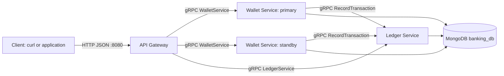

# Global Wallet Microservices: Beginner Guide

This document explains how this project works from the outside in. Start with Docker Compose, then follow one request through the services. The source code is the final authority when this guide and a description disagree.

## 1. What the project does

The project exposes a wallet API. A client can:

- Create a wallet with a currency and starting balance.
- Read a wallet balance.
- Transfer money between two wallets.
- Query the audit ledger.
- Switch gateway traffic between the primary and standby wallet service.

There are three Go services and one MongoDB database:



The primary and standby processes use different region names, but the Compose setup gives both wallet services the same MongoDB. This is useful for learning routing and failover, but it is not two independent regional databases.

## 2. The three services

### API Gateway

Source: `cmd/api-gateway/main.go`

The gateway is the public HTTP entry point. It:

1. Accepts JSON over HTTP.
2. Converts the JSON into a generated protobuf request.
3. Calls the active Wallet Service through gRPC.
4. Converts the protobuf response back into JSON.

`Gateway.getActiveWalletClient` chooses either the primary or standby wallet client. `handleFailover` changes this choice in memory. The gateway also calls the Ledger Service directly for ledger queries.

### Wallet Service

Source: `cmd/wallet-service/main.go`

This service implements the generated `WalletServiceServer` interface. It owns wallet operations:

- `CreateWallet` writes a wallet document.
- `GetBalance` reads a wallet document.
- `TransferFunds` updates two wallets, calls the Ledger Service, and stores an idempotency record.
- `HealthCheck` reports the configured region and active/standby flag.

### Ledger Service

Source: `cmd/ledger-service/main.go`

This service implements `LedgerServiceServer`. It records and reads audit entries in MongoDB. The wallet service calls `RecordTransaction` after changing wallet balances.

## 3. gRPC in this project

gRPC is the internal service-to-service protocol. It is not the same request as the public HTTP request.

### The `.proto` file is the contract

In `proto/wallet/wallet.proto`:

```proto
service WalletService {
  rpc CreateWallet (CreateWalletRequest) returns (CreateWalletResponse);
  rpc GetBalance (GetBalanceRequest) returns (GetBalanceResponse);
  rpc TransferFunds (TransferFundsRequest) returns (TransferFundsResponse);
  rpc HealthCheck (HealthRequest) returns (HealthResponse);
}
```

This declares the service name, method names, request types, and response types. `proto/ledger/ledger.proto` defines the Ledger Service in the same way.

For example, `Money` contains:

```proto
message Money {
  string currency = 1;
  int64 units = 2;
}
```

The numbers (`1`, `2`) are stable field numbers used by protobuf serialization. They are not array indexes.

### What `protoc` generates

The protobuf compiler generates Go types and helpers, including:

- `WalletServiceClient`: used by callers.
- `WalletServiceServer`: implemented by the wallet service.
- `NewWalletServiceClient`: creates a client over a gRPC connection.
- `RegisterWalletServiceServer`: publishes a server implementation.

The generated `.go` files are produced during the Docker build and are not checked into this repository.

### The client and server sides

The wallet service registers itself in `cmd/wallet-service/main.go`:

```go
grpcServer := grpc.NewServer()
walletv1.RegisterWalletServiceServer(grpcServer, srv)
grpcServer.Serve(lis)
```

The gateway creates a connection and client:

```go
conn, _ := grpc.NewClient(address,
    grpc.WithTransportCredentials(insecure.NewCredentials()))
client := walletv1.NewWalletServiceClient(conn)
```

Then the gateway calls a remote method like a normal Go method:

```go
resp, err := client.GetBalance(ctx, &walletv1.GetBalanceRequest{
    WalletId: walletID,
})
```

The call crosses the network, but protobuf and gRPC handle serialization and dispatching.

## 4. Public HTTP API

The gateway listens on port `8080` in Compose.

| Method | Path | Purpose |
|---|---|---|
| POST | `/api/v1/wallets` | Create or replace a wallet |
| GET | `/api/v1/wallets?id=alice` | Read a balance |
| POST | `/api/v1/transfers` | Transfer funds |
| GET | `/api/v1/ledger?wallet_id=alice` | Read ledger entries |
| GET | `/api/v1/cluster/status` | Check primary/standby status |
| POST | `/api/v1/cluster/failover` | Toggle the active gateway target |

Wallet and transfer calls have short gateway timeouts: about 3 seconds for wallet reads/creation and 5 seconds for transfers. Many downstream errors are returned by the gateway as HTTP 500 rather than being mapped to a more specific HTTP status.

### Important HTTP/protobuf difference

The HTTP transfer body is flat because the gateway defines its own JSON struct:

```json
{
  "idempotency_key": "transfer-alice-bob-001",
  "source_wallet_id": "alice",
  "destination_wallet_id": "bob",
  "amount": 25,
  "currency": "USD"
}
```

The gateway converts this into the protobuf shape internally:

```text
TransferFundsRequest {
  amount: Money {
    units: 25
    currency: "USD"
  }
}
```

Do not send `amount` as an object to the current HTTP gateway.

## 5. Complete example: Alice pays Bob

### Start the project

From the repository root:

```bash
docker compose up --build -d
```

The Compose setup starts MongoDB, initializes its single-node replica set, then starts the services. Check startup output with:

```bash
docker compose logs -f
```

### Create Alice and Bob

```bash
curl -X POST http://localhost:8080/api/v1/wallets \
  -H "Content-Type: application/json" \
  -d '{"wallet_id":"alice","currency":"USD","initial_balance":1000}'

curl -X POST http://localhost:8080/api/v1/wallets \
  -H "Content-Type: application/json" \
  -d '{"wallet_id":"bob","currency":"USD","initial_balance":500}'
```

The gateway routes these calls to the active wallet service. The wallet service writes documents similar to:

```json
{
  "_id": "alice",
  "currency": "USD",
  "balance": 1000,
  "updated_at": "..."
}
```

### Transfer 25 USD

```bash
curl -X POST http://localhost:8080/api/v1/transfers \
  -H "Content-Type: application/json" \
  -d '{
    "idempotency_key":"transfer-alice-bob-001",
    "source_wallet_id":"alice",
    "destination_wallet_id":"bob",
    "amount":25,
    "currency":"USD"
  }'
```

The request flow is:

1. The client sends HTTP JSON to the gateway.
2. The gateway selects the active wallet client.
3. The gateway converts JSON into `TransferFundsRequest` and calls `WalletService.TransferFunds` over gRPC.
4. Wallet Service checks `idempotency_records` for the key.
5. It conditionally debits Alice only when Alice has at least 25 USD.
6. It conditionally credits Bob only when Bob exists with USD currency.
7. Wallet Service calls `LedgerService.RecordTransaction` over gRPC.
8. Ledger Service writes an audit entry to `ledger_entries` and returns a transaction ID.
9. Wallet Service stores the idempotency key and transaction ID.
10. The gateway returns the result as JSON.

Expected balance effect:

```text
Alice: 1000 USD -> 975 USD
Bob:    500 USD -> 525 USD
```

A successful response has a status like `SUCCESS` and includes `transaction_id`, `routed_gateway`, and `handled_region`.

### Repeat the same request

Send the exact same request again with the same `idempotency_key`. The wallet service finds the existing idempotency record and returns `REJECTED_DUPLICATE` instead of applying the transfer again.

The key is the retry identity. A new key represents a new transfer attempt.

### Read the results

```bash
curl "http://localhost:8080/api/v1/wallets?id=alice"
curl "http://localhost:8080/api/v1/wallets?id=bob"
curl "http://localhost:8080/api/v1/ledger?wallet_id=alice"
```

## 6. What MongoDB stores

All services use database `banking_db`:

| Collection | Written by | Purpose |
|---|---|---|
| `wallets` | Wallet Service | Current wallet currency and balance |
| `idempotency_records` | Wallet Service | Maps a request key to a transaction ID |
| `ledger_entries` | Ledger Service | Transfer audit records |

`TransferFunds` uses MongoDB `WithTransaction` with majority write concern and snapshot read concern. Its intended sequence is idempotency lookup, debit, credit, ledger call, and idempotency insert.

The wallet service opens a MongoDB transaction before making the Ledger Service gRPC call. The Ledger Service uses its own service and MongoDB client, so this should be understood as a coordinated sequence, not assumed to be one true distributed ACID transaction.

## 7. Running and testing

Useful Makefile commands:

```bash
make up       # Start Compose in the background
make down     # Stop and remove Compose resources
make logs     # Follow service logs
make test     # Run scripts/test-e2e.sh
make clean    # Stop services and remove the Mongo volume
```

The E2E script demonstrates health checks, wallet creation, transfer, duplicate retry, balance reads, failover, and ledger queries. It is primarily a demonstration script: most curl calls print responses rather than strongly asserting every HTTP response.

## 8. Failover behavior

Check the current routing target:

```bash
curl http://localhost:8080/api/v1/cluster/status
```

Toggle the target:

```bash
curl -X POST http://localhost:8080/api/v1/cluster/failover
```

This changes an in-memory value inside the gateway process. It does not automatically detect failures, replicate data between databases, or move traffic between independent regions. Restarting the gateway resets its initial target.

## 9. Kubernetes overview

The `k8s/` files create:

- A namespace.
- A MongoDB StatefulSet and service.
- A Ledger Service deployment.
- Primary and standby Wallet Service deployments.
- An API Gateway exposed through a NodePort.

Build the images before applying the manifests, and make sure the images are available to Minikube or Kind. The Kubernetes MongoDB manifest starts MongoDB with `--replSet rs0`, while the application connection strings expect `replicaSet=rs0`; verify replica-set initialization in your cluster before troubleshooting the application services.

## 10. Caveats worth knowing

This project is a learning/demo system. The current implementation has several important boundaries:

- `CreateWallet` uses an upsert and `$set`, so creating an existing wallet can overwrite its balance and currency.
- Request validation is limited. Empty IDs, invalid amounts, and other malformed business inputs are not comprehensively rejected.
- Idempotency uses lookup-then-insert. Review unique indexes and concurrent retries before treating it as production-grade duplicate protection.
- The ledger service also uses lookup-then-insert behavior for duplicate keys.
- A single ledger document is stored per transfer; the project calls this double-entry conceptually, but does not store separate debit and credit documents.
- Ledger results are not explicitly sorted.
- Primary and standby share MongoDB in the local deployment.
- Failover is a manual in-memory route toggle.
- The project uses insecure gRPC transport inside the local deployment. Production deployments need authentication, authorization, encryption, validation, observability, and stronger failure handling.

## 11. Where to read next

- HTTP routing: `cmd/api-gateway/main.go`
- Wallet behavior and transfer sequence: `cmd/wallet-service/main.go`
- Ledger persistence: `cmd/ledger-service/main.go`
- Wallet gRPC contract: `proto/wallet/wallet.proto`
- Ledger gRPC contract: `proto/ledger/ledger.proto`
- MongoDB connection retry: `pkg/db/mongo.go`
- Local topology: `docker-compose.yml`
- Kubernetes topology: `k8s/`
- End-to-end demonstration: `scripts/test-e2e.sh`
