# CI/CD Pipeline Implementation & Deployment Guide

**Project**: Global Multi-Currency Digital Wallet & Ledger Service  
**Workflow File**: [`.github/workflows/ci.yml`](../.github/workflows/ci.yml)  
**Target Environments**: GitHub Cloud Runners (`ubuntu-latest`) & Local Self-Hosted Runner (`[self-hosted, Windows]`)  
**Container Registry**: [Docker Hub](https://hub.docker.com)  

---

## 1. Executive Overview

The Global Wallet microservices platform features an enterprise-grade, automated Continuous Integration and Continuous Deployment (CI/CD) pipeline built with **GitHub Actions**. The pipeline enforces strict contract-first validation, automated unit and race-condition safety gates, parallel multi-target Docker container image compilation, automated registry publication to Docker Hub, and continuous rolling deployments to self-hosted environments.

### Core Objectives
1. **Contract & Quality Integrity**: Ensure Protobuf contracts compile without schema drift, Go source code is formatted according to standard guidelines, and all unit and concurrent race tests pass before any merge.
2. **Optimized Build Cycles**: Leverage GitHub Actions cache backends (`type=gha`) and multi-stage Docker builds to package all 5 microservices in parallel within minutes.
3. **Semantic Artifact Versioning**: Automatically tag container images with branch names (`latest` on `main`), Git commit short SHAs (`sha-<hash>`), and semantic version tags (`vX.Y.Z`).
4. **Resilient Local Deployment**: Automatically deploy or update local Docker Compose stacks on a self-hosted Windows runner with pre-flight health checks and graceful failure handling.
5. **Noise Reduction (`paths-ignore`)**: Prevent documentation updates (`*.md`), guides, and postman collections from triggering redundant build and publish cycles.

---

## 2. Pipeline Architecture & Workflow Diagram

The pipeline consists of 9 sequential and parallelized enterprise stages executed across cloud and local runner environments:

```mermaid
flowchart TD
    subgraph Triggers["Trigger Mechanisms"]
        PR["Pull Request<br/>(main, develop)"]
        Push["Git Push<br/>(main, develop)"]
        Tag["Release Tag<br/>(v*)"]
        Manual["workflow_dispatch<br/>(Manual Trigger)"]
    end

    subgraph Phase1["Stage 1: Environment Check"]
        Env["1. env-setup-check<br/>• Toolchain verification<br/>• Dependency cache pre-warm"]
    end

    subgraph Phase2["Stage 2: Code Standards & SAST"]
        Standards["2. code-standards<br/>• gofmt verification<br/>• golangci-lint analysis<br/>• GoSec SAST security scan<br/>• SonarQube Quality Scanner"]
    end

    subgraph Phase3["Stage 3: Testing & Coverage"]
        Unit["3. unit-tests<br/>• go test -count=1<br/>• Race detector (-race)<br/>• Coverage profiling"]
        Integ["4. integration-tests<br/>• MongoDB Replica container<br/>• RabbitMQ broker container<br/>• Cross-service verification"]
        Sys["5. system-tests<br/>• E2E API Gateway testing<br/>• Health & readiness probes<br/>• JWT auth verification"]
    end

    subgraph Phase4["Stage 4: Security & Build"]
        Vuln["6. security-audit<br/>• govulncheck audit<br/>• CVE vulnerability database"]
        Build["7. build-artifacts<br/>• Multi-binary compilation<br/>• Protobuf contract verification"]
    end

    subgraph Phase5["Stage 5: Packaging & Release"]
        Pub["8. docker-publish<br/>• Matrix build (5 microservices)<br/>• Docker Hub publication<br/>• GHA cache (type=gha)"]
    end

    subgraph Phase6["Stage 6: Deployment"]
        Deploy["9. deploy<br/>• Self-hosted Windows runner<br/>• Docker daemon pre-flight check<br/>• Rolling compose stack updates"]
    end

    Triggers --> Env
    Env --> Standards
    Standards --> Unit
    Unit --> Integ
    Integ --> Sys
    Sys --> Vuln
    Vuln --> Build
    Build --> Pub
    Pub --> Deploy
```



---

## 3. Workflow Triggers & Path Filtering

The pipeline is configured in [`.github/workflows/ci.yml`](../.github/workflows/ci.yml) with path filtering to optimize resource consumption:

```yaml
on:
  push:
    branches: [main, develop]
    tags: ['v*']
    paths-ignore:
      - '**.md'
      - 'docs/**'
      - 'LICENSE'
      - 'SECURITY.md'
      - '.gitignore'
      - 'postman/**'
  pull_request:
    branches: [main, develop]
    paths-ignore:
      - '**.md'
      - 'docs/**'
      - 'LICENSE'
      - 'SECURITY.md'
      - '.gitignore'
      - 'postman/**'
  workflow_dispatch:
```

### Trigger Matrix

| Event | Branches / Tags | Stages Executed | Purpose |
|---|---|---|---|
| `pull_request` | `main`, `develop` | Stages 1 through 7 (`env-setup-check` $\rightarrow$ `build-artifacts`) | Full quality, SAST security, and test verification gate before code merge |
| `push` | `develop` | Stages 1 through 7 (`env-setup-check` $\rightarrow$ `build-artifacts`) | Continuous verification on active integration branch |
| `push` | `main` | Stages 1 through 9 (`env-setup-check` $\rightarrow$ `deploy`) | Full verification, production container packaging, and local rolling deployment |
| `push` (tag) | `refs/tags/v*` | Stages 1 through 9 (`env-setup-check` $\rightarrow$ `deploy`) | Release creation with semantic version container tagging |
| `workflow_dispatch` | Any branch | Stages 1 through 9 (`env-setup-check` $\rightarrow$ `deploy`) | On-demand manual triggering from GitHub Actions Web UI |

> [!NOTE]
> **Path Filtering (`paths-ignore`)**: Any commits that strictly update documentation, markdown files, licenses, `.gitignore`, or Postman test files bypass the pipeline entirely, preventing unnecessary test runs and registry build charges.

---

## 4. Pipeline Jobs & Execution Stages

### Stage 1: Environment Setup Check (`env-setup-check`)
* **Runner**: `ubuntu-latest`
* **Purpose**: Verifies that the build environment satisfies minimum compiler and toolchain prerequisites, downloads and hashes `go.mod` / `go.sum`, and caches Go module dependencies for downstream parallel jobs.
* **Execution Steps**:
  1. Source checkout (`actions/checkout@v4`).
  2. Setup Go compiler (`actions/setup-go@v5`) with caching enabled.
  3. Verify Go version (`go version`) and module download (`go mod download`).
  4. Module tidy check (`go mod tidy && git diff --exit-code go.mod go.sum`).

---

### Stage 2: Code Standards & Static Security Check (`code-standards`)
* **Runner**: `ubuntu-latest`
* **Purpose**: Enforces code style, static analysis linters, SAST security analysis, and SonarQube quality gate compliance.
* **Execution Steps**:
  1. **Source Checkout**: `actions/checkout@v4` with full git history (`fetch-depth: 0`).
  2. **Go Toolchain**: `actions/setup-go@v5`.
  3. **Protobuf Compiler**: Installs system `protobuf-compiler` alongside `protoc-gen-go` and `protoc-gen-go-grpc`.
  4. **Protobuf Contract Compilation**: Compiles `.proto` definitions to guarantee contract validity.
  5. **Formatting Gate**: Runs `gofmt -l .` to ensure 100% adherence to standard Go format.
  6. **GoSec SAST Scan**: Runs `securego/gosec` to scan for security vulnerabilities (e.g. hardcoded secrets, unsafe memory access, SQL/NoSQL injection vectors).
  7. **SonarQube Quality Scanner**: Runs `sonarsource/sonar-scanner-cli` targeting SonarQube Server or SonarCloud using `sonar-project.properties`.

---

### Stage 3: Unit Testing & Concurrency Safety (`unit-tests`)
* **Runner**: `ubuntu-latest`
* **Purpose**: Runs all isolated package unit tests with race detection and generates coverage reports.
* **Execution Steps**:
  1. **Go Toolchain & Contracts**: Configures environment and compiles protobuf contracts.
  2. **Unit Tests**: Runs `go test ./... -count=1` to guarantee tests pass without caching.
  3. **Race Condition Detector**: Executes `go test -race ./... -count=1` to detect data races or thread contention.
  4. **Coverage Profile**: Generates `coverage.out` and publishes coverage artifacts.

---

### Stage 4: Integration Testing (`integration-tests`)
* **Runner**: `ubuntu-latest`
* **Purpose**: Tests cross-service interactions, transactional guarantees, and message queues against real containerized services.
* **Container Services**:
  - **MongoDB**: `mongo:7.0` single-node replica set.
  - **RabbitMQ**: `rabbitmq:3.13-management` message broker.
* **Execution Steps**:
  1. Service container health checks.
  2. Runs integration test suites (`go test -tags=integration ./...`).

---

### Stage 5: System End-to-End Testing (`system-tests`)
* **Runner**: `ubuntu-latest`
* **Purpose**: Validates complete customer transaction workflows across API Gateway, Auth Service, and Core Wallets.
* **Execution Steps**:
  1. Boots application microservice test instances.
  2. Tests `/healthz`, `/readyz`, and `/metrics` management endpoints.
  3. Executes end-to-end token generation, wallet creation, and multi-service fund transfer flows.

---

### Stage 6: Security Vulnerability Audit (`security-audit`)
* **Runner**: `ubuntu-latest`
* **Purpose**: Checks Go dependencies against the official Go Vulnerability Database.
* **Execution Steps**:
  1. Installs `golang.org/x/vuln/cmd/govulncheck@latest`.
  2. Runs `govulncheck ./...` to detect known CVEs in third-party packages.

---

### Stage 7: Binary Build Verification (`build-artifacts`)
* **Runner**: `ubuntu-latest`
* **Purpose**: Verifies that all 5 microservice binaries compile natively without linker errors before triggering Docker image packaging.
* **Execution Steps**:
  - Compiles `cmd/api-gateway`, `cmd/wallet-service`, `cmd/ledger-service`, `cmd/auth-service`, and `cmd/logging-service`.

---

### Stage 8: Multi-Target Container Packaging & Publishing (`docker-publish`)
* **Runner**: `ubuntu-latest`
* **Condition**: Triggered only when previous stages pass and ref is `main`, a release tag (`v*`), or manual dispatch.
* **Matrix Strategy**: 5 microservices build simultaneously in parallel:

| Service Matrix Identifier | Dockerfile Target | Container Repository |
|---|---|---|
| `wallet-api-gateway` | `api-gateway` | `${DOCKERHUB_USERNAME}/wallet-api-gateway` |
| `wallet-service` | `wallet-service` | `${DOCKERHUB_USERNAME}/wallet-service` |
| `wallet-ledger-service` | `ledger-service` | `${DOCKERHUB_USERNAME}/wallet-ledger-service` |
| `wallet-auth-service` | `auth-service` | `${DOCKERHUB_USERNAME}/wallet-auth-service` |
| `wallet-logging-service` | `logging-service` | `${DOCKERHUB_USERNAME}/wallet-logging-service` |

* **Buildx & Cache Backend**:
  ```yaml
  cache-from: type=gha
  cache-to: type=gha,mode=max
  ```
* **Automated Tagging Engine**:
  - `latest` (applied when pushing to `main`)
  - `vX.Y.Z` & `vX.Y` (applied on version tags)
  - `sha-<short>` (e.g. `sha-3685067`, applied on every build for complete audit provenance)

---

### Stage 9: Continuous Deployment to Self-Hosted Environment (`deploy`)
* **Runner**: Self-hosted Windows runner (`[self-hosted, Windows]`)
* **Shell**: Native Windows `cmd` (`shell: cmd`) to avoid PowerShell script execution policy restrictions.
* **Pre-Flight Docker Daemon Readiness Check**:
  ```cmd
  docker info >nul 2>&1
  if errorlevel 1 (
    echo ::warning::Docker daemon is not running or accessible on this Windows runner. Skipping local deployment.
    echo DOCKER_READY=false>> "%GITHUB_ENV%"
  ) else (
    echo Docker daemon is running and accessible.
    echo DOCKER_READY=true>> "%GITHUB_ENV%"
  )
  exit /b 0
  ```
* **Rolling Deployment Order**:
  1. `docker compose -f docker-compose.mongodb.yml pull && up -d` (MongoDB Replica Set)
  2. `docker compose -f docker-compose.rabbitmq.yml pull && up -d` (AMQP Broker)
  3. `docker compose -f docker-compose.auth.yml pull && up -d` (Keycloak & Auth Service)
  4. `docker compose -f docker-compose.logging.yml pull && up -d` (Logging Service & Consumer)
  5. `docker compose -f docker-compose.yml pull && up -d` (API Gateway, Wallets, Ledger)
* **Verification**: Executes `docker ps` to display live container statuses and exposed ports.

---

## 5. Dockerized Quality & Security Scanners (Local & CI)

To ensure zero dependencies are required on developer machines, SonarQube and GoSec SAST are fully dockerized with zero port collisions:

```
┌────────────────────────────────────────────────────────────────────────────────────────┐
│                        QUALITY STACK PORT ALLOCATION ARCHITECTURE                      │
├──────────────────────┬──────────────┬──────────────┬───────────────────────────────────┤
│ Container Name       │ Host Port    │ Internal Port│ Purpose                           │
├──────────────────────┼──────────────┼──────────────┼───────────────────────────────────┤
│ wallet_sonarqube     │ 9000         │ 9000         │ SonarQube Web UI & Scanner Target │
│ wallet_sonarqube_db  │ None         │ 5432         │ PostgreSQL for SonarQube Internal │
└──────────────────────┴──────────────┴──────────────┴───────────────────────────────────┘
```

### Running SonarQube Locally
1. Start the SonarQube Community server stack:
   ```bash
   docker compose -f docker-compose.quality.yml up -d
   ```
2. Open [http://localhost:9000](http://localhost:9000) (default credentials: `admin` / `admin`).
3. Generate a User Token:
   - Navigate to **User Profile** $\rightarrow$ **Security** $\rightarrow$ **Generate Token**.
4. Run the scanner script:
   - **Windows**:
     ```powershell
     .\scripts\run-sonar-scan.bat <YOUR_TOKEN>
     ```
   - **Linux / macOS**:
     ```bash
     ./scripts/run-sonar-scan.sh <YOUR_TOKEN>
     ```

### Running GoSec SAST Security Scan Locally
Run the containerized GoSec scanner directly:
- **Windows**:
  ```powershell
  .\scripts\run-sast-scan.bat
  ```
- **Linux / macOS**:
  ```bash
  ./scripts/run-sast-scan.sh
  ```

---

## 6. Configuring GitHub Secrets & Permissions

To allow GitHub Actions to build, publish, and pull container images from Docker Hub, you must configure two encrypted secrets in your GitHub repository.

### Step 5.1: Create a Docker Hub Personal Access Token (PAT)
1. Log in to [Docker Hub](https://hub.docker.com).
2. Click on your profile avatar in the upper right corner and select **Account Settings**.
3. In the left navigation menu, click **Security**.
4. Click **New Access Token**.
5. Provide a description:
   - **Access Token Description**: `github-actions-global-wallet`
   - **Access permissions**: Select **Read & Write** (or **Read, Write, Delete**).
6. Click **Generate**.
7. **Copy the generated token immediately** (it will not be shown again).

---

### Step 5.2: Configure Secrets in GitHub Repository
1. Navigate to your repository on GitHub:  
   `https://github.com/<owner>/global-wallet-microservices`
2. Click on the **Settings** tab at the top of the repository.
3. In the left sidebar, expand **Secrets and variables** and select **Actions**.
4. In the **Repository secrets** section, click **New repository secret**.
5. Add the **Username Secret**:
   - **Name**: `DOCKERHUB_USERNAME`
   - **Secret**: Your Docker Hub username (e.g., `bkojha`)
   - Click **Add secret**.
6. Click **New repository secret** again to add the **Token Secret**:
   - **Name**: `DOCKERHUB_TOKEN`
   - **Secret**: Paste the Personal Access Token generated in Step 5.1.
   - Click **Add secret**.

```
┌─────────────────────────────────────────────────────────────────────────┐
│                       GITHUB ACTIONS SECRETS MATRIX                     │
├─────────────────────┬───────────────────────────────────────────────────┤
│ Secret Name         │ Value / Example                                   │
├─────────────────────┼───────────────────────────────────────────────────┤
│ DOCKERHUB_USERNAME  │ bkojha                                            │
│ DOCKERHUB_TOKEN     │ dckr_pat_xxxxxxxxxxxxxxxxxxxxxxxxxxxx            │
└─────────────────────┴───────────────────────────────────────────────────┘
```

---

### Step 5.3: Repository Workflow Permissions
1. Under **Settings** -> **Actions** -> **General**.
2. Scroll to **Workflow permissions**.
3. Ensure **Read repository contents and packages permissions** is selected.
4. Click **Save**.

---

## 6. Self-Hosted Runner Setup (Windows)

The deployment job targets a self-hosted Windows runner registered with the labels `[self-hosted, Windows]`.

### Step 6.1: Registering the Runner
1. In your GitHub repository, go to **Settings** -> **Actions** -> **Runners**.
2. Click **New self-hosted runner**.
3. Select **Windows** as the Runner image architecture (**x64**).
4. On your Windows machine, open an administrative terminal and create the runner directory:
   ```cmd
   mkdir D:\actions-runner && cd /d D:\actions-runner
   ```
5. Download the latest runner package:
   ```powershell
   Invoke-WebRequest -Uri https://github.com/actions/runner/releases/download/v2.327.0/actions-runner-win-x64-2.327.0.zip -OutFile actions-runner.zip
   Expand-Archive -Path actions-runner.zip -DestinationPath .
   ```
6. Run the configuration script using the token provided in the GitHub UI:
   ```cmd
   config.cmd --url https://github.com/<owner>/global-wallet-microservices --token <RUNNER_REGISTRATION_TOKEN>
   ```
7. When prompted:
   - **Enter the name of runner**: Press Enter for default hostname or specify a custom name (e.g. `NANDITA`).
   - **Enter runner group**: Press Enter for default (`Default`).
   - **Enter additional labels**: `Windows`

---

### Step 6.2: Running the Runner (Interactive vs Service)

#### Option A: Interactive Mode (Recommended for Docker Desktop)
Running the runner interactively ensures it executes under your active user account (`bkojh`), giving it direct, unhindered access to Docker Desktop's named pipe (`//./pipe/docker_engine`):
```cmd
cd /d D:\actions-runner
run.cmd
```

#### Option B: Windows Service Mode
If you prefer running the runner as a continuous Windows Service:
1. Stop and uninstall any existing default service:
   ```cmd
   cd /d D:\actions-runner
   .\svc.cmd stop
   .\svc.cmd uninstall
   ```
2. Install the service under your local user account (not `NT AUTHORITY\NETWORK SERVICE`):
   ```cmd
   .\svc.cmd install .\bkojh
   ```
   *(Enter your Windows account password when prompted).*
3. Start the service:
   ```cmd
   .\svc.cmd start
   ```

> [!TIP]
> Running the service under your user account ensures the runner shares the same desktop session permissions as Docker Desktop, enabling seamless automated deployments.

---

## 7. Troubleshooting & Frequently Asked Questions

### 1. Error: `open //./pipe/docker_engine: The system cannot find the file specified`
* **Cause**: Docker Desktop is either stopped, starting up, or running in a different user session than the GitHub Actions runner.
* **Resolution**:
  1. Open and start **Docker Desktop**.
  2. Verify that `docker info` succeeds in your command prompt.
  3. The workflow's pre-flight probe automatically detects this condition and cleanly skips deployment with a warning annotation instead of failing your pipeline.

### 2. Error: `File ... cannot be loaded because running scripts is disabled on this system`
* **Cause**: Windows PowerShell default execution policy is set to `Restricted`.
* **Resolution**: The workflow explicitly uses `shell: cmd` for all deployment steps on Windows, completely bypassing PowerShell execution policy restrictions.

### 3. Error: `Process completed with exit code 1` in Readiness Step
* **Cause**: Windows `cmd` retains the exit code of `docker info` even when executing `echo`.
* **Resolution**: The step concludes with an explicit `exit /b 0`, ensuring the probe step always exits cleanly regardless of Docker's status.

### 4. Updating Documentation Triggers Full Builds
* **Cause**: Missing path filters.
* **Resolution**: Path filtering (`paths-ignore`) is configured for all markdown files (`**.md`), documentation directories (`docs/**`), licenses, and test collections.

---

## 8. Summary of Published Docker Hub Images

Once published by the pipeline, all microservice container images are publicly available under your Docker Hub namespace:

```bash
# Pull the latest production images
docker pull bkojha/wallet-api-gateway:latest
docker pull bkojha/wallet-service:latest
docker pull bkojha/wallet-ledger-service:latest
docker pull bkojha/wallet-auth-service:latest
docker pull bkojha/wallet-logging-service:latest
```

These images can be run with standard Docker Compose or deployed onto Kubernetes clusters using the manifests in [`k8s/`](../k8s/).
