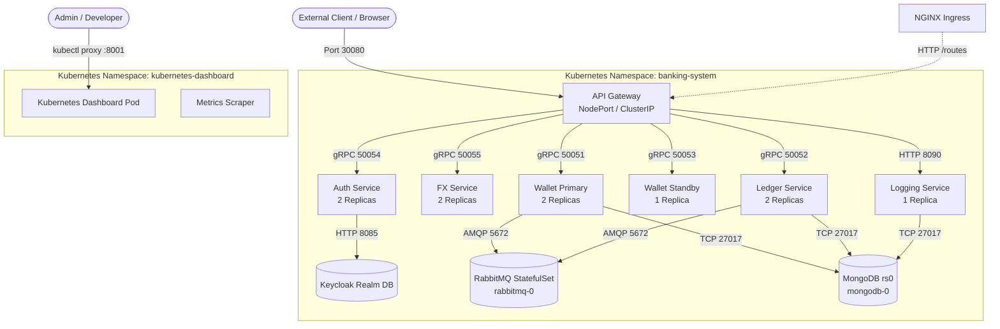

# Global Wallet Platform — Complete Kubernetes Operations Guide

Comprehensive guide for provisioning, deploying, maintaining, and observing the Global Wallet Microservices Platform on Kubernetes (Docker Desktop and Production-grade clusters).

---

## 1. Architecture & Cluster Topology

The platform deploys inside the dedicated **`banking-system`** namespace with built-in zero-trust networking, gRPC service discovery, stateful data stores, and high availability.



### Core Specifications
* **Target Namespace**: `banking-system`
* **Public Gateway Port**: NodePort `30080` (HTTP `:8080` inside cluster)
* **Metrics Gateway Port**: NodePort `30397` (Prometheus `:8081` inside cluster)
* **Internal DNS Pattern**: `<service-name>.banking-system.svc.cluster.local:<port>`

---

## 2. Manifest Inventory (`k8s/`)

The repository contains 12 declarative manifests engineered for production resilience:

| Manifest | Kind | Components & Responsibilities |
|---|---|---|
| [k8s/00-namespace.yaml](file:///c:/workarea/personal/After-equifax/global-wallet-microservices/k8s/00-namespace.yaml) | `Namespace` | Creates the isolated `banking-system` namespace. |
| [k8s/01-rbac.yaml](file:///c:/workarea/personal/After-equifax/global-wallet-microservices/k8s/01-rbac.yaml) | `ServiceAccount`, `Role`, `RoleBinding` | Least-privilege RBAC for pod management and gateway routing. |
| [k8s/02-mongodb.yaml](file:///c:/workarea/personal/After-equifax/global-wallet-microservices/k8s/02-mongodb.yaml) | `StatefulSet`, `Service` | Headless MongoDB cluster with automated `rs0` replica-set initiation sidecar. |
| [k8s/03-rabbitmq.yaml](file:///c:/workarea/personal/After-equifax/global-wallet-microservices/k8s/03-rabbitmq.yaml) | `StatefulSet`, `Service` | RabbitMQ event broker with management interface on port `15672`. |
| [k8s/04-wallet-services.yaml](file:///c:/workarea/personal/After-equifax/global-wallet-microservices/k8s/04-wallet-services.yaml) | `Deployment`, `Service` | `wallet-primary` (Active) & `wallet-standby` (Hot Standby) deployments. |
| [k8s/05-api-gateway.yaml](file:///c:/workarea/personal/After-equifax/global-wallet-microservices/k8s/05-api-gateway.yaml) | `Deployment`, `Service` | Dual-replica HTTP API Gateway exposed via NodePort `30080`. |
| [k8s/06-ledger-service.yaml](file:///c:/workarea/personal/After-equifax/global-wallet-microservices/k8s/06-ledger-service.yaml) | `Deployment`, `Service` | Immutable transaction ledger with gRPC port `50052`. |
| [k8s/07-logging-service.yaml](file:///c:/workarea/personal/After-equifax/global-wallet-microservices/k8s/07-logging-service.yaml) | `Deployment`, `Service` | Central audit logging engine with REST port `8090`. |
| [k8s/08-ingress.yaml](file:///c:/workarea/personal/After-equifax/global-wallet-microservices/k8s/08-ingress.yaml) | `Ingress` | NGINX routing rules for `/api/v1`, `/auth`, `/realms`, and `/api/v1/fx`. |
| [k8s/09-configmap-secrets.yaml](file:///c:/workarea/personal/After-equifax/global-wallet-microservices/k8s/09-configmap-secrets.yaml) | `ConfigMap`, `Secret` | Injects JWT keys, DB URIs, and service discovery environment variables. |
| [k8s/10-hpa-pdb.yaml](file:///c:/workarea/personal/After-equifax/global-wallet-microservices/k8s/10-hpa-pdb.yaml) | `HorizontalPodAutoscaler`, `PodDisruptionBudget` | Auto-scaling (CPU > 75%) and disruption protection during node maintenance. |
| [k8s/11-auth-service.yaml](file:///c:/workarea/personal/After-equifax/global-wallet-microservices/k8s/11-auth-service.yaml) | `ConfigMap`, `Deployment`, `Service` | Keycloak IAM with realm import + Go `auth-service` (OAuth2/OIDC). |
| [k8s/12-fx-service.yaml](file:///c:/workarea/personal/After-equifax/global-wallet-microservices/k8s/12-fx-service.yaml) | `Deployment`, `Service` | Multi-currency FX engine with rate caching and circuit breakers. |

---

## 3. Prerequisites & Environment Setup

### 3.1 Enabling Kubernetes in Docker Desktop (Windows)
1. Open **Docker Desktop Settings** (gear icon).
2. Go to the **Kubernetes** section in the left navigation.
3. Check **Enable Kubernetes** and click **Apply & Restart**.
4. Allocate recommended resources under **Settings > Resources**:
   * **CPUs**: at least 4 cores.
   * **Memory**: at least 6 GB (8 GB recommended).
5. Verify in PowerShell:
   ```powershell
   kubectl config current-context
   # Expected output: docker-desktop
   ```

### 3.2 Pre-building Local Docker Images
Kubernetes pulls local images from Docker Desktop's daemon cache when `imagePullPolicy: IfNotPresent` is set:
```powershell
docker compose build
```

---

## 4. Execution & Deployment Methods

### Method A: Automated CI/CD Pipeline (Recommended)
Every git push to `main` or `feature/k8s` automatically triggers `.github/workflows/ci.yml`.
The job **`deploy-k8s`** executes on your local self-hosted runner and performs:
1. Manifest application: `kubectl apply -f k8s/`
2. Rollout readiness wait for all 10+ deployments.
3. Automated smoke testing against `http://localhost:30080/healthz`.

### Method B: Automated CLI Script
From the project root, run the preconfigured deployment script:

**On Windows (PowerShell / Command Prompt):**
```powershell
.\scripts\deploy-k8s.bat
```

**Using the Makefile:**
```powershell
make k8s-deploy
```

**Check deployment health:**
```powershell
make k8s-status
```

### Method C: Manual Step-by-Step Deployment
```powershell
# 1. Create Namespace & RBAC
kubectl apply -f k8s/00-namespace.yaml
kubectl apply -f k8s/01-rbac.yaml

# 2. Apply ConfigMaps and Secrets
kubectl apply -f k8s/09-configmap-secrets.yaml

# 3. Deploy Stateful Infrastructure
kubectl apply -f k8s/02-mongodb.yaml
kubectl apply -f k8s/03-rabbitmq.yaml

# 4. Deploy Keycloak & Auth Service
kubectl apply -f k8s/11-auth-service.yaml

# 5. Deploy Core Microservices
kubectl apply -f k8s/04-wallet-services.yaml
kubectl apply -f k8s/06-ledger-service.yaml
kubectl apply -f k8s/07-logging-service.yaml
kubectl apply -f k8s/12-fx-service.yaml

# 6. Deploy API Gateway, Ingress, and Autoscaling
kubectl apply -f k8s/05-api-gateway.yaml
kubectl apply -f k8s/08-ingress.yaml
kubectl apply -f k8s/10-hpa-pdb.yaml
```

---

## 5. Verification & Health Smoke Test

Run these verification commands in your PowerShell console:

```powershell
# View all pods in wide output
kubectl get pods -n banking-system -o wide

# View all services and exposed NodePorts
kubectl get svc -n banking-system

# Verify API Gateway Health Endpoint
curl.exe http://localhost:30080/healthz
# Response: {"status":"UP"}

# Verify Gateway Readiness
curl.exe http://localhost:30080/readyz
# Response: {"status":"READY"}

# Verify Cluster Status
curl.exe http://localhost:30080/api/v1/cluster/status
```

---

## 6. Accessing & Navigating Kubernetes Dashboard (Web UI)

### 6.1 Installation & Access Steps
If not already installed, set up the official Kubernetes Dashboard with admin credentials:

1. **Deploy Dashboard Resources:**
   ```powershell
   kubectl apply -f https://raw.githubusercontent.com/kubernetes/dashboard/v2.7.0/aio/deploy/recommended.yaml
   ```

2. **Create Admin Service Account & Binding:**
   ```powershell
   kubectl create serviceaccount dashboard-admin -n kubernetes-dashboard
   kubectl create clusterrolebinding dashboard-admin --clusterrole=cluster-admin --serviceaccount=kubernetes-dashboard:dashboard-admin
   ```

3. **Generate Bearer Token:**
   ```powershell
   kubectl create token dashboard-admin -n kubernetes-dashboard
   ```
   *(Copy the entire token output)*

4. **Launch Local Proxy:**
   ```powershell
   kubectl proxy
   ```
   *(Keep this terminal open while using the dashboard)*

5. **Open in Browser:**
   Navigate to:
   ```text
   http://localhost:8001/api/v1/namespaces/kubernetes-dashboard/services/https:kubernetes-dashboard:/proxy/
   ```
   * Select **Token**.
   * Paste your token and click **Sign in**.

---

### 6.2 Navigating the Dashboard

> [!IMPORTANT]
> **Switch the Namespace Filter:**
> When the dashboard opens, the top bar dropdown defaults to **`default`**.
> Click the dropdown next to the Kubernetes logo and select **`banking-system`** (or **`All namespaces`**). All 15 running microservice pods will immediately appear.

#### Direct Deep Link:
You can bookmark and jump straight to the pods view:
```text
http://localhost:8001/api/v1/namespaces/kubernetes-dashboard/services/https:kubernetes-dashboard:/proxy/#/pod?namespace=banking-system
```

---

### 6.3 Key UI Features & How to Use Them

| Feature | Where to Click in UI | What It Does |
|---|---|---|
| **View Real-Time Logs** | Click any Pod name &rarr; Click the **Logs icon** (document with lines) in the top right. | Streams real-time HTTP requests, gRPC calls, errors, and traces. |
| **Interactive Pod Shell (`exec`)** | Click any Pod name &rarr; Click the **Terminal icon (`>_`)** in the top right. | Opens a live shell session inside the container (`/bin/sh`). |
| **Scale Microservices** | Go to **Workloads > Deployments** &rarr; Click the three dots (`⋮`) on any service &rarr; Select **Scale**. | Dynamically increase or decrease replica count (e.g., from 2 to 4 pods). |
| **Inspect Env & Secrets** | Go to **Config and Storage > Secrets** or **Config Maps** &rarr; Select any item. | View injected environment variables, database strings, and configuration payloads. |
| **Restart Deployments** | Go to **Workloads > Deployments** &rarr; Click three dots (`⋮`) &rarr; Click **Delete** on a pod or edit the deployment YAML. | Kubelet automatically terminates and spawns fresh pods with zero downtime. |
| **Inspect Health Probes** | Click any Pod &rarr; Scroll down to the **Containers** table. | Displays current state and settings of Liveness (`/healthz`) and Readiness (`/readyz`) probes. |

---

## 7. Troubleshooting & Day-2 Operations

### 7.1 Inspecting Pod Failures
```powershell
# Get events and detailed failure reasons (e.g. OOM, failed probe)
kubectl describe pod <pod-name> -n banking-system

# View container logs
kubectl logs <pod-name> -n banking-system --tail=100

# View logs of previous crashed container instance
kubectl logs <pod-name> -n banking-system --previous
```

### 7.2 Performing a Zero-Downtime Rolling Restart
If you update a Docker image locally and want to refresh the running pods:
```powershell
kubectl rollout restart deployment/api-gateway -n banking-system
kubectl rollout restart deployment/auth-service -n banking-system
kubectl rollout restart deployment/wallet-primary -n banking-system
kubectl rollout restart deployment/ledger-service -n banking-system
kubectl rollout restart deployment/fx-service -n banking-system
```

### 7.3 Executing Commands Inside Running Containers
```powershell
# Connect into api-gateway
kubectl exec -it deployment/api-gateway -n banking-system -- /bin/sh

# Check MongoDB replica status
kubectl exec -it mongodb-0 -n banking-system -c mongodb -- mongosh --eval "rs.status()"

# Check RabbitMQ cluster status
kubectl exec -it rabbitmq-0 -n banking-system -- rabbitmqctl cluster_status
```

### 7.4 Tearing Down the Cluster
To delete all resources and free memory:
```powershell
make k8s-down
# OR
kubectl delete namespace banking-system
```
