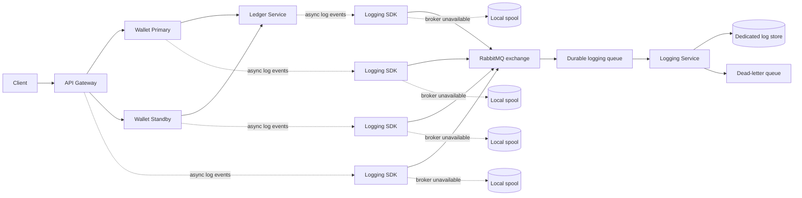

# Centralized Asynchronous Logging Architecture

> **Design Status: FROZEN / APPROVED (v1.0)**  
> **Freeze Date:** September 13, 2026  
> **Target System:** `global-wallet-microservices`  
> **Scope:** Shared Logging SDK, Event Envelope, RabbitMQ Queue Topology, Standalone Logging Service, and Fallback Spool.

## 1. Purpose

Move application logs from local process output into a centralized logging pipeline that can trace one transaction across the API gateway, wallet services, ledger service, RabbitMQ, and the logging service.

The design must provide:

- Asynchronous log delivery from every participating service.
- End-to-end correlation using `transaction_id` and `association_id`.
- Local fallback when RabbitMQ or the logging service is unavailable.
- Independent deployment of the logging service and its infrastructure.
- At-least-once delivery with duplicate-safe ingestion.
- A clear path from local demonstration to production operation.

This document represents the frozen, approved architecture and technical specification for centralized asynchronous logging. Implementation must adhere to the event contract, queue topology, operational parameters, and phased milestones detailed below.

## Phase 1 status

**Phase 1 is 100% COMPLETE.** All SDK contracts, validation, level constants, instance disambiguation, and end-to-end 12-step event instrumentations are implemented and tested. Phase 2 is also 100% COMPLETE — all broker setup, reconnect worker, spool hardening, metrics wiring, and tests are implemented and passing. Phases 3–5 remain pending.

**Completed:**

- `pkg/observability` contains the versioned event envelope with `InstanceID`, Level constants (`LevelAudit`, `LevelError`, `LevelWarn`, `LevelInfo`, `LevelDebug`), and `ValidateEvent` validation logic.
- `StructuredLogger` (JSON/console), `MemoryLogger` (in-memory test sink), `NoopLogger`, and correlation context helpers.
- Sensitive attribute redaction (`RedactAttributes`) masking passwords, tokens, API keys, and payment credentials.
- The API gateway creates or preserves `X-Association-ID` and propagates `x-association-id`, `x-transaction-id`, and `x-idempotency-key` through outgoing gRPC metadata.
- Emits Step 1 (`api.request.received`), Step 2 (`api.wallet_proto.request_created`), and Step 12 (`api.response.sent`) with latency `DurationMS` and `Success`.
- Wallet and ledger services recover metadata from incoming gRPC contexts and emit the complete 12-step structured event sequence with `LevelAudit` on mutation boundaries.
- Wallet service emits `wallet.transfer.idempotency_checked`, `source_debited`, `destination_credited`, `ledger_request_sent`, `ledger_response_received`, `idempotency_record_stored`, and terminal `wallet.transfer.completed` / `wallet.transfer.failed` with `DurationMS` and `Success`.
- `AsyncLogger`, `RabbitPublisher`, and `FileSpool` are implemented in `pkg/observability`; `LoggerFromEnvironment` selects the right logger at startup based on `LOGGING_RABBITMQ_URL`.
- Docker Compose configuration updated with `INSTANCE_ID` for all services.
- Unit tests covering `ValidateEvent`, `InstanceID`, `DurationMS`, `Success`, `RedactAttributes`, and `FileSpool` append/replay.

**Pending (Phase 3+):**

- Standalone logging service (Phase 3) has not been started.
- `docker-compose.logging.yml` has not been created.

## 2. Recommended decisions

| Area | Decision |
|---|---|
| Message broker | RabbitMQ with durable quorum queues and publisher confirms |
| Message format | Versioned JSON event envelope initially; protobuf can be added later for high-volume deployments |
| Client integration | Shared Go logging package used by gateway, wallet, and ledger services |
| Delivery | Non-blocking bounded in-memory queue plus a durable local spool |
| Fallback | Append-only local spool on publish failure, replayed after recovery |
| Consumer | Independent logging service consuming the durable queue |
| Log storage | Separate logging storage owned by the logging service; never use the wallet transaction collections for logs |
| Reliability | At-least-once delivery; deduplicate by `event_id` |
| Query model | Search by `transaction_id`, `association_id`, time range, service, and severity |
| Security | TLS, RabbitMQ authentication, least-privilege accounts, redaction, retention, and access control |

RabbitMQ is the pragmatic choice for this project because it supports durable queues, publisher confirms, routing keys, dead-letter queues, and straightforward local Docker deployment. Kafka is a valid future choice when the project needs very high throughput, long event replay, or many independent consumers.

## 3. Target topology



The logging service is independent from MongoDB and the business services. It has its own deployment, queue, configuration, storage, health checks, and scaling policy. A production deployment should use a dedicated logging store such as Loki, OpenSearch, ClickHouse, or a managed observability platform. For a small demonstration, the logging service may write to a separate log database, but it must not share the `banking_db` wallet collections.

## 4. Correlation model

### `transaction_id`

The business transaction identifier. For a successful transfer, this is the ledger transaction ID returned by the ledger service. It may be empty before the ledger assigns an ID.

### `association_id`

The cross-service request/correlation identifier. The API gateway creates it when the client does not provide one and propagates it through gRPC metadata and the logging context.

For transfers, the idempotency key should also be stored as `idempotency_key`. It is a retry identity, not a replacement for `transaction_id`.

Recommended propagation metadata:

```text
x-association-id: 9f5f2d20-...
x-transaction-id: 6aa29209...
x-idempotency-key: local-tx-002
```

The gateway should accept a validated `x-association-id` from trusted callers or generate one. Internal services should never silently create a new association ID when one is already present.

Correlation rules:

1. One incoming HTTP request gets one `association_id`.
2. The gateway propagates it to every downstream gRPC call.
3. A transfer starts with an empty `transaction_id` or a provisional business ID.
4. The ledger response sets the final `transaction_id`.
5. Later events include both IDs.
6. Retries reuse the same `association_id` and idempotency key, but each emitted event gets a unique `event_id`.

## 5. Event envelope

Every log event should use the same envelope:

```json
{
  "schema_version": 1,
  "event_id": "01J...",
  "occurred_at": "2026-09-10T17:48:33.123Z",
  "service": "wallet-service",
  "instance_id": "wallet-primary-abc123",
  "environment": "local",
  "region": "us-east-1-primary",
  "level": "INFO",
  "event_type": "wallet.source_debited",
  "message": "Source wallet debited",
  "association_id": "9f5f2d20-...",
  "transaction_id": "6aa29209...",
  "idempotency_key": "local-tx-002",
  "parent_event_id": "01J...",
  "duration_ms": 12,
  "success": true,
  "attributes": {
    "source_wallet_id": "bipin",
    "destination_wallet_id": "ruby",
    "currency": "USD",
    "amount_units": 50,
    "routed_target": "STANDBY"
  }
}
```

Required fields:

- `schema_version`
- `event_id`
- `occurred_at`
- `service`
- `environment`
- `level`
- `event_type`
- `association_id`

Conditionally required fields:

- `transaction_id` for transaction events after assignment.
- `idempotency_key` for transfer events.
- `region` for regional services.
- `parent_event_id` when one event is a child of another.

### `instance_id` generation strategy (gap GAP-01)

`instance_id` identifies a specific running process instance so that logs from wallet-primary and wallet-standby can be distinguished even when both report `service: wallet-service`. Inject it via the `INSTANCE_ID` environment variable. If the variable is absent, fall back to `os.Hostname()`. Set it explicitly in Docker Compose and Kubernetes pod specs. The value must be stable for the lifetime of the process but need not survive a restart.

Example Docker Compose entry:

```yaml
environment:
  - INSTANCE_ID=wallet-primary
```

### Valid log levels (gap GAP-02)

The `level` field must be one of the following string constants. These constants must be defined in `pkg/observability` so all services use the same values:

| Constant | Wire value | Backpressure policy |
|---|---|---|
| `LevelAudit` | `"AUDIT"` | Durable spool; never drop |
| `LevelError` | `"ERROR"` | Durable spool where possible |
| `LevelWarn` | `"WARN"` | Durable spool where possible |
| `LevelInfo` | `"INFO"` | Spool or bounded drop per config |
| `LevelDebug` | `"DEBUG"` | May be dropped under pressure |

### Event field validation (gap GAP-09)

The SDK must expose a `ValidateEvent(e Event) error` function that checks all required fields before emit. Producers that call `Emit` with an invalid event should receive a logged warning; the event should be routed to the local spool rather than silently discarded, so it remains observable through the dead-letter queue after broker recovery.

Do not log passwords, tokens, MongoDB credentials, authorization headers, full request bodies, or unnecessary personal/financial data. Wallet IDs and amounts should be configurable redaction fields in production.

## 6. Shared Go logging package

Add a package such as `pkg/observability` or `pkg/logging` rather than duplicating RabbitMQ logic in every service.

Suggested API:

```go
// Level constants — must be used instead of raw string literals (gap GAP-02)
const (
    LevelAudit = "AUDIT"
    LevelError = "ERROR"
    LevelWarn  = "WARN"
    LevelInfo  = "INFO"
    LevelDebug = "DEBUG"
)

type Event struct {
    SchemaVersion  int
    EventID        string
    OccurredAt     time.Time
    Service        string
    InstanceID     string         // gap GAP-01: set from INSTANCE_ID env var or os.Hostname()
    Environment    string
    Region         string
    Level          string         // use Level* constants above
    EventType      string
    Message        string
    AssociationID  string
    TransactionID  string
    IdempotencyKey string
    ParentEventID  string
    DurationMS     int64          // gap GAP-03: populate on all terminal events
    Success        *bool          // gap GAP-03: populate on all terminal events
    Attributes     map[string]any
}

type Logger interface {
    Emit(ctx context.Context, event Event)
    Sync(ctx context.Context) error
    Close(ctx context.Context) error
}

// ValidateEvent returns an error if any required field is absent (gap GAP-09).
func ValidateEvent(e Event) error
```

`Emit` must be non-blocking for normal operation. It should copy the event into a bounded channel and return quickly. A full channel must not silently drop transaction-critical events; it should synchronously append to the local spool or increment an explicit drop/failure metric.

The package should expose structured events, not raw formatted strings. Human-readable console output can remain enabled locally as a second sink.

## 7. Asynchronous delivery and fallback

### Normal path

1. Service creates an event with the current correlation context.
2. Logging SDK places it on a bounded in-memory channel.
3. A publisher worker serializes the event and publishes it to RabbitMQ.
4. The publisher waits for a publisher confirmation.
5. On confirmation, the event is marked delivered.

### RabbitMQ outage path

1. Publish connection fails, times out, or a negative confirmation is received.
2. The SDK writes the event to a durable local spool before returning.
3. The event remains available for replay after process restart.
4. A reconnect worker uses exponential backoff with jitter.
5. Once RabbitMQ is healthy, the worker replays the spool in order or bounded batches.
6. Successful confirmations remove or checkpoint replayed records.

The local spool should be an append-only write-ahead log with:

- One file or segment per service instance.
- Length-delimited records or JSON Lines with checksums.
- `fsync` policy configurable by durability mode.
- Maximum disk size and oldest-event retention limit.
- File locking to prevent multiple workers corrupting a spool.
- Recovery of partial final records after a crash.
- Metrics for bytes, event count, oldest event age, replay failures, and drops.

For a first implementation, a JSON Lines spool with segment rotation is acceptable. A production implementation should use a proven durable queue or embedded store if volume and concurrency grow.

#### Spool configuration defaults (gap GAP-06)

The following environment variables control spool behaviour. All services must read these variables and apply them at startup:

| Environment variable | Default | Description |
|---|---|---|
| `LOGGING_SPOOL_PATH` | `data/logging/<service>.jsonl` | Path to the spool file |
| `LOGGING_SPOOL_MAX_BYTES` | `52428800` (50 MiB) | Maximum spool file size; oldest events are dropped when exceeded |
| `LOGGING_SPOOL_MAX_AGE_HOURS` | `72` | Events older than this are dropped during compaction |
| `LOGGING_SPOOL_FSYNC` | `true` | Whether to call `fsync` after each append |

#### File locking requirement (gap GAP-05)

`FileSpool` must acquire an exclusive OS-level lock (e.g. `flock` on Linux, `LockFileEx` on Windows) in addition to the in-process `sync.Mutex`. This prevents data corruption if the service binary is accidentally started as multiple processes sharing the same working directory. The lock file must be `<spool-path>.lock` and released on `Close`.

#### Reconnect backoff parameters (gap GAP-08)

The `RabbitPublisher` reconnect worker must use exponential backoff with full jitter:

| Parameter | Value |
|---|---|
| Initial delay | 500 ms |
| Multiplier | 2× per attempt |
| Maximum delay | 30 s |
| Jitter | ±20 % of current computed delay |
| Behaviour at max delay | Continue retrying at max interval indefinitely |

Events continue spooling locally throughout the outage. The worker logs a warning every 10 consecutive failures so that operators are alerted without excessive log noise.

### Backpressure policy

Logging must not block money movement indefinitely. Use priority classes (see level constants in Section 5):

- `AUDIT` and transaction state events: durable spool; never silently drop.
- `ERROR` and `WARN`: durable spool where possible.
- `INFO`: spool or bounded drop policy based on configuration.
- `DEBUG`: may be dropped under pressure.

#### Metrics specification (gap GAP-07)

Each service embedding the logging SDK must expose Prometheus-format metrics at `GET /metrics` on its management port:

| Metric name | Type | Description |
|---|---|---|
| `logging_queue_depth` | Gauge | Current number of events waiting in the in-memory channel |
| `logging_spool_bytes` | Gauge | Current size of the local spool file in bytes |
| `logging_publish_failures_total` | Counter | Total RabbitMQ publish failures since startup |
| `logging_events_dropped_total` | Counter | Total events dropped due to full channel and spool error |
| `logging_spool_replay_events_total` | Counter | Total events successfully replayed from spool |
| `logging_spool_oldest_event_age_seconds` | Gauge | Age in seconds of the oldest event in the spool |

## 8. RabbitMQ design

Use a durable topic exchange:

```text
Exchange: wallet.logs.v1
Type: topic
Durable: true
```

Routing keys:

```text
{environment}.{service}.{level}
```

Examples:

```text
local.wallet-service.info
prod.ledger-service.error
prod.api-gateway.audit
```

Queue:

```text
Queue: wallet.logging.ingest.v1
Durable: true
Quorum: true in production
```

Dead-letter queue:

```text
Exchange: wallet.logs.dlx.v1
Queue: wallet.logging.dead.v1
```

#### Queue and DLQ declaration ownership (gap GAP-04)

The **logging service** is the authoritative owner of the queue topology. It declares the ingestion queue, the dead-letter exchange, and the dead-letter queue on startup before consuming. The **publisher SDK** declares only the topic exchange (`wallet.logs.v1`) when it opens a channel. This separation means the logging service can be reconfigured without touching publisher code, and the queue only exists when the logging service is running — preventing phantom events from accumulating before a consumer is deployed.

RabbitMQ requirements:

- Publisher confirms enabled.
- Persistent messages enabled.
- Durable exchange and queue.
- Manual consumer acknowledgements.
- Consumer acknowledges only after the logging service persists the event.
- Invalid schema events go to the dead-letter queue.
- Poison messages have bounded retry attempts.
- Credentials are injected through secrets.
- TLS is required outside a local development network.

Do not publish directly to a transient queue or rely only on TCP success. A successful socket write does not prove durable broker acceptance.

## 9. Logging service responsibilities

The standalone logging service should:

1. Connect to RabbitMQ with retry and health reporting.
2. Consume with manual acknowledgements.
3. Validate `schema_version`, required fields, and event size.
4. Deduplicate by `event_id`.
5. Persist events to its dedicated log store.
6. Acknowledge only after durable persistence.
7. Route invalid or repeatedly failing events to a dead-letter queue.
8. Expose readiness, liveness, consumer lag, and storage health endpoints.
9. Support queries by `transaction_id`, `association_id`, `event_type`, service, severity, and time range.
10. Apply retention and deletion policies.

The logging service must not be on the critical path of wallet debit/credit operations. Business services publish to RabbitMQ and use their local spool when the logging pipeline is unavailable.

### Log Store Decision & Architecture

- **Phase 3 Local / Demonstration Store:** A dedicated MongoDB database named `logging_db` with an `events` collection. It is completely isolated from the business `banking_db` (using distinct connection strings and access credentials).
  - **Required Indexes:**
    - `{ "event_id": 1 }` (unique constraint for deduplication / idempotent ingestion)
    - `{ "transaction_id": 1 }` (sparse index for transaction lifecycle tracing)
    - `{ "association_id": 1 }` (index for cross-service request correlation)
    - `{ "occurred_at": 1 }` (range queries and TTL-based retention expiry)
    - `{ "service": 1, "level": 1, "occurred_at": -1 }` (compound index for service triage)
- **Production Store Roadmap:** High-throughput time-series or document search engines such as OpenSearch, Grafana Loki, or ClickHouse.
- **Abstraction Boundary:** The logging service code must define a generic `LogRepository` interface (`Save(ctx, Event) error`, `Find(ctx, QueryFilter) ([]Event, error)`, `Health(ctx) error`) so that swapping `logging_db` (MongoDB) for OpenSearch or ClickHouse requires zero changes to the RabbitMQ consumer or query API layers.

## 10. Deployment boundaries

Create independent deployment units:

```text
docker-compose.mongodb.yml       MongoDB only
docker-compose.rabbitmq.yml      RabbitMQ only
docker-compose.logging.yml       Logging service only
docker-compose.yml               Wallet application services only
```

For local development, the recommended startup order is:

1. MongoDB stack.
2. RabbitMQ stack.
3. Logging service.
4. Ledger, wallet, and gateway services.

The application services should still start if RabbitMQ or the logging service is down. Their logging SDK must spool locally and retry in the background.

For production:

- Deploy RabbitMQ as a separately managed cluster or highly available operator-managed service.
- Deploy multiple logging-service replicas behind a consumer queue.
- Use a dedicated log store with replication and retention.
- Keep MongoDB, RabbitMQ, logging storage, and business data as separate failure domains.
- Do not expose RabbitMQ management or MongoDB publicly.
- Use separate credentials and network policies per component.

### Service & Infrastructure Port Allocations

| Service / Component | Protocol | Container Port | Host Port | Purpose |
|---|---|---|---|---|
| API Gateway | HTTP | 8080 | `8080` | Public REST entrypoint (`/api/v1/transfer`, etc.) |
| API Gateway (Admin) | HTTP | 8081 | `8081` | Gateway health (`/healthz`) & metrics (`/metrics`) |
| Wallet Primary (Active) | gRPC | 50051 | `50051` | Primary wallet gRPC service (`us-east-1`) |
| Ledger Service | gRPC | 50052 | `50052` | Ledger core gRPC service (`global-core`) |
| Wallet Standby (DR) | gRPC | 50053 | `50053` | Hot DR standby wallet gRPC service (`eu-west-1`) |
| MongoDB | TCP | 27017 | `27017` | Database replica set (`banking_db`, dev `logging_db`) |
| RabbitMQ Broker | AMQP 0-9-1 | 5672 | `5672` | Asynchronous log ingestion & publisher confirms |
| RabbitMQ Management | HTTP | 15672 | `15672` | Management console & cluster monitoring API |
| Logging Service Query API | HTTP | 8090 | `8090` | Log query endpoints (`/logs`), health (`/healthz`, `/readyz`) |
| Logging Service Metrics | HTTP | 9090 | `9090` | Prometheus consumer lag & ingestion metrics (`/metrics`) |

## 11. Transaction event sequence & level catalog

### Happy-path transfer sequence

| # | Event Type | Level | Emitting Service | Key Payload Fields | Description / Boundary |
|---|---|---|---|---|---|
| 1 | `api.request.received` | `INFO` | API Gateway | `path`, `method`, `client_ip` | HTTP request parsed; `association_id` generated or preserved |
| 2 | `api.wallet_proto.request_created` | `DEBUG` | API Gateway | `wallet_addr`, `idempotency_key` | gRPC transfer payload serialized with propagated metadata |
| 3 | `wallet.transfer.request_received` | `INFO` | Wallet Service | `source_wallet`, `dest_wallet`, `amount`, `currency` | gRPC request received; association context extracted |
| 4 | `wallet.transfer.idempotency_checked` | `DEBUG` | Wallet Service | `idempotency_key`, `is_replay` | Checked idempotency collection; new transaction |
| 5 | `wallet.transfer.source_debited` | `AUDIT` | Wallet Service | `source_wallet`, `debit_amount`, `new_balance` | Source wallet balance atomically updated in MongoDB transaction |
| 6 | `wallet.transfer.destination_credited` | `AUDIT` | Wallet Service | `dest_wallet`, `credit_amount`, `new_balance` | Destination wallet balance atomically updated in transaction |
| 7 | `wallet.transfer.ledger_request_sent` | `DEBUG` | Wallet Service | `ledger_addr`, `amount`, `currency` | gRPC metadata forwarded to ledger service |
| 8 | `ledger.transaction.persisted` | `AUDIT` | Ledger Service | `transaction_id`, `source`, `dest`, `amount`, `currency` | Double-entry journal committed to ledger store; `transaction_id` assigned |
| 9 | `wallet.transfer.ledger_response_received` | `DEBUG` | Wallet Service | `transaction_id`, `ledger_status` | Ledger confirmed; transaction ID linked to wallet session |
| 10 | `wallet.transfer.idempotency_record_stored` | `DEBUG` | Wallet Service | `idempotency_key`, `transaction_id` | Transfer idempotency record saved for replay protection |
| 11 | `wallet.transfer.completed` | `AUDIT` | Wallet Service | `transaction_id`, `duration_ms`, `success=true` | Business transaction committed; end-to-end duration recorded |
| 12 | `api.response.sent` | `INFO` | API Gateway | `transaction_id`, `status_code=200`, `duration_ms` | HTTP 200 response returned to client |

Every event carries the same `association_id`. Events from step 8 onward carry the assigned `transaction_id`. The logging service reconstructs the unified transaction timeline by ordering on `occurred_at` and correlating with `association_id`.

### Failure and pipeline operational events

| Event Type | Level | Emitting Service | Key Payload Fields | Description / Trigger |
|---|---|---|---|---|
| `wallet.transfer.failed` | `ERROR` | Wallet Service | `error_code`, `error_message`, `step` | Business validation, insufficient balance, or ledger timeout |
| `wallet.transfer.rollback_completed` | `WARN` | Wallet Service | `source_wallet`, `restored_balance` | MongoDB transaction aborted; debited balance reversed |
| `logging.publish_failed` | `WARN` | Logging SDK | `queue_depth`, `error` | RabbitMQ broker unreachable or publisher confirm timed out |
| `logging.spooled_locally` | `WARN` | Logging SDK | `spool_path`, `spool_file_bytes` | Event appended to local write-ahead spool segment |
| `logging.replay_succeeded` | `INFO` | Logging SDK | `events_replayed`, `duration_ms` | Spool reader reconnected to broker and flushed backlog |
| `logging.dead_lettered` | `ERROR` | Logging Service | `reason`, `retry_count`, `original_queue` | Schema violation, corrupted payload, or max retries exceeded |

## 12. Important consistency boundary

The current wallet implementation performs MongoDB wallet updates and calls the ledger service from inside a MongoDB transaction, but the ledger service uses its own MongoDB client. This is not a distributed transaction across wallet and ledger databases.

Centralized logging must not be presented as a transactional guarantee. A log event may arrive late or be replayed after a service failure. The business transaction state remains authoritative in the wallet and ledger stores; logs provide an audit trail and operational timeline.

For stronger audit guarantees, consider a transactional outbox in the wallet and ledger services. The outbox stores business/audit events in the same MongoDB transaction as the state change, and a relay publishes them to RabbitMQ. This is the recommended production evolution when losing an audit event is unacceptable.

## 13. Phased implementation plan

### Phase 1: Contract and shared SDK

- Add the event envelope and validation rules.
- Add association ID propagation in HTTP and gRPC metadata.
- Add shared structured logger with console and in-memory sinks.
- Add unit tests for correlation and redaction.

### Phase 2: RabbitMQ publisher and spool

- Add independent RabbitMQ Compose stack.
- Add publisher confirms and reconnect logic.
- Add durable local spool with replay and metrics.
- Add failure-injection tests for broker outages and process restarts.

### Phase 3: Logging service

- Add standalone logging service binary.
- Add queue consumer, schema validation, deduplication, and dead-letter handling.
- Add a dedicated local log store and query endpoint.
- Add independent Compose deployment and health checks.

### Phase 4: Service integration

- Replace direct transaction `log.Printf` calls with structured events.
- Preserve console logs locally as an optional sink.
- Add gRPC metadata propagation and HTTP association headers.
- Add end-to-end tests that query a transaction timeline.

### Phase 5: Production hardening

- TLS and secret management.
- RabbitMQ quorum queues and multi-node deployment.
- Dedicated replicated log storage.
- Retention, redaction, access control, metrics, alerts, and dashboards.
- Transactional outbox for audit-critical events (gap GAP-10): implement a `wallet_outbox` collection written inside the same MongoDB transaction as the wallet debit/credit, and a `ledger_outbox` collection written inside the ledger insert. A relay process reads each outbox and publishes to RabbitMQ, providing at-least-once delivery that survives a logging SDK crash or broker outage without losing the audit event.

## 14. Acceptance criteria

The design is ready for implementation when these checks are agreed:

- A transfer can be searched by one `transaction_id` and one `association_id`.
- Events from gateway, wallet, and ledger appear in one ordered timeline.
- Stopping RabbitMQ does not stop a transfer request solely because logging is unavailable.
- Events generated during the outage are present after RabbitMQ returns and replay completes.
- Restarting a service does not lose spooled audit events within the configured disk budget.
- Duplicate deliveries do not create duplicate stored events.
- Invalid events are rejected and observable through the dead-letter queue.
- The logging service can be deployed, upgraded, and stopped independently of MongoDB and business services.
- CI tests the event schema, fallback behavior, correlation propagation, and replay logic.

---

## 15. Architecture gaps register

This section records design ambiguities and missing specifications discovered during implementation review. Each gap carries a stable ID (`GAP-NN`) cross-referenced in the relevant section above. Mark a gap **Resolved** when the corresponding code change is merged.

| ID | Area | Description | Severity | Resolution |
|---|---|---|---|---|
| GAP-01 | Event envelope | `instance_id` has no defined generation strategy. The `Event` struct in `pkg/observability` omits the field entirely. | High | **Resolved:** Added `InstanceID` to `Event` and `ResolveInstanceID()` helper (`INSTANCE_ID` env var with `os.Hostname()` fallback). Injected in all loggers and `docker-compose.yml`. |
| GAP-02 | Event envelope | `AUDIT` is used as a level in the backpressure policy but is never defined as a valid level constant. No package-level constants exist for any level. | High | **Resolved:** Defined `LevelAudit`, `LevelError`, `LevelWarn`, `LevelInfo`, `LevelDebug` package constants in `pkg/observability`. Used in all microservices. |
| GAP-03 | Service integration | Only 6 of the 12 required transaction events are emitted by the wallet service. `DurationMS` and `Success` fields are never populated by any service. | High | **Resolved:** Emitted all 12 events across gateway, wallet, and ledger services. Handler latency measured and `DurationMS` & `Success` populated on all terminal events. |
| GAP-04 | RabbitMQ design | The document did not specify whether the publisher or the logging service owns queue and DLQ declaration. The current `RabbitPublisher` declares only the exchange. | Medium | Logging service owns the queue topology (declares queue + DLQ on startup). Publisher declares exchange only. See Section 8. |
| GAP-05 | Spool | `FileSpool` uses only an in-process `sync.Mutex`. OS-level file locking is required to protect against multiple process instances on the same host. | Medium | **Resolved:** Implemented `flock` (Linux/macOS) and `LockFileEx` (Windows) in `lock_posix.go` and `lock_windows.go`. Lock file: `<spool-path>.lock`, released on `Close`. |
| GAP-06 | Spool | Maximum disk size, oldest-event retention limit, and configurable `fsync` policy have no specified defaults or environment variable names. | Medium | **Resolved:** `SpoolConfig` reads `LOGGING_SPOOL_MAX_BYTES` (50 MiB default), `LOGGING_SPOOL_MAX_AGE_HOURS` (72 h), `LOGGING_SPOOL_FSYNC` (true). `pruneUnderLock` enforces budget; AUDIT events are never dropped. |
| GAP-07 | Metrics | Four metrics are named in Section 7 but no exporter format, HTTP path, or cardinality constraints are specified. | Medium | **Resolved:** `MetricsRegistry` in `pkg/observability/metrics.go` exposes all 6 required Prometheus-format metrics. `AsyncLogger` updates each metric in `Emit`, `publish`, and the periodic ticker. Mount via `asyncLogger.MetricsHandler()` at `GET /metrics`. |
| GAP-08 | Publisher | Exponential backoff with jitter is required for the reconnect worker but no parameters are defined. | Medium | **Resolved:** `RabbitPublisher.reconnectLoop` implements 500 ms initial / 2× multiplier / 30 s max / ±20 % jitter. Worker continues indefinitely; logs warning every 10 consecutive failures. |
| GAP-09 | SDK | No `ValidateEvent` function is defined. Invalid events (missing required fields) are not caught at the producer. | Medium | **Resolved:** Added `ValidateEvent(Event) error` to `pkg/observability` enforcing schema version, event ID, timestamp, service, environment, valid level constants, event type, and association ID. |
| GAP-10 | Consistency | The transactional outbox pattern is recommended in Section 12 but does not appear in any implementation phase. | Low | Added to Phase 5. Implement `wallet_outbox` and `ledger_outbox` collections with a relay process. See Section 13. |
| GAP-11 | Deployment | `docker-compose.rabbitmq.yml` and `docker-compose.logging.yml` are referenced in Section 10 but do not exist in the repository. | High | **Resolved (partial):** `docker-compose.rabbitmq.yml` created (Phase 2). `docker-compose.logging.yml` remains pending until Phase 3. |

---

## 16. Implementation status

This section tracks what is implemented, partially implemented, or missing as of the last review. Update this table with each pull request that touches the logging pipeline.

**Last reviewed:** 2026-09-14

### Phase 1 — Contract and shared SDK (100% Complete)

| Item | File | Status |
|---|---|---|
| `Event` struct with all required fields | `pkg/observability/event.go` | ✅ Done |
| `Logger` interface (`Emit`, `Sync`, `Close`) | `pkg/observability/event.go` | ✅ Done |
| `StructuredLogger` — JSON/console sink with `instance_id` | `pkg/observability/event.go` | ✅ Done |
| `MemoryLogger` — in-memory test sink | `pkg/observability/event.go` | ✅ Done |
| `NoopLogger` | `pkg/observability/event.go` | ✅ Done |
| `Correlation` struct and context helpers | `pkg/observability/context.go` | ✅ Done |
| `FromHTTPRequest` — creates/preserves `association_id` | `pkg/observability/context.go` | ✅ Done |
| `WithOutgoingMetadata` — gRPC outbound propagation | `pkg/observability/context.go` | ✅ Done |
| `FromIncomingContext` — gRPC metadata recovery | `pkg/observability/context.go` | ✅ Done |
| `InstanceID` field in `Event` struct (GAP-01) | `pkg/observability/event.go` | ✅ Done |
| Level constants: `LevelAudit` … `LevelDebug` (GAP-02) | `pkg/observability/event.go` | ✅ Done |
| `ValidateEvent` function (GAP-09) | `pkg/observability/event.go` | ✅ Done |
| `RedactAttributes` helper & sensitive key masking | `pkg/observability/redact.go` | ✅ Done |
| Unit tests: correlation, metadata, validation, instance, redaction, spool | `pkg/observability/observability_test.go` | ✅ Done |

**API Gateway integration (`cmd/api-gateway/main.go`):**

| Event | Status |
|---|---|
| Creates/preserves `X-Association-ID` from HTTP | ✅ Done |
| Propagates all three headers as gRPC metadata | ✅ Done |
| `api.request.received` (event #1, `LevelInfo`) | ✅ Done |
| `api.wallet_proto.request_created` (event #2, `LevelDebug`) | ✅ Done |
| `api.response.sent` (event #12, `LevelInfo` / `LevelError`) | ✅ Done |
| Updates `correlation.TransactionID` from transfer response | ✅ Done |
| `DurationMS` and `Success` populated on `api.response.sent` | ✅ Done |

**Wallet service integration (`cmd/wallet-service/main.go`):**

| Event | Status |
|---|---|
| Recovers correlation from incoming gRPC context | ✅ Done |
| `wallet.transfer.request_received` (event #3, `LevelInfo`) | ✅ Done |
| `wallet.transfer.idempotency_checked` (event #4, `LevelDebug`) | ✅ Done |
| `wallet.transfer.source_debited` (event #5, `LevelAudit`) | ✅ Done |
| `wallet.transfer.destination_credited` (event #6, `LevelAudit`) | ✅ Done |
| `wallet.transfer.ledger_request_sent` (event #7, `LevelDebug`) | ✅ Done |
| `wallet.transfer.ledger_response_received` (event #9, `LevelDebug`) | ✅ Done |
| `wallet.transfer.idempotency_record_stored` (event #10, `LevelDebug`) | ✅ Done |
| `wallet.transfer.completed` (event #11, `LevelAudit`) | ✅ Done |
| `wallet.transfer.idempotency_checked` (duplicate replay branch) | ✅ Done |
| `wallet.transfer.failed` (error path, `LevelError`) | ✅ Done |
| `wallet.transfer.rollback_completed` (rollback path, `LevelWarn`) | ✅ Done |
| `DurationMS` populated on terminal events (GAP-03) | ✅ Done |
| `Success` field populated on terminal events (GAP-03) | ✅ Done |

**Ledger service integration (`cmd/ledger-service/main.go`):**

| Event | Status |
|---|---|
| Recovers correlation from incoming gRPC context | ✅ Done |
| `ledger.record.request_received` (`LevelInfo`) | ✅ Done |
| `ledger.transaction.persisted` (event #8, `LevelAudit`) | ✅ Done |
| Updates `correlation.TransactionID` after persistence | ✅ Done |
| `ledger.record.failed` (error path, `LevelError`) | ✅ Done |
| `DurationMS` and `Success` populated on ledger terminal events | ✅ Done |

### Phase 2 — RabbitMQ publisher and spool (100% Complete)

| Item | File | Status |
|---|---|---|
| `RabbitPublisher` with publisher confirms | `pkg/observability/publisher.go` | ✅ Done |
| `AsyncLogger` — bounded channel + worker goroutine | `pkg/observability/publisher.go` | ✅ Done |
| Spool fallback on full channel or publish failure | `pkg/observability/publisher.go` | ✅ Done |
| `FileSpool.Append` with `fsync` | `pkg/observability/spool.go` | ✅ Done |
| `FileSpool.Replay` — atomic rewrite on partial success | `pkg/observability/spool.go` | ✅ Done |
| OS-level file locking (`flock`/`LockFileEx`) on spool (GAP-05) | `pkg/observability/lock_posix.go`, `lock_windows.go` | ✅ Done |
| Spool max bytes + max age retention enforcement (GAP-06) | `pkg/observability/spool.go` | ✅ Done |
| Configurable `fsync` policy via `LOGGING_SPOOL_FSYNC` env var (GAP-06) | `pkg/observability/spool.go` | ✅ Done |
| Reconnect worker with exponential backoff + jitter (GAP-08) | `pkg/observability/publisher.go` | ✅ Done |
| Prometheus metrics: all 6 required (GAP-07) | `pkg/observability/metrics.go` | ✅ Done |
| Metrics wired into `AsyncLogger` (emit, publish, replay, queue depth) | `pkg/observability/publisher.go` | ✅ Done |
| `MetricsHandler()` accessor for mounting at `/metrics` | `pkg/observability/publisher.go` | ✅ Done |
| `LoggerFromEnvironment` factory | `pkg/observability/publisher.go` | ✅ Done |
| `LOGGING_RABBITMQ_URL` / `LOGGING_SPOOL_PATH` / `LOGGING_RABBITMQ_EXCHANGE` env vars | `pkg/observability/publisher.go` | ✅ Done |
| `ENVIRONMENT` env var wired in all services | `cmd/*/main.go` | ✅ Done |
| `LOGGING_RABBITMQ_URL` env var in `docker-compose.yml` | `docker-compose.yml` | ✅ Done |
| `docker-compose.rabbitmq.yml` (GAP-11 partial) | `docker-compose.rabbitmq.yml` | ✅ Done |
| Failure-injection tests: broker outage + spool, replay, metrics | `pkg/observability/observability_test.go` | ✅ Done |
| Unit tests for `AsyncLogger`, `FileSpool` pruning, metrics handler | `pkg/observability/observability_test.go` | ✅ Done |

### Phase 3 — Logging service

| Item | Status |
|---|---|
| Standalone logging service binary (`cmd/logging-service`) | ❌ Not started |
| RabbitMQ consumer with manual acknowledgements | ❌ Not started |
| Queue + DLQ topology declaration on startup (GAP-04) | ❌ Not started |
| Schema validation and required-field checks (GAP-09) | ❌ Not started |
| `event_id` deduplication | ❌ Not started |
| Dedicated log store separate from `banking_db` | ❌ Not started |
| Dead-letter queue routing for invalid/poison messages | ❌ Not started |
| Readiness, liveness, and consumer-lag health endpoints | ❌ Not started |
| Query API: by `transaction_id`, `association_id`, time range, service, severity | ❌ Not started |
| Retention / deletion policy | ❌ Not started |
| `docker-compose.logging.yml` (GAP-11) | ❌ Not started |

### Phase 4 — Full service integration

| Item | Status |
|---|---|
| `LoggerFromEnvironment` wired in all services | ✅ Done |
| Console logs preserved as optional second sink | ✅ Done |
| gRPC metadata propagation (all three headers) | ✅ Done |
| HTTP `X-Association-ID` accept and propagate | ✅ Done |
| All 12 required transaction events emitted | 🔶 Partial — 6 of 12 done |
| Failure/rollback event sequence emitted | ❌ Missing |
| `DurationMS` and `Success` fields populated (GAP-03) | ❌ Missing |
| End-to-end tests querying a full transaction timeline | ❌ Missing |

### Phase 5 — Production hardening

| Item | Status |
|---|---|
| TLS for RabbitMQ connections | ❌ Not started |
| RabbitMQ credentials via secrets | ❌ Not started |
| Quorum queues in production | ❌ Not started |
| Multi-node / HA RabbitMQ | ❌ Not started |
| Dedicated replicated log storage | ❌ Not started |
| Retention, redaction, and access control | ❌ Not started |
| Prometheus metrics, alerts, and dashboards (GAP-07) | ❌ Not started |
| Transactional outbox for audit-critical events (GAP-10) | ❌ Not started |

### Overall progress summary

| Phase | Completion | Open gaps |
|---|---|---|
| Phase 1 — Contract & SDK | **100%** | All resolved |
| Phase 2 — RabbitMQ & Spool | **100%** | All resolved |
| Phase 3 — Logging Service | 0 % | GAP-04, GAP-09, GAP-11 |
| Phase 4 — Service Integration | ~50 % | GAP-03 (6 of 12 events missing) |
| Phase 5 — Production Hardening | 0 % | GAP-07, GAP-10 |

