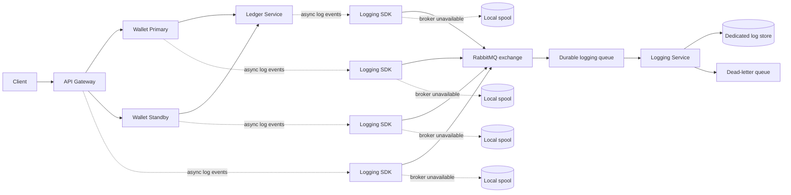

# Centralized Asynchronous Logging Architecture

## 1. Purpose

Move application logs from local process output into a centralized logging pipeline that can trace one transaction across the API gateway, wallet services, ledger service, RabbitMQ, and the logging service.

The design must provide:

- Asynchronous log delivery from every participating service.
- End-to-end correlation using `transaction_id` and `association_id`.
- Local fallback when RabbitMQ or the logging service is unavailable.
- Independent deployment of the logging service and its infrastructure.
- At-least-once delivery with duplicate-safe ingestion.
- A clear path from local demonstration to production operation.

This document is the proposed design. Implementation should follow after the event contract and operational choices are approved.

## Phase 1 status

Phase 1 is implemented in the current codebase:

- `pkg/observability` contains the versioned event envelope, structured console logger, in-memory test logger, and correlation context helpers.
- The API gateway creates or preserves `X-Association-ID` and propagates `x-association-id`, `x-transaction-id`, and `x-idempotency-key` through outgoing gRPC metadata.
- Wallet and ledger services recover the metadata from incoming gRPC contexts and emit structured boundary events.
- Existing human-readable logs remain enabled for local troubleshooting.
- RabbitMQ, durable local spooling, and the standalone logging consumer are intentionally deferred to Phases 2 and 3.

## 2. Recommended decisions

| Area | Decision |
|---|---|
| Message broker | RabbitMQ with durable quorum queues and publisher confirms |
| Message format | Versioned JSON event envelope initially; protobuf can be added later for high-volume deployments |
| Client integration | Shared Go logging package used by gateway, wallet, and ledger services |
| Delivery | Non-blocking bounded in-memory queue plus a durable local spool |
| Fallback | Append-only local spool on publish failure, replayed after recovery |
| Consumer | Independent logging service consuming the durable queue |
| Log storage | Separate logging storage owned by the logging service; never use the wallet transaction collections for logs |
| Reliability | At-least-once delivery; deduplicate by `event_id` |
| Query model | Search by `transaction_id`, `association_id`, time range, service, and severity |
| Security | TLS, RabbitMQ authentication, least-privilege accounts, redaction, retention, and access control |

RabbitMQ is the pragmatic choice for this project because it supports durable queues, publisher confirms, routing keys, dead-letter queues, and straightforward local Docker deployment. Kafka is a valid future choice when the project needs very high throughput, long event replay, or many independent consumers.

## 3. Target topology



The logging service is independent from MongoDB and the business services. It has its own deployment, queue, configuration, storage, health checks, and scaling policy. A production deployment should use a dedicated logging store such as Loki, OpenSearch, ClickHouse, or a managed observability platform. For a small demonstration, the logging service may write to a separate log database, but it must not share the `banking_db` wallet collections.

## 4. Correlation model

### `transaction_id`

The business transaction identifier. For a successful transfer, this is the ledger transaction ID returned by the ledger service. It may be empty before the ledger assigns an ID.

### `association_id`

The cross-service request/correlation identifier. The API gateway creates it when the client does not provide one and propagates it through gRPC metadata and the logging context.

For transfers, the idempotency key should also be stored as `idempotency_key`. It is a retry identity, not a replacement for `transaction_id`.

Recommended propagation metadata:

```text
x-association-id: 9f5f2d20-...
x-transaction-id: 6aa29209...
x-idempotency-key: local-tx-002
```

The gateway should accept a validated `x-association-id` from trusted callers or generate one. Internal services should never silently create a new association ID when one is already present.

Correlation rules:

1. One incoming HTTP request gets one `association_id`.
2. The gateway propagates it to every downstream gRPC call.
3. A transfer starts with an empty `transaction_id` or a provisional business ID.
4. The ledger response sets the final `transaction_id`.
5. Later events include both IDs.
6. Retries reuse the same `association_id` and idempotency key, but each emitted event gets a unique `event_id`.

## 5. Event envelope

Every log event should use the same envelope:

```json
{
  "schema_version": 1,
  "event_id": "01J...",
  "occurred_at": "2026-09-10T17:48:33.123Z",
  "service": "wallet-service",
  "instance_id": "wallet-primary-abc123",
  "environment": "local",
  "region": "us-east-1-primary",
  "level": "INFO",
  "event_type": "wallet.source_debited",
  "message": "Source wallet debited",
  "association_id": "9f5f2d20-...",
  "transaction_id": "6aa29209...",
  "idempotency_key": "local-tx-002",
  "parent_event_id": "01J...",
  "duration_ms": 12,
  "success": true,
  "attributes": {
    "source_wallet_id": "bipin",
    "destination_wallet_id": "ruby",
    "currency": "USD",
    "amount_units": 50,
    "routed_target": "STANDBY"
  }
}
```

Required fields:

- `schema_version`
- `event_id`
- `occurred_at`
- `service`
- `environment`
- `level`
- `event_type`
- `association_id`

Conditionally required fields:

- `transaction_id` for transaction events after assignment.
- `idempotency_key` for transfer events.
- `region` for regional services.
- `parent_event_id` when one event is a child of another.

Do not log passwords, tokens, MongoDB credentials, authorization headers, full request bodies, or unnecessary personal/financial data. Wallet IDs and amounts should be configurable redaction fields in production.

## 6. Shared Go logging package

Add a package such as `pkg/observability` or `pkg/logging` rather than duplicating RabbitMQ logic in every service.

Suggested API:

```go
type Event struct {
    SchemaVersion  int
    EventID        string
    OccurredAt     time.Time
    Service        string
    Environment    string
    Region         string
    Level          string
    EventType      string
    Message        string
    AssociationID  string
    TransactionID  string
    IdempotencyKey string
    ParentEventID  string
    Attributes     map[string]any
}

type Logger interface {
    Emit(ctx context.Context, event Event)
    Sync(ctx context.Context) error
    Close(ctx context.Context) error
}
```

`Emit` must be non-blocking for normal operation. It should copy the event into a bounded channel and return quickly. A full channel must not silently drop transaction-critical events; it should synchronously append to the local spool or increment an explicit drop/failure metric.

The package should expose structured events, not raw formatted strings. Human-readable console output can remain enabled locally as a second sink.

## 7. Asynchronous delivery and fallback

### Normal path

1. Service creates an event with the current correlation context.
2. Logging SDK places it on a bounded in-memory channel.
3. A publisher worker serializes the event and publishes it to RabbitMQ.
4. The publisher waits for a publisher confirmation.
5. On confirmation, the event is marked delivered.

### RabbitMQ outage path

1. Publish connection fails, times out, or a negative confirmation is received.
2. The SDK writes the event to a durable local spool before returning.
3. The event remains available for replay after process restart.
4. A reconnect worker uses exponential backoff with jitter.
5. Once RabbitMQ is healthy, the worker replays the spool in order or bounded batches.
6. Successful confirmations remove or checkpoint replayed records.

The local spool should be an append-only write-ahead log with:

- One file or segment per service instance.
- Length-delimited records or JSON Lines with checksums.
- `fsync` policy configurable by durability mode.
- Maximum disk size and oldest-event retention limit.
- File locking to prevent multiple workers corrupting a spool.
- Recovery of partial final records after a crash.
- Metrics for bytes, event count, oldest event age, replay failures, and drops.

For a first implementation, a JSON Lines spool with segment rotation is acceptable. A production implementation should use a proven durable queue or embedded store if volume and concurrency grow.

### Backpressure policy

Logging must not block money movement indefinitely. Use priority classes:

- `AUDIT` and transaction state events: durable spool; never silently drop.
- `ERROR` and `WARN`: durable spool where possible.
- `INFO`: spool or bounded drop policy based on configuration.
- `DEBUG`: may be dropped under pressure.

The service should expose `logging_queue_depth`, `logging_spool_bytes`, `logging_publish_failures`, and `logging_events_dropped` metrics.

## 8. RabbitMQ design

Use a durable topic exchange:

```text
Exchange: wallet.logs.v1
Type: topic
Durable: true
```

Routing keys:

```text
{environment}.{service}.{level}
```

Examples:

```text
local.wallet-service.info
prod.ledger-service.error
prod.api-gateway.audit
```

Queue:

```text
Queue: wallet.logging.ingest.v1
Durable: true
Quorum: true in production
```

Dead-letter queue:

```text
Exchange: wallet.logs.dlx.v1
Queue: wallet.logging.dead.v1
```

RabbitMQ requirements:

- Publisher confirms enabled.
- Persistent messages enabled.
- Durable exchange and queue.
- Manual consumer acknowledgements.
- Consumer acknowledges only after the logging service persists the event.
- Invalid schema events go to the dead-letter queue.
- Poison messages have bounded retry attempts.
- Credentials are injected through secrets.
- TLS is required outside a local development network.

Do not publish directly to a transient queue or rely only on TCP success. A successful socket write does not prove durable broker acceptance.

## 9. Logging service responsibilities

The standalone logging service should:

1. Connect to RabbitMQ with retry and health reporting.
2. Consume with manual acknowledgements.
3. Validate `schema_version`, required fields, and event size.
4. Deduplicate by `event_id`.
5. Persist events to its dedicated log store.
6. Acknowledge only after durable persistence.
7. Route invalid or repeatedly failing events to a dead-letter queue.
8. Expose readiness, liveness, consumer lag, and storage health endpoints.
9. Support queries by `transaction_id`, `association_id`, `event_type`, service, severity, and time range.
10. Apply retention and deletion policies.

The logging service must not be on the critical path of wallet debit/credit operations. Business services publish to RabbitMQ and use their local spool when the logging pipeline is unavailable.

## 10. Deployment boundaries

Create independent deployment units:

```text
docker-compose.mongodb.yml       MongoDB only
docker-compose.rabbitmq.yml      RabbitMQ only
docker-compose.logging.yml       Logging service only
docker-compose.yml               Wallet application services only
```

For local development, the recommended startup order is:

1. MongoDB stack.
2. RabbitMQ stack.
3. Logging service.
4. Ledger, wallet, and gateway services.

The application services should still start if RabbitMQ or the logging service is down. Their logging SDK must spool locally and retry in the background.

For production:

- Deploy RabbitMQ as a separately managed cluster or highly available operator-managed service.
- Deploy multiple logging-service replicas behind a consumer queue.
- Use a dedicated log store with replication and retention.
- Keep MongoDB, RabbitMQ, logging storage, and business data as separate failure domains.
- Do not expose RabbitMQ management or MongoDB publicly.
- Use separate credentials and network policies per component.

## 11. Transaction event sequence

A successful transfer should produce events similar to:

```text
1. api.request.received
2. api.wallet_proto.request_created
3. wallet.transfer.request_received
4. wallet.transfer.idempotency_checked
5. wallet.transfer.source_debited
6. wallet.transfer.destination_credited
7. wallet.transfer.ledger_request_sent
8. ledger.transaction.persisted
9. wallet.transfer.ledger_response_received
10. wallet.transfer.idempotency_record_stored
11. wallet.transfer.completed
12. api.response.sent
```

Every event carries the same `association_id`. Events after ledger persistence carry the same final `transaction_id`. The logging service can reconstruct the transaction timeline by sorting on `occurred_at` and using `parent_event_id` where available.

Failure sequences must also be visible:

```text
wallet.transfer.failed
wallet.transfer.rollback_completed
logging.publish_failed
logging.spooled_locally
logging.replay_succeeded
```

## 12. Important consistency boundary

The current wallet implementation performs MongoDB wallet updates and calls the ledger service from inside a MongoDB transaction, but the ledger service uses its own MongoDB client. This is not a distributed transaction across wallet and ledger databases.

Centralized logging must not be presented as a transactional guarantee. A log event may arrive late or be replayed after a service failure. The business transaction state remains authoritative in the wallet and ledger stores; logs provide an audit trail and operational timeline.

For stronger audit guarantees, consider a transactional outbox in the wallet and ledger services. The outbox stores business/audit events in the same MongoDB transaction as the state change, and a relay publishes them to RabbitMQ. This is the recommended production evolution when losing an audit event is unacceptable.

## 13. Phased implementation plan

### Phase 1: Contract and shared SDK

- Add the event envelope and validation rules.
- Add association ID propagation in HTTP and gRPC metadata.
- Add shared structured logger with console and in-memory sinks.
- Add unit tests for correlation and redaction.

### Phase 2: RabbitMQ publisher and spool

- Add independent RabbitMQ Compose stack.
- Add publisher confirms and reconnect logic.
- Add durable local spool with replay and metrics.
- Add failure-injection tests for broker outages and process restarts.

### Phase 3: Logging service

- Add standalone logging service binary.
- Add queue consumer, schema validation, deduplication, and dead-letter handling.
- Add a dedicated local log store and query endpoint.
- Add independent Compose deployment and health checks.

### Phase 4: Service integration

- Replace direct transaction `log.Printf` calls with structured events.
- Preserve console logs locally as an optional sink.
- Add gRPC metadata propagation and HTTP association headers.
- Add end-to-end tests that query a transaction timeline.

### Phase 5: Production hardening

- TLS and secret management.
- RabbitMQ quorum queues and multi-node deployment.
- Dedicated replicated log storage.
- Retention, redaction, access control, metrics, alerts, and dashboards.
- Transactional outbox for audit-critical events.

## 14. Acceptance criteria

The design is ready for implementation when these checks are agreed:

- A transfer can be searched by one `transaction_id` and one `association_id`.
- Events from gateway, wallet, and ledger appear in one ordered timeline.
- Stopping RabbitMQ does not stop a transfer request solely because logging is unavailable.
- Events generated during the outage are present after RabbitMQ returns and replay completes.
- Restarting a service does not lose spooled audit events within the configured disk budget.
- Duplicate deliveries do not create duplicate stored events.
- Invalid events are rejected and observable through the dead-letter queue.
- The logging service can be deployed, upgraded, and stopped independently of MongoDB and business services.
- CI tests the event schema, fallback behavior, correlation propagation, and replay logic.
