# Next-Level Architectural & Operational Improvement Roadmap

**Project**: Global Multi-Currency Digital Wallet & Ledger Service  
**Status**: In Progress  
**Last Updated**: October 2026  

---

## 1. Executive Summary & Purpose

Following the successful completion of the **Production Readiness Audit** (Phases 1–4, covering ACID transactional outbox, zero-trust mTLS, high-availability failover consensus, OpenTelemetry tracing, and cryptographic double-entry ledger verification), this roadmap defines the next evolution of the platform.

The goal is to elevate the platform from a single-cluster microservice suite to an enterprise-grade global banking core with:
1. **100% Cloud-Native & Kubernetes Completeness** across all 6 microservices + Keycloak IdP.
2. **Distributed Cache Invalidation & Resilient Leasing** for horizontal scale.
3. **Resilience, Circuit Breaking & Graceful Fallback** under network partitioning.
4. **Core Banking & Financial Product Capabilities** (Multi-currency pots, payment rails, velocity limits).
5. **Developer Experience, API Governance & External Compliance** (Swagger/OpenAPI, Merkle root checkpointing, operational CLI).

---

## 2. Strategic Pillars & Workstreams

```mermaid
graph TD
    A[Global Wallet Platform] --> P1[Pillar 1: Kubernetes & GitOps Completeness]
    A --> P2[Pillar 2: Distributed Caching & Event Bus]
    A --> P3[Pillar 3: Resilience & Circuit Breaking]
    A --> P4[Pillar 4: Core Banking & Product Expansion]
    A --> P5[Pillar 5: Developer Experience & Compliance]

    P1 --> K1[Auth & FX Manifests]
    P1 --> K2[Ingress & Secret Unification]
    P1 --> K3[HPA & PDB Coverage]

    P2 --> C1[AMQP Invalidation Bus]
    P2 --> C2[L2 Redis Adapter]
    P2 --> C3[Distributed Outbox Lease]

    P3 --> R1[Sony Gobreaker on Inter-Service RPCs]
    P3 --> R2[FX Provider Stale Fallbacks]
    P3 --> R3[Adaptive Rate Limiting]

    P4 --> B1[Multi-Currency Pots per Wallet]
    P4 --> B2[Velocity Limits Engine]
    P4 --> B3[Deposit & Withdraw External Rails]

    P5 --> D1[OpenAPI 3.0 & Swagger UI]
    P5 --> D2[Unified CLI walletctl]
    P5 --> D3[Merkle Root Ledger Checkpoints]
```

---

## 3. Detailed Progress Tracker & Checklist

### Pillar 1: Kubernetes & Cloud-Native Completeness
*Focus: Ensure every microservice, identity provider, and route has enterprise K8s manifests.*

- [x] **K8S-01: Standalone `auth-service` & `keycloak` Manifests (`k8s/11-auth-service.yaml`)**
  - [x] ConfigMap for `wallet-realm-realm.json` OIDC realm import.
  - [x] Keycloak StatefulSet/Deployment & ClusterIP service on `:8085`.
  - [x] Non-root `auth-service` Deployment (2 replicas, ports `50054` & `9095`).
  - [x] Liveness (`/healthz`) and readiness probes on management port `:9095`.
  - [x] ClusterIP service for internal gRPC & metrics routing.
- [x] **K8S-02: Standalone `fx-service` Manifests (`k8s/12-fx-service.yaml`)**
  - [x] Deployment with 2 replicas running `wallet-system/fx-service:latest`.
  - [x] Port exposure: `50055` (gRPC), `8086` (B2B HTTP REST), `9096` (Metrics/Health).
  - [x] Non-root security context (`10001:10001`, `drop: ["ALL"]`, `allowPrivilegeEscalation: false`).
  - [x] Probes on `:9096/healthz`.
  - [x] ClusterIP service mapping gRPC, HTTP, and metrics ports.
- [x] **K8S-03: Inter-Service Service Discovery & Wiring Updates**
  - [x] Update `k8s/04-wallet-services.yaml` with `FX_SERVICE_ADDR: "fx-service:50055"`.
  - [x] Update `k8s/05-api-gateway.yaml` with `AUTH_SERVICE_ADDR: "auth-service:50054"` and `FX_SERVICE_ADDR: "fx-service:50055"`.
- [x] **K8S-04: Ingress & Edge Routing Expansion (`k8s/08-ingress.yaml`)**
  - [x] Expose Keycloak authentication endpoints (`/auth`, `/realms`).
  - [x] Expose FX Engine B2B endpoints (`/api/v1/fx/b2b`).
  - [x] Ensure TLS termination and routing rules are configured.
- [x] **K8S-05: ConfigMap, Secrets & Autoscaling (`k8s/09-configmap-secrets.yaml`, `k8s/10-hpa-pdb.yaml`)**
  - [x] Inject FX default spreads, sync intervals, and provider keys.
  - [x] Inject Auth credentials, Keycloak secrets, and client IDs.
  - [x] Add HPA (`minReplicas: 2`, `maxReplicas: 6`) for `auth-service` and `fx-service`.
  - [x] Add PDB (`minAvailable: 1`) for `auth-service` and `fx-service`.
- [x] **K8S-06: `auth-service` Management & Observability Harmonization**
  - [x] Add HTTP management server on `METRICS_PORT` (`:9095`) with `/metrics` and `/healthz`.
  - [x] Update `monitoring/prometheus.yml` scrape configs for `auth-service` (:9095) and `fx-service` (:9096).

---

### Pillar 2: Distributed Caching & Event Bus
*Focus: Scale `wallet-service` to N horizontal pods with zero stale read hazards.*

- [ ] **DIST-01: AMQP Distributed Cache Invalidation Bus**
  - [ ] Declare RabbitMQ fanout exchange `wallet.cache.events`.
  - [ ] Implement publisher in `wallet-service` emitting `balance.invalidated` on balance mutating operations.
  - [ ] Implement subscriber in `wallet-service` invalidating local `BalanceCache` across all replica pods.
- [ ] **DIST-02: Pluggable L2 Redis / Dragonfly Cache Backend**
  - [ ] Implement `DistributedCache` interface supporting either in-memory or Redis backends.
  - [ ] Add TTL and cache tag invalidation.
- [ ] **DIST-03: Distributed Outbox Relay Worker Lease**
  - [ ] Add advisory lock / lease mechanism for `LedgerRelay` to prevent multi-pod polling race conditions on high-scale shards.

---

### Pillar 3: Resilience, Circuit Breaking & Graceful Fallback
*Focus: Prevent cascade failures across network boundaries.*

- [ ] **RES-01: Circuit Breaker Interceptors (`sony/gobreaker`)**
  - [ ] Add client-side circuit breaking to API Gateway dials for Wallet, FX, and Auth.
  - [ ] Add circuit breaking to `wallet-service` for `ledger-service` and `fx-service` calls.
- [ ] **RES-02: Resilient FX Rate Stale Fallback**
  - [ ] If upstream rate providers (Frankfurter/ECB) fail or timeout, return last-known good rate marked with `stale_quote: true`.
  - [ ] Log warning and emit Prometheus metric `fx_provider_degraded_total`.
- [ ] **RES-03: Outbox Relay Exponential Backoff with Jitter**
  - [ ] Enhance outbox retry loop with full-jitter exponential backoff on consecutive ledger gRPC errors.

---

### Pillar 4: Core Banking & Financial Product Expansion
*Focus: Support multi-currency wallets, payment rails, and velocity limits.*

- [ ] **FIN-01: Multi-Currency Pots per Wallet**
  - [ ] Extend `WalletModel` to support balances map `map[string]int64` (e.g. `USD: 10000`, `EUR: 5000`).
  - [ ] Enable atomic intra-wallet currency exchanges.
- [ ] **FIN-02: Velocity Limits & Compliance Engine**
  - [ ] Add configurable 24-hour rolling volume limits and transaction rate caps per user.
  - [ ] Support KYC tier enforcement (`TIER_1`, `TIER_2`, `TIER_3`).
- [ ] **FIN-03: External Deposit & Withdrawal Rails Simulator**
  - [ ] Add `POST /api/v1/wallets/{id}/deposit` (Card/ACH/SEPA inbound simulation).
  - [ ] Add `POST /api/v1/wallets/{id}/withdraw` (External bank payout simulation).
  - [ ] Record corresponding 2-leg external settlement journal entries in `ledger-service`.
- [ ] **FIN-04: Outbound Partner Webhook Dispatcher**
  - [ ] Support merchant/partner webhook registration (`transfer.completed`, `fraud.flagged`).
  - [ ] Sign payloads with HMAC-SHA256 (`X-Wallet-Signature`) with retry worker.

---

### Pillar 5: Developer Experience, Tooling & Auditing
*Focus: Seamless operator experience and regulatory audit exports.*

- [ ] **DEV-01: OpenAPI 3.0 & Embedded Swagger UI**
  - [ ] Embed OpenAPI 3.0 definition and Swagger UI into `api-gateway` at `/swagger` and `/docs`.
- [ ] **DEV-02: Unified CLI Utility (`walletctl`)**
  - [ ] Command-line interface in Go for health inspection, token generation, failover drills, and audit verification.
- [ ] **DEV-03: Merkle Root Ledger Checkpoints**
  - [ ] Periodic Merkle root generation over batches of SHA-256 ledger entries for external regulatory attestation.

---

## 4. Current Execution Status: Track 1 (Kubernetes Completeness)

| Manifest / Component | File Path | Status |
|---|---|:---:|
| Auth Service & Keycloak | `k8s/11-auth-service.yaml` | ✅ Complete |
| FX Engine Service | `k8s/12-fx-service.yaml` | ✅ Complete |
| Wallet Service Discovery | `k8s/04-wallet-services.yaml` | ✅ Complete |
| API Gateway Discovery | `k8s/05-api-gateway.yaml` | ✅ Complete |
| Ingress Path Expansion | `k8s/08-ingress.yaml` | ✅ Complete |
| Config & Secrets Unification | `k8s/09-configmap-secrets.yaml` | ✅ Complete |
| Autoscaling & Disruption Budgets | `k8s/10-hpa-pdb.yaml` | ✅ Complete |
| Auth Service Metrics Server | `cmd/auth-service/main.go` | ✅ Complete |
| Prometheus Scrape Targets | `monitoring/prometheus.yml` | ✅ Complete |
