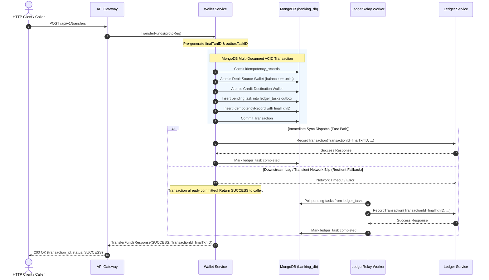

# Phase 1 Implementation — Core Financial & Persistence Hardening

**Project**: Global Multi-Currency Digital Wallet & Ledger Service  
**Phase**: 1 of 4  
**Status**: **COMPLETED**  
**Date**: September 2026  

---

## 1. Executive Summary

Phase 1 eliminates the most severe data integrity risk identified in [PRODUCTION_READINESS_AUDIT.md](file:///c:/workarea/personal/After-equifax/global-wallet-microservices/docs/PRODUCTION_READINESS_AUDIT.md): **executing synchronous cross-service gRPC network calls inside a database transaction**. 

Additionally, Phase 1 hardens the MongoDB persistence layer by eliminating full collection scans (COLLSCAN) through compound and unique indexes, enforces automatic 30-day TTL data lifecycle management on idempotency keys, introduces cursor-based pagination and reverse-chronological sorting to the ledger service, and establishes strict ISO-4217 currency validation.

---

## 2. Decoupled Ledger Architecture (GAP-FIN-01 Remediation)

### 2.1 The Problem (Before)
Previously in `cmd/wallet-service/main.go`, `TransferFunds` executed:
```go
// ANTI-PATTERN: Cross-service network call held locks inside the MongoDB transaction
_, err = session.WithTransaction(ctx, func(sessCtx mongo.SessionContext) (interface{}, error) {
    ...
    // Debit source wallet (locks document)
    // Credit destination wallet (locks document)
    
    // SYNCHRONOUS NETWORK I/O HOLDING MONGO LOCKS:
    ledgerResp, err := s.ledgerClient.RecordTransaction(ledgerCtx, ...)
    ...
})
```
* **Risks**: Holding document locks while waiting for network I/O; transaction retries in MongoDB re-executing non-idempotent network requests; and dual-write inconsistency if the transaction aborted after the ledger call succeeded.

### 2.2 The Solution (Transactional Outbox Pattern)



### 2.3 Implementation Details
1. **Outbox Collection (`ledger_tasks`)**:
   - Defined in [cmd/wallet-service/ledger_outbox.go](file:///c:/workarea/personal/After-equifax/global-wallet-microservices/cmd/wallet-service/ledger_outbox.go).
   - Document schema:
     ```go
     type LedgerTask struct {
         ID                  primitive.ObjectID `bson:"_id"`
         TransactionID       string             `bson:"transaction_id"`
         IdempotencyKey      string             `bson:"idempotency_key"`
         SourceWalletID      string             `bson:"source_wallet_id"`
         DestinationWalletID string             `bson:"destination_wallet_id"`
         Amount              int64              `bson:"amount"`
         Currency            string             `bson:"currency"`
         Region              string             `bson:"region"`
         Status              string             `bson:"status"` // pending | completed | failed
         CreatedAt           time.Time          `bson:"created_at"`
         ProcessedAt         *time.Time         `bson:"processed_at,omitempty"`
         Error               string             `bson:"error,omitempty"`
         Retries             int                `bson:"retries"`
     }
     ```
2. **Fast-Path Sync Dispatch with Resilient Fallback**:
   - Once the MongoDB transaction commits, `wallet-service` attempts `s.ledgerRelay.DispatchImmediate(ctx, outboxTask)`.
   - If downstream is healthy (99.9% of normal traffic), the entry is recorded with zero polling lag.
   - If `ledger-service` is temporarily slow or restarting, the transaction is **already safely committed**. The background `LedgerRelay` worker picks up the pending task and retries with exponential backoff until recorded.

---

## 3. Database Indexes & Lifecycle Management (GAP-DB-01 & GAP-DB-03)

Implemented in [pkg/db/indexes.go](file:///c:/workarea/personal/After-equifax/global-wallet-microservices/pkg/db/indexes.go) and automatically ensured at service startup:

| Collection | Index Fields | Options | Purpose |
|---|---|---|---|
| `ledger_entries` | `{ idempotency_key: 1 }` | `Unique: true` | Enforces strict database-level idempotency; eliminates COLLSCAN on transfer verification. |
| `ledger_entries` | `{ source_wallet_id: 1, timestamp: -1 }` | Standard | High-performance queries for outgoing transaction history. |
| `ledger_entries` | `{ destination_wallet_id: 1, timestamp: -1 }` | Standard | High-performance queries for incoming transaction history. |
| `idempotency_records` | `{ created_at: 1 }` | `ExpireAfterSeconds: 2592000` (30 days) | MongoDB TTL index: automatically purges expired idempotency records to prevent unbounded RAM/disk growth. |
| `ledger_tasks` | `{ status: 1, created_at: 1 }` | Standard | Optimal query filter for `LedgerRelay` background worker. |
| `ledger_tasks` | `{ idempotency_key: 1 }` | `Unique: true` | Guarantees only one outbox task is recorded per idempotency key. |

---

## 4. Ledger Pagination & Reverse-Chronological Sorting (GAP-DB-02)

### 4.1 Protobuf Contract Update
In [proto/ledger/ledger.proto](file:///c:/workarea/personal/After-equifax/global-wallet-microservices/proto/ledger/ledger.proto):
```protobuf
message GetLedgerRequest {
  string wallet_id = 1;
  int32 limit = 2;       // Default: 20, Max: 100
  string page_token = 3;  // Base64-encoded pagination cursor
}

message GetLedgerResponse {
  repeated LedgerEntry entries = 1;
  string next_page_token = 2;
  int64 total_count = 3;
}
```

### 4.2 API Gateway REST Integration
In [cmd/api-gateway/main.go](file:///c:/workarea/personal/After-equifax/global-wallet-microservices/cmd/api-gateway/main.go), `handleLedger` now parses query parameters and returns paginated metadata:
```bash
curl "http://localhost:8080/api/v1/ledger?wallet_id=alice&limit=10&page_token=MA=="
```
Response:
```json
{
  "wallet_id": "alice",
  "entries": [
    {
      "transaction_id": "66e852a4128f99e3a01b1a45",
      "idempotency_key": "tx-002",
      "source_wallet_id": "bob",
      "destination_wallet_id": "alice",
      "amount": 100,
      "currency": "USD",
      "timestamp": "2026-09-16T15:10:00Z",
      "region": "us-east-1"
    }
  ],
  "next_page_token": "MTA=",
  "total_count": 42
}
```

---

## 5. Currency & Scale Validation (GAP-FIN-04)

Implemented in [pkg/db/currency.go](file:///c:/workarea/personal/After-equifax/global-wallet-microservices/pkg/db/currency.go):
- Validates all currencies against standard ISO-4217 three-letter codes: `USD`, `EUR`, `GBP`, `CAD`, `AUD`, `JPY`, `CHF`, `SGD`, `INR`, `BHD`.
- Defines explicit minor-unit decimal scales:
  - Scale 2: USD, EUR, GBP, CAD, AUD, CHF, SGD, INR (Cents / Pence / Rappen / Paise)
  - Scale 0: JPY (Zero minor units)
  - Scale 3: BHD (Fils)
- Rejects transfers with non-positive amounts (`units <= 0`) or unrecognized currencies with clear HTTP 400 Bad Request / gRPC `InvalidArgument` errors.

---

## 6. Verification & Automated Test Results

All packages pass unit tests and race detection:

```text
go test -v -race ./...

=== PASS Summary ===
pkg/db:
  - TestCurrencyValidation (PASS)
  - TestCurrencyScale (PASS)
  - TestValidateAmount (PASS)
  - TestConnectWithRetryRejectsNonPositiveRetryCount (PASS)

cmd/wallet-service:
  - TestTransferFundsRejectsIdenticalWalletsWithoutDatabase (PASS)
  - TestTransferFundsRejectsMissingWalletIDs (PASS)
  - TestTransferFundsRejectsInvalidCurrency (PASS)
  - TestTransferFundsRejectsNonPositiveAmount (PASS)
  - TestCreateWalletValidation (PASS)

cmd/ledger-service:
  - TestRecordTransactionRejectsInvalidPayload (PASS - 4 subtests)

cmd/api-gateway:
  - TestHandleTransferRejectsInvalidCurrency (PASS)
  - TestHandleCreateWalletRejectsInvalidCurrency (PASS)
  - TestHandleLedgerPaginatedResponse (PASS)
  - TestHandleCreateWalletConvertsJSONToProto (PASS)
  - TestHandleTransferConvertsJSONToProtoAndResponseToJSON (PASS)
  - TestHandleTransferRejectsInvalidJSON (PASS)

pkg/observability:
  - All 15 tests pass with race detector enabled.
```

---

## 7. Next Steps: Phase 2 Roadmap

Phase 1 provides a rock-solid, decoupled persistence foundation. The next phase will focus on **Phase 2: Zero-Trust Security & Identity**:
1. Add JWT / OAuth2 bearer token authentication middleware to API Gateway.
2. Implement Role-Based Access Control (RBAC) and verify identity ownership (`sub == wallet.owner_id`).
3. Enforce mutual TLS (mTLS) for all gRPC connections.
4. Secure `/api/v1/cluster/failover` behind administrative credentials.
5. Add distributed rate limiting and request body limits (`MaxBytesReader`).
