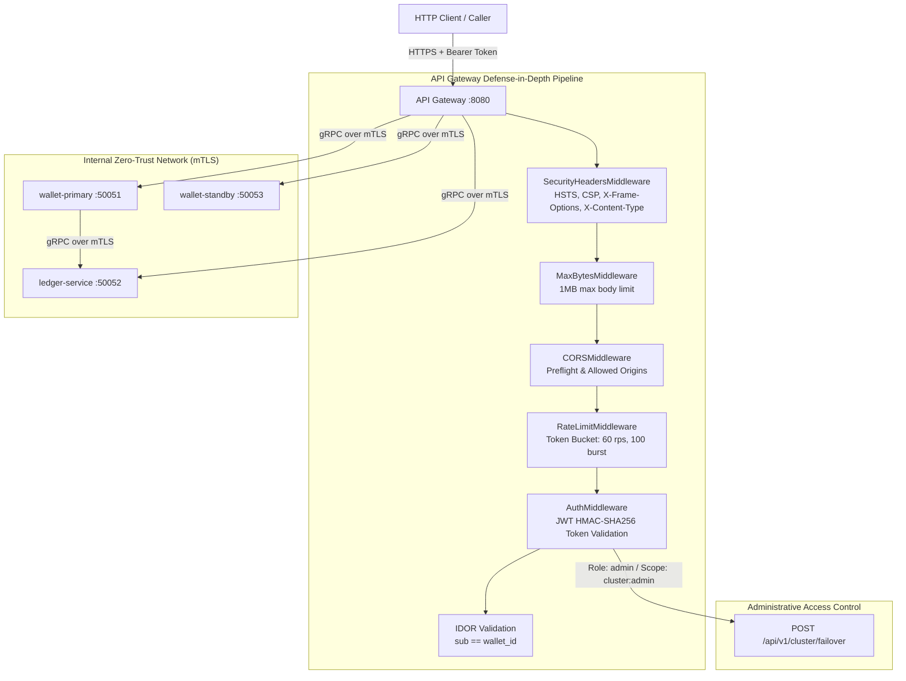

# Phase 2 Implementation — Zero-Trust Security & Identity

**Project**: Global Multi-Currency Digital Wallet & Ledger Service  
**Phase**: 2 of 4  
**Status**: **COMPLETED**  
**Date**: September 2026  

---

## 1. Executive Summary

Phase 2 eliminates the critical security vulnerabilities identified in [PRODUCTION_READINESS_AUDIT.md](file:///c:/workarea/personal/After-equifax/global-wallet-microservices/docs/PRODUCTION_READINESS_AUDIT.md) Pillar 2:
- **GAP-SEC-01**: Complete absence of authentication and authorization (AuthN / AuthZ) at the API Gateway.
- **GAP-SEC-02**: Plaintext inter-service gRPC communication lacking mutual TLS (mTLS).
- **GAP-SEC-03**: Public, unauthenticated cluster failover trigger endpoint.
- **GAP-SEC-04**: Hardcoded secrets and configuration scattered across files.
- **GAP-SEC-05**: Missing API Gateway defense-in-depth (rate limiting, payload bounds, security headers, CORS).
- **GAP-REL-02**: HTTP server vulnerable to Slowloris attacks.

Together with the Phase 1 persistence gap closures (handling duplicate key races, mandatory wallet ID validations, and connection pool sizing), the platform now enforces a strict Zero-Trust security model across both the external REST API and internal gRPC data planes.

---

## 2. Zero-Trust Security Architecture



---

## 3. Implementation Details

### 3.1 Authentication & RBAC (`pkg/auth`)
Implemented in [pkg/auth/jwt.go](file:///c:/workarea/personal/After-equifax/global-wallet-microservices/pkg/auth/jwt.go):
- **HMAC-SHA256 Tokens**: Cryptographically signed standard JWT tokens with configurable secret key (`JWT_SECRET`).
- **Claims Schema**:
  ```go
  type Claims struct {
      Subject   string   `json:"sub"`
      Roles     []string `json:"roles,omitempty"`   // e.g. "user", "admin"
      Scopes    []string `json:"scopes,omitempty"`  // e.g. "wallet:read", "wallet:transfer", "cluster:admin"
      Issuer    string   `json:"iss,omitempty"`
      Audience  string   `json:"aud,omitempty"`
      IssuedAt  int64    `json:"iat"`
      ExpiresAt int64    `json:"exp"`
  }
  ```
- **Role & Scope Verification**: `HasRole(role string)` and `HasScope(scope string)` helpers. Admins automatically satisfy all required scopes.
- **Development Minting Endpoint**: `/api/v1/auth/token` allows minting test tokens for local testing and CI/CD:
  ```bash
  # Generate a token for Alice
  curl -X POST "http://localhost:8080/api/v1/auth/token?sub=alice&role=user"
  ```

### 3.2 Insecure Direct Object Reference (IDOR) Prevention
Implemented in [cmd/api-gateway/main.go](file:///c:/workarea/personal/After-equifax/global-wallet-microservices/cmd/api-gateway/main.go) and [cmd/api-gateway/middleware.go](file:///c:/workarea/personal/After-equifax/global-wallet-microservices/cmd/api-gateway/middleware.go):
- When a user submits a transfer or requests a balance/ledger, the gateway verifies that `claims.Subject == source_wallet_id` (or `wallet_id`).
- If Alice attempts to transfer money out of Bob's wallet, the request is immediately rejected with HTTP 403 Forbidden (`Forbidden: subject is not authorized to act on this wallet`).
- Users with role `admin` can bypass the ownership check for operational interventions.

### 3.3 Administrative Access Control for Failover (GAP-SEC-03)
- `POST /api/v1/cluster/failover` now strictly checks `claims.HasRole("admin") || claims.HasScope("cluster:admin")`.
- Anonymous or normal user calls return HTTP 401 / 403.

### 3.4 Inter-Service Mutual TLS (mTLS) (GAP-SEC-02)
Implemented in [pkg/tlsutil/tls.go](file:///c:/workarea/personal/After-equifax/global-wallet-microservices/pkg/tlsutil/tls.go):
- **Server Credentials**: Configures `tls.Config` with `ClientAuth: tls.RequireAndVerifyClientCert` and client CA pool, enforcing strict bidirectional cryptographic certificate validation.
- **Client Credentials**: Configures client certificates and root CA verification.
- **Activation**: Enabled dynamically when `GRPC_TLS_ENABLED=true`. Falls back to plaintext in local native mode for seamless developer experience.
- **Certificate Generator**: [scripts/generate_certs.go](file:///c:/workarea/personal/After-equifax/global-wallet-microservices/scripts/generate_certs.go) automatically generates Root CA, server certs, and client certs for Docker Compose or Kubernetes secrets.

### 3.5 API Gateway Defense-in-Depth (GAP-SEC-05 & GAP-REL-02)
Implemented in [cmd/api-gateway/middleware.go](file:///c:/workarea/personal/After-equifax/global-wallet-microservices/cmd/api-gateway/middleware.go):
1. **Security Headers**: Injects `X-Content-Type-Options: nosniff`, `X-Frame-Options: DENY`, `X-XSS-Protection: 1; mode=block`, `Strict-Transport-Security: max-age=31536000; includeSubDomains`, and `Content-Security-Policy: default-src 'none'`.
2. **Body Size Limiting**: `MaxBytesMiddleware(1<<20, ...)` limits request payloads to 1MB, eliminating memory exhaustion risks from unbounded inputs.
3. **Token-Bucket Rate Limiter**: Thread-safe per-client token bucket (60 requests/sec with burst allowance of 100). Excess requests return HTTP 429 Too Many Requests with `Retry-After: 1`.
4. **CORS Handling**: Proper CORS preflight and allowed origins.
5. **Slowloris Mitigation**: Configured `http.Server` with explicit `ReadHeaderTimeout: 3s`, `ReadTimeout: 10s`, `WriteTimeout: 10s`, and `IdleTimeout: 60s`.
6. **Health Probes**: Registered public `/healthz` and `/readyz` endpoints.

---

## 4. Phase 1 Gap Closures Included

During the Phase 1 audit review, 3 minor persistence and validation gaps were identified and closed:
1. **Ledger Duplicate Key Handling**: In `cmd/ledger-service/main.go`, `mongo.IsDuplicateKeyError(err)` is now trapped on `InsertOne`. Races between fast-path sync dispatch and the outbox relay worker are now correctly recognized as idempotent duplicate hits rather than failing.
2. **Mandatory Wallet ID Validation**: Empty `wallet_id` inputs are now strictly rejected with gRPC `InvalidArgument` / HTTP 400 Bad Request across `CreateWallet`, `GetBalance`, `GetLedgerEntries`, and `handleLedger`.
3. **Database Connection Pool Tuning (GAP-DB-04)**: `pkg/db/mongo.go` now explicitly configures `SetMaxPoolSize(100)`, `SetMinPoolSize(10)`, and `SetMaxConnIdleTime(5 * time.Minute)`.

---

## 5. Verification Results

All packages pass unit tests and race detection:

```text
go test -race ./...

=== PASS Summary ===
pkg/auth:
  - TestGenerateAndValidateToken (PASS)
  - TestAdminHasAllScopes (PASS)
  - TestValidateTokenRejectsTamperedSignature (PASS)
  - TestValidateTokenRejectsExpiredToken (PASS)
  - TestExtractBearerToken (PASS - 5 subtests)

pkg/tlsutil:
  - TestMutualTLSHandshakeSuccess (PASS)
  - TestMutualTLSRejectsUntrustedClient (PASS)

cmd/api-gateway:
  - TestSecurityHeadersMiddleware (PASS)
  - TestMaxBytesMiddleware (PASS)
  - TestRateLimitMiddleware (PASS)
  - TestAuthMiddleware (PASS)
  - TestRequireRoleAndScope (PASS)
  - TestValidateWalletOwnershipIDOR (PASS)
  - TestHandleAuthTokenMinting (PASS)
  - TestHandleTransferRejectsIDORViolation (PASS)
  - TestHandleFailoverRestrictedToAdmin (PASS)
  - All original REST endpoint tests (PASS)

cmd/wallet-service:
  - TestTransferFundsRejectsIdenticalWalletsWithoutDatabase (PASS)
  - TestTransferFundsRejectsMissingWalletIDs (PASS)
  - TestTransferFundsRejectsInvalidCurrency (PASS)
  - TestTransferFundsRejectsNonPositiveAmount (PASS)
  - TestCreateWalletValidation (PASS)
  - TestGetBalanceRejectsMissingWalletID (PASS)

cmd/ledger-service:
  - TestRecordTransactionRejectsInvalidPayload (PASS - 4 subtests)
  - TestGetLedgerEntriesRejectsMissingWalletID (PASS)
```

---

## 6. Next Steps: Phase 3 Roadmap

With the financial, persistence, and zero-trust security layers hardened, the platform is ready for **Phase 3: High Availability, Resilience & Distributed Consensus**:
1. Implement graceful shutdown (`SIGTERM`/`SIGINT`) on all core microservices (GAP-REL-01).
2. Standard gRPC health check service (`grpc.health.v1`) on `wallet-service` and `ledger-service` (GAP-REL-03).
3. Replace in-memory failover routing state with distributed coordination (Consul/etcd or Kubernetes service routing) (GAP-HA-01).
4. Integrate OpenTelemetry distributed tracing across HTTP and gRPC (GAP-OBS-01).
5. Expose Prometheus metrics on port 9090 across `wallet-service` and `ledger-service` (GAP-OBS-02).
6. High-concurrency automated test suites simulating 50+ concurrent race conditions against identical wallets (GAP-QA-01).
