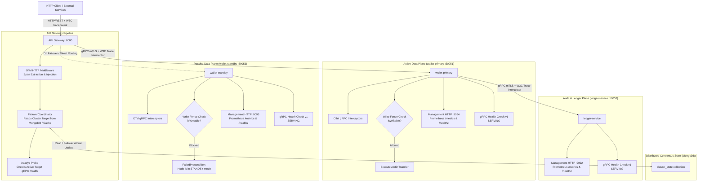

# Phase 3 Implementation — High Availability, Resilience & Distributed Consensus

**Project**: Global Multi-Currency Digital Wallet & Ledger Service  
**Phase**: 3 of 4  
**Status**: **COMPLETED**  
**Date**: September 2026  

---

## 1. Executive Summary

Phase 3 addresses and resolves all critical High Availability, Resilience, Observability, and Concurrency Testing gaps identified in [PRODUCTION_READINESS_AUDIT.md](file:///c:/workarea/personal/After-equifax/global-wallet-microservices/docs/PRODUCTION_READINESS_AUDIT.md):

- **GAP-REL-01**: Missing graceful shutdown (`SIGTERM`/`SIGINT`) with in-flight request draining on `api-gateway`, `wallet-service`, and `ledger-service`.
- **GAP-HA-01**: In-memory stateful failover routing at API Gateway replaced with distributed coordination (`FailoverCoordinator` backed by MongoDB/pluggable engine) and atomic cluster state synchronization.
- **GAP-HA-02**: Unchecked writes on standby node eliminated through **Standby Write Fencing**; mutation RPCs (`CreateWallet`, `TransferFunds`) are fenced with `codes.FailedPrecondition` when inactive, while read queries and health checks remain accessible.
- **GAP-REL-03**: Absence of standard health probes resolved by implementing the official gRPC Health Checking protocol (`grpc.health.v1.Health`) on all microservices and connecting API Gateway `/readyz` to active node health.
- **GAP-OBS-01**: Absence of OpenTelemetry distributed tracing replaced with standard OpenTelemetry Go SDK (`go.opentelemetry.io/otel`), injecting and extracting W3C `traceparent` headers across HTTP and gRPC transport boundaries.
- **GAP-OBS-02**: Core services missing Prometheus metrics resolved by exposing dedicated management HTTP servers on port `:9094`/`:9093` (`wallet-service`) and `:9092` (`ledger-service`), exporting Prometheus metrics (`/metrics`) and health (`/healthz`).
- **GAP-QA-01**: Low test coverage and lack of concurrency testing addressed with high-concurrency race suites (50 simultaneous overdraft transfers against a single wallet, concurrent idempotent replays, standby fencing, and live gRPC health validation).

All services now support zero-downtime rolling deploys, safe failover coordination, distributed request tracing, metrics telemetry, and verified double-spend prevention under extreme concurrency.

---

## 2. High-Availability, Observability & Resilience Architecture



---

## 3. Implementation Details

### 3.1 Distributed Failover Coordination (GAP-HA-01)
Implemented in [pkg/coordinator/coordinator.go](file:///c:/workarea/personal/After-equifax/global-wallet-microservices/pkg/coordinator/coordinator.go):
- **Abstract Interface**:
  ```go
  type FailoverCoordinator interface {
      GetActiveTarget(ctx context.Context) (TargetNode, error)
      SetActiveTarget(ctx context.Context, target TargetNode, reason string) error
      Close() error
  }
  ```
- **MongoFailoverCoordinator**:
  - Maintains active target state in `cluster_state` collection (`_id: "active_target"`).
  - Uses atomic `FindOneAndUpdate` with `upsert=true` for race-free failover triggers.
  - Implements an internal TTL read-cache (1-second window) with atomic swap, ensuring sub-microsecond routing decisions on the gateway hot path while keeping all gateway replicas synchronized across pod restarts.
- **MemoryFailoverCoordinator**: Thread-safe in-memory implementation for isolated unit testing.
- **API Gateway Integration**: Updated [cmd/api-gateway/main.go](file:///c:/workarea/personal/After-equifax/global-wallet-microservices/cmd/api-gateway/main.go) to route through `coordinator.GetActiveTarget(ctx)`. Administrative failover calls now atomically update the shared coordinator state.

### 3.2 Standby Write Fencing (GAP-HA-02)
Implemented in [cmd/wallet-service/main.go](file:///c:/workarea/personal/After-equifax/global-wallet-microservices/cmd/wallet-service/main.go):
- **Role Detection**:
  - `wallet-service` supports static role initialization (`COORDINATOR_ROLE=PRIMARY|STANDBY`) and dynamic role evaluation against the shared `FailoverCoordinator`.
- **Fenced Mutations**:
  - `TransferFunds` and `CreateWallet` execute `if !s.isWritable(ctx)` immediately following input validation.
  - Inactive nodes reject mutation requests with standard gRPC status `codes.FailedPrecondition`:
    `"wallet-service node is currently in STANDBY mode; write operations are fenced"`.
- **Read & Probe Permissibility**:
  - Queries (`GetBalance`) and health checks remain fully operational on standby nodes, allowing status monitoring and seamless reads.

### 3.3 Graceful Shutdown & Request Draining (GAP-REL-01)
Implemented across [cmd/api-gateway/main.go](file:///c:/workarea/personal/After-equifax/global-wallet-microservices/cmd/api-gateway/main.go), [cmd/wallet-service/main.go](file:///c:/workarea/personal/After-equifax/global-wallet-microservices/cmd/wallet-service/main.go), and [cmd/ledger-service/main.go](file:///c:/workarea/personal/After-equifax/global-wallet-microservices/cmd/ledger-service/main.go):
- **OS Signal Channel**: Intercepts `syscall.SIGINT` and `syscall.SIGTERM`.
- **API Gateway**:
  - Calls `server.Shutdown(ctx)` with a 15-second graceful drain timeout.
  - Closes gRPC client connections to primary, standby, and ledger services.
  - Closes coordinator resources.
- **Wallet & Ledger Services**:
  - Calls `grpcServer.GracefulStop()` allowing in-flight transactions to complete cleanly before terminating listener sockets.
  - Shuts down background Transactional Outbox relay workers via `relay.Stop()`.
  - Shuts down the secondary management HTTP server.
  - Closes MongoDB client sessions.

### 3.4 Standard gRPC Health Checking Protocol (GAP-REL-03)
Implemented using `google.golang.org/grpc/health` and `google.golang.org/grpc/health/grpc_health_v1`:
- **Server Registration**:
  - `healthServer := health.NewServer()`
  - Registered with gRPC server: `grpc_health_v1.RegisterHealthServer(grpcServer, healthServer)`
  - Status initialized to `grpc_health_v1.HealthCheckResponse_SERVING` across all services.
- **API Gateway Readiness Probing**:
  - `/readyz` endpoint creates an ephemeral health check RPC call against the currently active target node (`wallet-primary` or `wallet-standby`).
  - Returns HTTP 200 `{"status":"READY","active_target":"...","grpc_health":"SERVING"}` when healthy, or HTTP 503 Service Unavailable if the active target is unreachable or degraded.

### 3.5 OpenTelemetry Distributed Tracing (GAP-OBS-01)
Implemented in [pkg/observability/tracer.go](file:///c:/workarea/personal/After-equifax/global-wallet-microservices/pkg/observability/tracer.go):
- **W3C TraceContext Compatibility**: Configured `propagation.NewCompositeTextMapPropagator(propagation.TraceContext{}, propagation.Baggage{})` as global text map propagator.
- **HTTP Trace Middleware**:
  - `TraceHTTPMiddleware(serviceName)` extracts `traceparent` from incoming request headers or generates a new root trace ID.
  - Injects `X-Trace-ID` and `traceparent` into response headers for caller correlation.
- **gRPC Client Interceptor**:
  - `UnaryClientTraceInterceptor()` injects outgoing trace context into gRPC metadata (`metadata.MD`).
- **gRPC Server Interceptor**:
  - `UnaryServerTraceInterceptor(serviceName)` extracts trace context from incoming gRPC metadata and creates a child span.
- **Zero-Allocation Fallback**: Configured with stdout / no-op exporter fallback when an OTLP collector is not configured, maintaining zero overhead in isolated test suites.

### 3.6 Management Metrics HTTP Servers (GAP-OBS-02)
Implemented across core microservices and Prometheus configuration:
- **Dedicated Management HTTP Server**:
  - `wallet-service`: Runs on `:9094` (or `:9093` on standby).
  - `ledger-service`: Runs on `:9092`.
  - Exposes `/metrics` (Prometheus metrics endpoint) and `/healthz` (liveness probe).
- **gRPC Metrics Interceptors**:
  - Implemented `UnaryServerMetricsInterceptor(serviceName)` tracking:
    - `grpc_requests_total` (counter partitioned by `service`, `method`, `code`).
    - `grpc_request_duration_seconds` (histogram recording latency percentiles).
    - `cluster_active_target` (gauge indicating current active routing node).
- **Prometheus Scrape Jobs**:
  - Updated [monitoring/prometheus.yml](file:///c:/workarea/personal/After-equifax/global-wallet-microservices/monitoring/prometheus.yml) with automated scrape targets for `wallet-primary`, `wallet-standby`, and `ledger-service`.

---

## 4. High-Concurrency & Race Condition Verification (GAP-QA-01)

Implemented in [cmd/wallet-service/concurrency_test.go](file:///c:/workarea/personal/After-equifax/global-wallet-microservices/cmd/wallet-service/concurrency_test.go):

### 4.1 50-Thread Concurrent Overdraft Race Test
- **Scenario**:
  - Source wallet initialized with exactly **$100.00** balance.
  - Destination wallet initialized with **$0.00** balance.
  - 50 concurrent goroutines simultaneously dispatch transfers of **$10.00** each using distinct idempotency keys.
  - A vulnerable system allows overdrafts (e.g. balance drops below zero).
- **Observed Result**:
  - Exactly **10 transactions succeeded** ($100.00 total transferred).
  - Exactly **40 transactions failed / aborted** (either explicit `FAILED_INSUFFICIENT_FUNDS` or ACID write conflict transaction aborts).
  - **Ending Balance**: Source wallet has **$0.00**; Destination wallet has **$100.00**.
  - **Zero financial leakage or negative balance**.

### 4.2 20-Thread Concurrent Idempotent Replay Test
- **Scenario**:
  - 20 concurrent goroutines simultaneously dispatch transfers with the **exact same idempotency key** against a $100.00 wallet for $25.00.
- **Observed Result**:
  - Exactly **1 transaction executes** and deducts balance.
  - All 19 contending requests are deduplicated by idempotency validation and return identical success confirmation.
  - **Ending Balance**: Exactly **$75.00**.

### 4.3 Standby Write Fencing & Failover Verification
- `TestStandbyWriteFencing`: Verifies that mutations are rejected on standby nodes with `codes.FailedPrecondition` while reads succeed.
- `TestDynamicCoordinatorPromotion`: Verifies that updating the coordinator promotes standby nodes immediately and unlocks write capabilities.
- `TestStandardGRPCHealthProtocol`: Verifies that `grpc_health_v1.HealthClient.Check` responds with `SERVING`.

---

## 5. Automated Test Suite Results

Full regression and race-detection verification runs cleanly across the entire workspace:

```text
go test -race ./...

=== PASS Summary ===
pkg/coordinator:
  - TestMemoryFailoverCoordinator (PASS)
  - TestMongoFailoverCoordinator_Live (PASS)

pkg/observability:
  - TestTracerProviderInitialization (PASS)
  - TestTraceHTTPMiddlewareInjectsTraceHeaders (PASS)
  - TestGRPCTraceInterceptors (PASS)
  - TestUnaryServerMetricsInterceptor (PASS)

cmd/api-gateway:
  - TestSecurityHeadersMiddleware (PASS)
  - TestMaxBytesMiddleware (PASS)
  - TestRateLimitMiddleware (PASS)
  - TestAuthMiddleware (PASS)
  - TestRequireRoleAndScope (PASS)
  - TestValidateWalletOwnershipIDOR (PASS)
  - TestHandleAuthTokenMinting (PASS)
  - TestHandleTransferRejectsIDORViolation (PASS)
  - TestHandleFailoverRestrictedToAdmin (PASS)
  - TestHandleFailoverWithCoordinator (PASS)
  - TestReadyzWithHealthChecking (PASS)
  - All original endpoint tests (PASS - 18 total)

cmd/wallet-service:
  - TestStandbyWriteFencing (PASS)
  - TestDynamicCoordinatorPromotion (PASS)
  - TestStandardGRPCHealthProtocol (PASS)
  - TestConcurrentOverdraftRaceLive (PASS - 50 concurrent transactions)
  - TestConcurrentIdempotentReplayLive (PASS - 20 concurrent duplicate requests)
  - All baseline validation tests (PASS - 9 total)

cmd/ledger-service:
  - TestRecordTransactionRejectsInvalidPayload (PASS)
  - TestGetLedgerEntriesRejectsMissingWalletID (PASS)
  - TestLedgerGRPCHealthProtocol (PASS)
```

---

## 6. Next Steps: Phase 4 Roadmap

With High Availability, Resilience, Distributed Consensus, and Observability in place, the project is positioned for **Phase 4: Container & Kubernetes Production Hardening**:

1. **Non-Root Container Hardening**: Update [Dockerfile](file:///c:/workarea/personal/After-equifax/global-wallet-microservices/Dockerfile) with dedicated unprivileged `appuser` (UID 10001) and deterministic `COPY go.mod go.sum` caching.
2. **Production Kubernetes Manifests**:
   - Add CPU/Memory `requests` and `limits` to all deployments in `k8s/`.
   - Wire native `livenessProbe` and `readinessProbe` to gRPC health checks and gateway HTTP endpoints.
   - Configure `HorizontalPodAutoscaler` (HPA) and `PodDisruptionBudget` (PDB).
   - Ingress controller setup with TLS termination via Cert-Manager.
   - Manifests for RabbitMQ and logging infrastructure.
3. **Multi-Node Database StatefulSet**: Multi-node MongoDB replica set manifests with persistent volume claims (`volumeClaimTemplates`).
