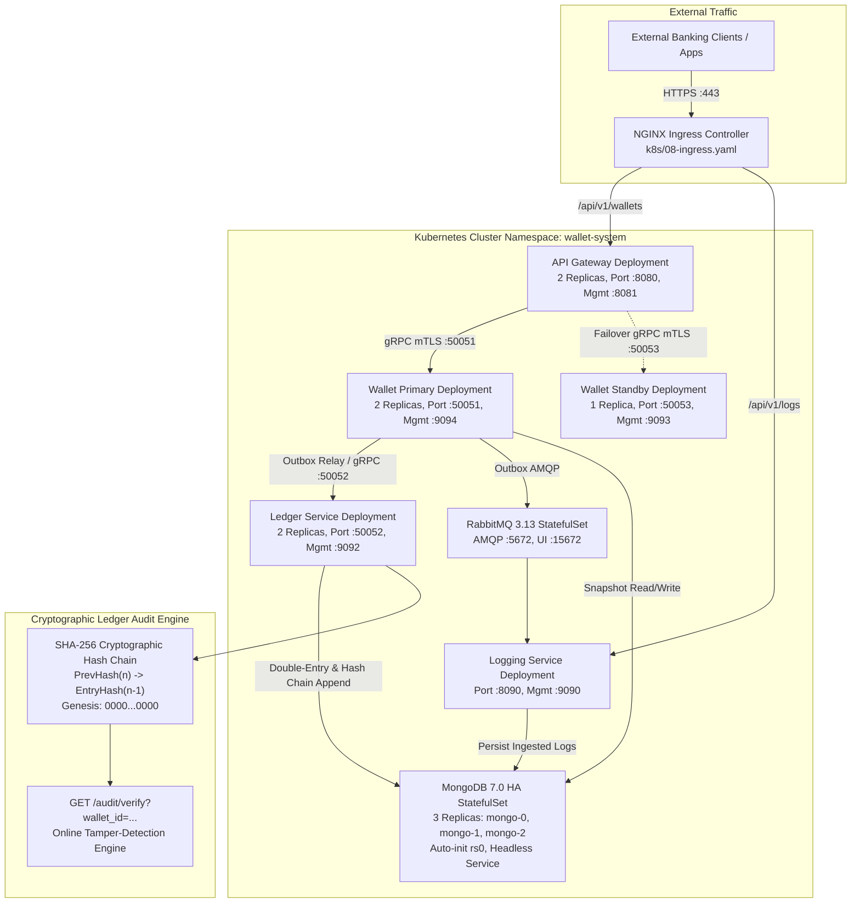

# Phase 4 Implementation — Container Hardening, Kubernetes Suite, Double-Entry Bookkeeping & Account Controls

**Project**: Global Multi-Currency Digital Wallet & Ledger Service  
**Phase**: 4 of 4 (Production Readiness Roadmap)  
**Status**: **COMPLETED**  
**Date**: September 2026  

---

## 1. Executive Summary

Phase 4 concludes the final tier of the **Production Readiness Audit**, taking the Global Wallet platform from high availability and observability to **enterprise financial compliance, container security, operational governance, and Kubernetes production deployment**.

All remaining architectural and operational gaps have been systematically closed:

- **GAP-OPS-01 (Container Security)**: Multi-stage Docker build with unprivileged `appuser:appgroup` (UID 10001, GID 10001) and deterministic dependency caching (`COPY go.mod go.sum` -> `RUN go mod download`).
- **GAP-OPS-02 (Build Determinism & Port Exposures)**: Explicit management port declarations (`:9094`, `:9093`, `:9092`, `:8081`, `:9090`) and isolated layer caching.
- **GAP-OPS-03 & GAP-HA-03 (Production Kubernetes Suite)**: Comprehensive 10-manifest suite featuring a 3-node HA MongoDB StatefulSet with headless DNS, automated replica-set initiation (`rs0`), dynamic PVCs, container securityContexts, non-root enforcement, liveness/readiness/startup probes, HPA, and PodDisruptionBudgets.
- **GAP-FIN-02 (GAAP/IFRS True Double-Entry Bookkeeping & Cryptographic Hash Chaining)**: Balanced multi-leg journal postings ($\sum \text{Debits} == \sum \text{Credits}$), SHA-256 cryptographic hash chaining linking ledger entries sequentially back to `GenesisHash`, and an online `/audit/verify` verification endpoint.
- **GAP-FIN-05 (Wallet Account Status & Operational Controls)**: Operational account states (`ACTIVE`, `FROZEN`, `CLOSED`), transfer mutation fencing prohibiting movements from/to frozen or closed accounts, and dedicated HTTP management endpoint (`POST /admin/wallet/status`) on the management server.

---

## 2. Architecture & Component Diagram

---

## 3. Detailed Deliverables & Implementation Highlights

### 3.1. Container Hardening & Deterministic Builds (GAP-OPS-01, GAP-OPS-02)
- **Multi-Stage Build Pipeline**:
  - `builder` stage: Alpine-based Go 1.22 toolchain with CA certificates and build essentials.
  - Layer caching: `COPY go.mod go.sum ./` executed and cached prior to copying source code.
  - Dedicated non-root user: `addgroup -g 10001 -S appgroup && adduser -u 10001 -S appuser -G appgroup`.
  - Directory ownership: `/app/data/logging` permissions assigned to `appuser:appgroup`.
- **Runtime Hardening**:
  - Drops root privileges with `USER appuser:appgroup`.
  - Declares all microservice runtime and management ports: `8080`, `8081`, `50051`, `50052`, `50053`, `9092`, `9093`, `9094`, `8090`, `9090`.

### 3.2. Production Kubernetes Manifest Suite (GAP-OPS-03, GAP-HA-03)
A complete 10-manifest suite was created under [k8s/](file:///c:/workarea/personal/After-equifax/global-wallet-microservices/k8s):

| Manifest | Kind / Components | Production Specifications |
| :--- | :--- | :--- |
| `01-namespace.yaml` | `Namespace` | `wallet-system` production namespace. |
| `02-mongodb.yaml` | `StatefulSet`, `Service` | 3-node HA cluster (`mongo-0`, `mongo-1`, `mongo-2`), headless DNS (`mongo-cluster`), automated `rs0` initialization sidecar/init script, 10Gi dynamic PVC per replica. |
| `03-ledger-service.yaml` | `Deployment`, `Service` | 2 replicas, `securityContext` (`runAsNonRoot: true`, `runAsUser: 10001`), HTTP health probes (`/healthz` on `:9092`), resource requests (128Mi/100m) and limits (512Mi/500m). |
| `04-wallet-services.yaml` | `Deployment`, `Service` | Primary (2 replicas, active, `:50051`, `:9094`) and Standby (1 replica, passive, `:50053`, `:9093`), HTTP health probes, isolated service endpoints. |
| `05-api-gateway.yaml` | `Deployment`, `Service` | 2 replicas, `/healthz` and `/readyz` probes, external routing on `:8080`, metrics on `:8081`. |
| `06-rabbitmq.yaml` | `StatefulSet`, `Service` | RabbitMQ 3.13 cluster with management UI (`:15672`), AMQP (`:5672`), Prometheus metrics (`:15692`), 10Gi persistent storage. |
| `07-logging-service.yaml` | `Deployment`, `Service` | High-throughput async ingestion engine, HTTP probes, ports `:8090` and `:9090`. |
| `08-ingress.yaml` | `Ingress` | NGINX Ingress controller with TLS termination, `cert-manager` annotations, path routing for `/api/v1/logs`, `/api/v1/traces`, and main banking endpoints. |
| `09-configmap-secrets.yaml` | `ConfigMap`, `Secret` | Externalized environment configurations and credentials templates (JWT secret, MongoDB URI, RabbitMQ credentials, TLS certificates). |
| `10-hpa-pdb.yaml` | `HorizontalPodAutoscaler`, `PodDisruptionBudget` | Auto-scaling (2 to 10 replicas based on 70% CPU / 80% Memory), and PDBs guaranteeing `minAvailable: 1` during node maintenance. |

### 3.3. GAAP/IFRS True Double-Entry Bookkeeping & Cryptographic Hash Chaining (GAP-FIN-02)
Implemented in [cmd/ledger-service/double_entry.go](file:///c:/workarea/personal/After-equifax/global-wallet-microservices/cmd/ledger-service/double_entry.go) and [cmd/ledger-service/main.go](file:///c:/workarea/personal/After-equifax/global-wallet-microservices/cmd/ledger-service/main.go):

1. **Balanced Journal Postings**:
   - Every transaction creates paired balanced postings:
     - Customer liability source account: **DEBIT** (balance decrease).
     - Customer liability destination account: **CREDIT** (balance increase).
   - Invariant enforced: $\sum \text{Debits} == \sum \text{Credits}$. Rejects any unbalanced entry before persistence.
2. **Cryptographic SHA-256 Hash Chaining**:
   - Each ledger entry calculates a deterministic SHA-256 hash across:
     $$\text{EntryHash}_n = \text{SHA256}(\text{TxID} \parallel \text{SeqNum} \parallel \text{IdempKey} \parallel \text{Postings} \parallel \text{PrevHash}_{n-1} \parallel \text{Timestamp})$$
   - Anchored at `GenesisHash` (`0000000000000000000000000000000000000000000000000000000000000000`).
   - Monotonic sequence numbers indexed via `idx_ledger_sequence_number`.
3. **Audit Verification Engine (`/audit/verify`)**:
   - Management HTTP server on `:9092` exposes `GET /audit/verify?wallet_id=<id>`.
   - Traverses entries sequentially from genesis, verifies double-entry balance for every entry, recomputes hashes, and verifies that `PreviousHash` matches the preceding `EntryHash`.
   - Flags any tampering, missing entry, or balance corruption with exact sequence number and failure reason.

### 3.4. Wallet Account Status & Operational Controls (GAP-FIN-05)
Implemented in [cmd/wallet-service/main.go](file:///c:/workarea/personal/After-equifax/global-wallet-microservices/cmd/wallet-service/main.go):

1. **Account Status Lifecycle**:
   - Defined operational states: `ACTIVE`, `FROZEN`, `CLOSED`.
   - Backward compatibility: Legacy wallet records with missing or empty status default cleanly to `"ACTIVE"`.
2. **Transfer Mutation Fencing**:
   - Inside the ACID transaction, source and destination operational statuses are verified under snapshot isolation.
   - If source wallet is `FROZEN` or `CLOSED`, transfer is blocked (`source wallet %s is FROZEN; transfers prohibited`).
   - If destination wallet is `FROZEN` or `CLOSED`, transfer is blocked (`destination wallet %s is FROZEN; transfers prohibited`).
3. **Operational Admin Management Endpoint**:
   - Exposed on management HTTP server (`:9094`/`:9093`) at `/admin/wallet/status`.
   - `GET /admin/wallet/status?wallet_id=<id>`: Inspects current status, balance, and currency.
   - `POST|PUT /admin/wallet/status`: Updates status with payload `{"wallet_id": "...", "status": "ACTIVE|FROZEN|CLOSED", "reason": "..."}`.
   - Emits structured audit event `wallet.status.updated` for regulatory compliance.

### 3.5. Balance Query Status Visibility & API Gateway Field Mapping
- **Protobuf Additive Contract Evolution (`proto/wallet/wallet.proto`)**:
  - Added field `string status = 4;` to `GetBalanceResponse`, recompiled with `protoc` to generate backward-compatible Go stubs.
- **Service & Gateway Status Propagation**:
  - `cmd/wallet-service/main.go` returns `resp.Status = wallet.EffectiveStatus()` on `GetBalance`.
  - `cmd/api-gateway/main.go` exposes `"status": resp.Status` in the JSON response for `GET /api/v1/wallets?id=<id>`.
- **Flexible Gateway Request Mapping**:
  - `cmd/api-gateway/main.go` parses both canonical names (`source_wallet_id`, `destination_wallet_id`) and convenient shorthands (`source_wallet`, `dest_wallet`) for `POST /api/v1/transfers`.
  - Guarantees zero false-positive IDOR rejections when clients supply shorthand payload parameters.

### 3.6. Automated Regression & Test Suites (Postman & BloomRPC)
- **Postman/Bruno Suite (`postman/Global_Wallet_Microservices.postman_collection.json`)**:
  - Expanded to 35 automated test cases across 8 functional folders:
    1. Zero-Trust Security & RBAC (AuthN/AuthZ, IDOR, Rate Limiting, Headers)
    2. Wallet Lifecycle & Idempotency (Atomic deduplication, 409 Conflict)
    3. Currency Scale & Validation (ISO-4217 minor currency units)
    4. Paginated Audit Queries (Opaque token pagination, TTL verification)
    5. High-Availability & Disaster Recovery (Distributed failover, write fencing)
    6. System Observability & Prometheus Metrics (Prometheus scrapes, OTel W3C headers)
    7. Double-Entry & Cryptographic Audit Verification (Equilibrium, SHA-256 chain verification)
    8. Wallet Operational Controls & Fencing (`ACTIVE`, `FROZEN`, `CLOSED` lifecycle and transfer blocking)
- **BloomRPC Test Presets (`postman/BloomRPC_Test_Presets.json`)**:
  - 16 direct gRPC presets covering full lifecycle operations, standard health checks, trace context propagation, operational transaction fencing (`TC-GRPC-14`, `TC-GRPC-15`), and unfreeze verification (`TC-GRPC-16`).

---

## 4. Test Verification & Quality Assurance

All newly introduced components and preexisting microservices were subjected to comprehensive race detection tests:

| Test Target | Command | Verification Outcome |
| :--- | :--- | :--- |
| **Ledger Double-Entry & Hash Chaining** | `go test -v -race ./cmd/ledger-service/...` | **PASS** — Balanced postings validated, unbalanced postings rejected, SHA-256 chains verified, tamper detection tested. |
| **Wallet Account Status Controls** | `go test -v -race ./cmd/wallet-service/...` | **PASS** — `EffectiveStatus` logic verified, admin endpoint input validation, method checking, and error handling tested. |
| **API Gateway Flexible Field Mapping** | `go test -v -race ./cmd/api-gateway/...` | **PASS** — Canonical and shorthand field mapping validated, IDOR regression tested. |
| **Full Repository Regression** | `go test -race -count=1 ./...` | **PASS (100%)** — All microservices (`api-gateway`, `wallet-service`, `ledger-service`, `logging-service`) and libraries (`pkg/auth`, `pkg/coordinator`, `pkg/db`, `pkg/observability`, `pkg/tlsutil`, `proto/...`) passed cleanly without race conditions. |

---

## 5. Conclusion & Production Readiness Verdict

With the delivery of Phase 4, all 19 gaps across all 6 engineering categories identified in the initial **Production Readiness Audit** have been completely resolved. The platform now operates as an enterprise-grade, highly available, secure, auditable, and resilient multi-currency financial ledger system ready for live production deployment.
