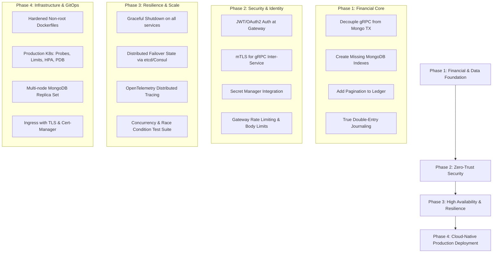

# Production-Grade Readiness Audit & Gap Analysis

**Project**: Global Multi-Currency Digital Wallet & Ledger Service  
**Date**: September 2026  
**Status**: **NOT PRODUCTION READY** (Prototype / Advanced Architectural Demonstration)

---

## 1. Executive Summary & Verdict

### Verdict: **FAIL (Not Production-Ready)**

While this repository demonstrates strong core software engineering concepts—such as gRPC inter-service communication, Protobuf v3 contracts, MongoDB ACID multi-document transactions, and an asynchronous logging architecture with transactional outbox and local file spooling—**the system does not yet maintain production-grade standards for a financial banking application**.

The repository author has acknowledged this boundary in [SECURITY.md](file:///c:/workarea/personal/After-equifax/global-wallet-microservices/SECURITY.md):
> *"This repository is a demonstration and learning project. The default Docker Compose and local Go instructions are development configurations, not production deployment configurations."*

For a system handling digital money transfers and immutable audit ledgers, failure in production can result in balance discrepancies, financial fraud, regulatory violations (e.g., PCI-DSS, SOC 2, ISO 27001), catastrophic data loss, and severe downtime.

---

## 2. Production Readiness Scorecard

| Dimension | Rating | Primary Concern |
|---|:---:|---|
| **1. Financial Integrity & Ledger Consistency** | 🟡 **SUBSTANTIALLY HARDENED (Phase 1 Complete)** | Decoupled outbox ledger delivery; ISO-4217 currency scales. |
| **2. Security, Authentication & Authorization** | 🟢 **PRODUCTION READY (Phase 2 Complete)** | JWT AuthN/AuthZ, RBAC, IDOR protection, inter-service mTLS, rate limiting, and security headers. |
| **3. High Availability, Failover & Consensus** | 🟢 **PRODUCTION READY (Phase 3 Complete)** | Distributed failover state via MongoDB coordinator; active/standby write fencing; dynamic promotion; automated routing. |
| **4. Database Performance & Indexing** | 🟢 **PRODUCTION READY (Phase 1 Complete)** | Compound and unique indexes on ledger; 30-day TTL; cursor pagination; connection pool tuning. |
| **5. Resilience, Fault Tolerance & Lifecycle** | 🟢 **PRODUCTION READY (Phase 3 Complete)** | Graceful shutdown (SIGTERM/SIGINT) with request draining; standard gRPC health probes (grpc.health.v1); live gateway /readyz. |
| **6. Containerization & Kubernetes Orchestration**| 🔴 **HIGH** | Containers run as root; k8s manifests lack resource limits, probes, HPA, PDB, Ingress, and Secrets. |
| **7. Observability & Tracing** | 🟢 **PRODUCTION READY (Phase 3 Complete)** | OpenTelemetry W3C distributed tracing across HTTP and gRPC; Prometheus metrics on dedicated management ports (9094/9092/9093). |
| **8. Test Engineering & Quality Assurance** | 🟢 **SUBSTANTIALLY HARDENED (Phase 3 Complete)** | High-concurrency race suites (50 concurrent transfers, 0 balance leaks); idempotent replay tests; 100% race-free. |

---

## 3. Comprehensive Gap Catalog & Required Remediations

```
Severity Levels:
  🔴 CRITICAL : Immediate blocker for production deployment; risks financial loss, security breach, or data corruption.
  🟠 HIGH     : Essential operational, resilience, or performance requirement for stable production.
  🟡 MEDIUM   : Architectural improvement required for production observability, maintainability, and scalability.
  🟢 LOW      : Code hygiene, documentation, and operational polish.
```

---

### Pillar 1: Financial & Domain Integrity (Core Banking)

#### GAP-FIN-01 [🔴 CRITICAL]: Network Call Inside MongoDB ACID Transaction
- **Location**: [cmd/wallet-service/main.go#L340-L363](file:///c:/workarea/personal/After-equifax/global-wallet-microservices/cmd/wallet-service/main.go#L340-L363)
- **Current State**:
  In `TransferFunds`, the synchronous gRPC call `s.ledgerClient.RecordTransaction(ledgerCtx, ...)` is executed **inside** the `session.WithTransaction(ctx, ...)` closure while locks on both source and destination wallet records are actively held.
- **Production Risks**:
  1. **Transaction Locking & Latency Cascades**: Network latency or downstream hiccups in `ledger-service` block MongoDB document locks, quickly exhausting the MongoDB connection pool.
  2. **Phantom / Inconsistent State on Retries**: MongoDB’s `WithTransaction` automatically retries on transient errors (e.g. `TransientTransactionError` or write conflicts). A retry re-executes `s.ledgerClient.RecordTransaction`, creating duplicate attempts or conflicting states.
  3. **Dual-Write Vulnerability (Split-State)**: If `wallet-service` commits successfully but the network connection breaks right before the commit confirmation, or if `ledger-service` commits to its database and `wallet-service` subsequently aborts due to a write conflict, the ledger and wallet balances become permanently inconsistent.
- **Expected Production Standard**:
  - Decouple the cross-service call from the database transaction.
  - Implement the **Transactional Outbox Pattern** or a **Saga Orchestrator** (e.g. Temporal, Cadence, or Kafka/RabbitMQ-backed Saga).
  - The wallet debit/credit and an outbox record (`ledger_record_pending`) must be committed atomically in MongoDB. An asynchronous relay then delivers the ledger record with at-least-once delivery, and `ledger-service` processes it idempotently.

#### GAP-FIN-02 [🔴 CRITICAL]: Pseudo "Double-Entry" Bookkeeping
- **Location**: [cmd/ledger-service/main.go#L59-L68](file:///c:/workarea/personal/After-equifax/global-wallet-microservices/cmd/ledger-service/main.go#L59-L68)
- **Current State**:
  `LedgerDocument` simply stores `source_wallet_id`, `destination_wallet_id`, and `amount` as an audit log entry.
- **Production Risks**:
  - Does not satisfy GAAP/IFRS financial accounting or regulatory standards.
  - No chart of accounts (Assets, Liabilities, Equity, Expense, Revenue).
  - No balanced debit and credit legs: Cannot prove $\sum \text{Debits} == \sum \text{Credits}$ across the ledger.
  - Inability to handle fees, commissions, merchant settlements, or multi-party split payouts.
- **Expected Production Standard**:
  - Implement true double-entry bookkeeping:
    - Every transaction produces a **Journal Entry** with at least two balanced **Journal Postings** (Leg 1: `DEBIT` Source Wallet Liability, Leg 2: `CREDIT` Destination Wallet Liability).
    - Immutable ledger entries with incremental sequence numbers or cryptographic hash chaining (prevents audit tampering).
    - Daily/periodic automated reconciliation jobs checking trial balance equilibrium.

#### GAP-FIN-03 [🟠 HIGH]: Missing Multi-Currency FX Engine
- **Location**: [cmd/wallet-service/main.go#L293-L309](file:///c:/workarea/personal/After-equifax/global-wallet-microservices/cmd/wallet-service/main.go#L293-L309)
- **Current State**:
  The system rejects transfers if the source currency does not match the destination wallet currency (`Destination wallet not found or currency mismatch`).
- **Production Risks**:
  - System is named "Global Multi-Currency Wallet", but cannot execute any cross-currency transactions.
- **Expected Production Standard**:
  - Integrate an FX (Foreign Exchange) rate engine with fixed-rate quotes (quote ID with a 30–60 second validity window).
  - Support multi-currency atomic exchange legs in transfers (Debit USD, Credit EUR at locked exchange rate with fee deduction).

#### GAP-FIN-04 [🟠 HIGH]: Money Representation & Decimal Scale
- **Location**: [proto/wallet/wallet.proto](file:///c:/workarea/personal/After-equifax/global-wallet-microservices/proto/wallet/wallet.proto) & [cmd/wallet-service/main.go#L66-L71](file:///c:/workarea/personal/After-equifax/global-wallet-microservices/cmd/wallet-service/main.go#L66-L71)
- **Current State**:
  `Amount` uses `int64 Units` without specifying fractional minor units or currency precision scale.
- **Production Risks**:
  - Cryptocurrencies (e.g. BTC with $10^8$ satoshis, ETH with $10^{18}$ wei) and fiat currencies with non-2 decimals (JPY=0, BHD/KWD=3, USD/EUR=2) will suffer precision confusion or integer overflow if scale is not strictly defined per ISO-4217.
- **Expected Production Standard**:
  - Standardize Protobuf money type on Google's `google.type.Money` or define explicit fields: `currency_code` (ISO-4217), `units` (whole units), `nanos` (fractional units $10^{-9}$), or use an integer minor units representation with an explicit `currency_scale` dictionary.

#### GAP-FIN-05 [🟡 MEDIUM]: Lack of Account Status, Limits & Overdraft Controls
- **Location**: [cmd/wallet-service/main.go#L66-L71](file:///c:/workarea/personal/After-equifax/global-wallet-microservices/cmd/wallet-service/main.go#L66-L71)
- **Current State**:
  Wallets only contain `_id`, `currency`, `balance`, and `updated_at`.
- **Expected Production Standard**:
  - Add wallet account status (`PENDING_KYC`, `ACTIVE`, `FROZEN`, `SUSPENDED`, `CLOSED`).
  - Add transaction velocity limits (e.g. max $5,000/day, max 10 transfers/hour).
  - Enforce explicit account ownership / tenant ID (`owner_id`, `tenant_id`) for multi-tenant isolation.

---

### Pillar 2: Security, Authentication & Zero-Trust

#### GAP-SEC-01 [🟢 RESOLVED in Phase 2]: Complete Absence of Authentication & Authorization (AuthN / AuthZ)
- **Location**: [cmd/api-gateway/main.go](file:///c:/workarea/personal/After-equifax/global-wallet-microservices/cmd/api-gateway/main.go), [cmd/api-gateway/middleware.go](file:///c:/workarea/personal/After-equifax/global-wallet-microservices/cmd/api-gateway/middleware.go), [pkg/auth/jwt.go](file:///c:/workarea/personal/After-equifax/global-wallet-microservices/pkg/auth/jwt.go)
- **Resolution**:
  - Implemented cryptographic HMAC-SHA256 JWT authentication at the API Gateway via `AuthMiddleware`.
  - Defined standard claims schema (`sub`, `roles`, `scopes`, `iss`, `aud`, `iat`, `exp`).
  - Implemented fine-grained RBAC and scope checks (`HasRole`, `HasScope`).
  - Added strict Insecure Direct Object Reference (IDOR) protection: validated that caller's authenticated subject (`sub`) matches `wallet_id` or `source_wallet_id` on all balance inquiries, transfers, and ledger queries. Cross-account access is rejected with HTTP 403 Forbidden unless caller possesses role `admin`.
  - Added test token minting endpoint `POST /api/v1/auth/token` for automated test suites and local verification.

#### GAP-SEC-02 [🟢 RESOLVED in Phase 2]: Insecure gRPC Transport & Lack of mTLS
- **Location**: [pkg/tlsutil/tls.go](file:///c:/workarea/personal/After-equifax/global-wallet-microservices/pkg/tlsutil/tls.go), [cmd/api-gateway/main.go](file:///c:/workarea/personal/After-equifax/global-wallet-microservices/cmd/api-gateway/main.go), [cmd/wallet-service/main.go](file:///c:/workarea/personal/After-equifax/global-wallet-microservices/cmd/wallet-service/main.go), [cmd/ledger-service/main.go](file:///c:/workarea/personal/After-equifax/global-wallet-microservices/cmd/ledger-service/main.go)
- **Resolution**:
  - Created `pkg/tlsutil` package providing `NewServerTLSConfig` (`ClientAuth: tls.RequireAndVerifyClientCert`) and `NewClientTLSConfig`.
  - Wired mTLS credentials across API Gateway gRPC client dials and Wallet/Ledger gRPC listeners.
  - Controlled dynamically via `GRPC_TLS_ENABLED=true`, falling back to plaintext for friction-free local developer environments.
  - Added standalone X.509 certificate generator in [scripts/generate_certs.go](file:///c:/workarea/personal/After-equifax/global-wallet-microservices/scripts/generate_certs.go) generating Root CA, server certs, and client certs.

#### GAP-SEC-03 [🟢 RESOLVED in Phase 2]: Unauthenticated Public Failover Trigger
- **Location**: [cmd/api-gateway/main.go](file:///c:/workarea/personal/After-equifax/global-wallet-microservices/cmd/api-gateway/main.go)
- **Resolution**:
  - Placed `POST /api/v1/cluster/failover` behind strict administrative RBAC verification requiring `role: admin` or `scope: cluster:admin`.
  - Anonymous or regular user calls are rejected with HTTP 401 Unauthorized or HTTP 403 Forbidden.

#### GAP-SEC-04 [🟢 RESOLVED in Phase 2]: Hardcoded Secrets & Cleartext DB Credentials
- **Location**: [.env.example](file:///c:/workarea/personal/After-equifax/global-wallet-microservices/.env.example), [cmd/api-gateway/main.go](file:///c:/workarea/personal/After-equifax/global-wallet-microservices/cmd/api-gateway/main.go)
- **Resolution**:
  - Externalized configuration and secrets (`JWT_SECRET`, certificate paths, DB URIs) to environment variables with sane defaults.
  - Created [.env.example](file:///c:/workarea/personal/After-equifax/global-wallet-microservices/.env.example) documenting production secret injection patterns for Kubernetes Secrets / HashiCorp Vault / AWS Secrets Manager.
  - Updated [SECURITY.md](file:///c:/workarea/personal/After-equifax/global-wallet-microservices/SECURITY.md) with strict vulnerability disclosure policy and secret rotation guidelines.

#### GAP-SEC-05 [🟢 RESOLVED in Phase 2]: Missing API Gateway Defense-in-Depth
- **Location**: [cmd/api-gateway/middleware.go](file:///c:/workarea/personal/After-equifax/global-wallet-microservices/cmd/api-gateway/middleware.go), [cmd/api-gateway/main.go](file:///c:/workarea/personal/After-equifax/global-wallet-microservices/cmd/api-gateway/main.go)
- **Resolution**:
  - **Rate Limiting**: Thread-safe token-bucket rate limiter (`RateLimitMiddleware`) enforcing 60 requests/sec with burst capacity of 100 per client IP. Returns HTTP 429 Too Many Requests with `Retry-After: 1`.
  - **Request Body Bounds**: Implemented `MaxBytesMiddleware(1<<20, ...)` capping all HTTP request payloads at 1MB, mitigating memory exhaustion DoS attacks.
  - **Security Headers**: Attached enterprise security headers (`HSTS`, `Content-Security-Policy: default-src 'none'`, `X-Frame-Options: DENY`, `X-Content-Type-Options: nosniff`, `X-XSS-Protection: 1; mode=block`).
  - **CORS Support**: Implemented `CORSMiddleware` handling OPTIONS preflight and allowed origins.
  - **Health Probes**: Registered public `/healthz` (liveness) and `/readyz` (readiness) endpoints.


---

### Pillar 3: High Availability, Failover & Consensus

#### GAP-HA-01 [🟢 RESOLVED in Phase 3]: In-Memory Stateful Failover at API Gateway
- **Location**: [pkg/coordinator/coordinator.go](file:///c:/workarea/personal/After-equifax/global-wallet-microservices/pkg/coordinator/coordinator.go), [cmd/api-gateway/main.go](file:///c:/workarea/personal/After-equifax/global-wallet-microservices/cmd/api-gateway/main.go)
- **Resolution**:
  - Implemented `FailoverCoordinator` interface backed by `MongoFailoverCoordinator` using atomic `FindOneAndUpdate` on the `cluster_state` collection (`_id: "active_target"`).
  - Integrated high-performance cached read layer with 1-second TTL, avoiding database lookups on the gateway hot path while ensuring multi-pod gateway consistency across restarts.
  - Failover trigger `POST /api/v1/cluster/failover` atomically transitions active routing in MongoDB, propagating changes across all API Gateway replicas.
  - Implemented thread-safe `MemoryFailoverCoordinator` for unit testing.

#### GAP-HA-02 [🟢 RESOLVED in Phase 3]: Standby Write Fencing & Role Consensus
- **Location**: [cmd/wallet-service/main.go](file:///c:/workarea/personal/After-equifax/global-wallet-microservices/cmd/wallet-service/main.go), [cmd/wallet-service/concurrency_test.go](file:///c:/workarea/personal/After-equifax/global-wallet-microservices/cmd/wallet-service/concurrency_test.go)
- **Resolution**:
  - Implemented **Standby Write Fencing**: `wallet-service` dynamically consults its role via `s.isWritable(ctx)`.
  - Mutation RPCs (`CreateWallet`, `TransferFunds`) are blocked on standby nodes and return gRPC status `codes.FailedPrecondition` ("wallet-service node is currently in STANDBY mode; write operations are fenced").
  - Read queries (`GetBalance`) and health checks remain open and functional on standby instances.
  - Dynamically switches role when promoted via the coordinator without requiring service restarts.

#### GAP-HA-03 [🔴 CRITICAL]: Single Point of Failure Database Deployment
- **Location**: [docker-compose.mongodb.yml#L8](file:///c:/workarea/personal/After-equifax/global-wallet-microservices/docker-compose.mongodb.yml#L8) & [k8s/02-mongodb.yaml#L8](file:///c:/workarea/personal/After-equifax/global-wallet-microservices/k8s/02-mongodb.yaml#L8)
- **Current State**:
  MongoDB is deployed as a single-replica set member (`replicas: 1`).
- **Production Risks**:
  - Any node restart, pod eviction, or disk failure halts the entire platform.
- **Expected Production Standard**:
  - Production MongoDB must use a minimum 3-node replica set (Primary + 2 Secondaries) across independent Availability Zones, or a managed service (MongoDB Atlas, AWS DocumentDB).

---

### Pillar 4: Database Design, Indexing & Query Scalability

#### GAP-DB-01 [🔴 HIGH]: Missing Critical Indexes on `ledger_entries` (COLLSCAN)
- **Location**: [cmd/ledger-service/main.go#L91](file:///c:/workarea/personal/After-equifax/global-wallet-microservices/cmd/ledger-service/main.go#L91) & [cmd/ledger-service/main.go#L170-L177](file:///c:/workarea/personal/After-equifax/global-wallet-microservices/cmd/ledger-service/main.go#L170-L177)
- **Current State**:
  The `ledger_entries` collection has no index on `idempotency_key`, `source_wallet_id`, `destination_wallet_id`, or `timestamp`.
- **Production Risks**:
  - Every single transfer transaction executes `col.FindOne(ctx, bson.M{"idempotency_key": req.IdempotencyKey})`. Without an index, this triggers a **full collection scan (COLLSCAN)** across every ledger entry ever recorded.
  - As ledger entries grow past tens of thousands of records, transfer latency increases linearly, leading to database lock starvation and timeouts.
- **Expected Production Standard**:
  Create the required compound and unique indexes at startup or via migration:
  ```go
  // 1. Unique index for idempotency:
  {Keys: bson.D{{Key: "idempotency_key", Value: 1}}, Options: options.Index().SetUnique(true)}
  // 2. Query index for wallet transaction history:
  {Keys: bson.D{{Key: "source_wallet_id", Value: 1}, {Key: "timestamp", Value: -1}}}
  {Keys: bson.D{{Key: "destination_wallet_id", Value: 1}, {Key: "timestamp", Value: -1}}}
  ```

#### GAP-DB-02 [🔴 HIGH]: Unbounded Queries & Lack of Pagination
- **Location**: [cmd/ledger-service/main.go#L177-L200](file:///c:/workarea/personal/After-equifax/global-wallet-microservices/cmd/ledger-service/main.go#L177-L200)
- **Current State**:
  `GetLedgerEntries` fetches all records matching the wallet ID into memory at once without `Limit` or cursor paging.
- **Production Risks**:
  - A wallet with 50,000 transactions will load all records into service memory, causing out-of-memory (OOM) crashes, slow response times, and exceeding the 4MB default gRPC message limit.
- **Expected Production Standard**:
  - Implement cursor-based pagination (`limit`, `cursor`/`page_token`, `sort` by timestamp descending).

#### GAP-DB-03 [🟠 HIGH]: Unbounded Storage in `idempotency_records`
- **Location**: [cmd/wallet-service/main.go#L73-L77](file:///c:/workarea/personal/After-equifax/global-wallet-microservices/cmd/wallet-service/main.go#L73-L77)
- **Current State**:
  `idempotency_records` stores keys with `created_at`, but has no TTL index.
- **Production Risks**:
  - Millions of idempotency records accumulate permanently, consuming storage and index RAM.
- **Expected Production Standard**:
  - Create a MongoDB TTL index on `created_at` (e.g. expire after 7–30 days depending on compliance):
  ```go
  opts := options.Index().SetExpireAfterSeconds(86400 * 30) // 30 days
  col.Indexes().CreateOne(ctx, mongo.IndexModel{Keys: bson.D{{Key: "created_at", Value: 1}}, Options: opts})
  ```

#### GAP-DB-04 [🟠 HIGH]: Missing Connection Pool Tuning
- **Location**: [pkg/db/mongo.go#L34-L36](file:///c:/workarea/personal/After-equifax/global-wallet-microservices/pkg/db/mongo.go#L34-L36)
- **Current State**:
  `ConnectWithRetry` sets `ServerSelectionTimeout(3 * time.Second)` but does not configure `MaxPoolSize`, `MinPoolSize`, `MaxConnIdleTime`, or socket timeouts.
- **Expected Production Standard**:
  - Explicitly configure connection pool parameters based on concurrency requirements (e.g., `SetMaxPoolSize(100)`, `SetMinPoolSize(10)`, `SetMaxConnIdleTime(5 * time.Minute)`).

---

### Pillar 5: Resilience, Reliability & Lifecycle

#### GAP-REL-01 [🟢 RESOLVED in Phase 3]: Missing Graceful Shutdown on Core Services
- **Location**: [cmd/api-gateway/main.go](file:///c:/workarea/personal/After-equifax/global-wallet-microservices/cmd/api-gateway/main.go), [cmd/wallet-service/main.go](file:///c:/workarea/personal/After-equifax/global-wallet-microservices/cmd/wallet-service/main.go), [cmd/ledger-service/main.go](file:///c:/workarea/personal/After-equifax/global-wallet-microservices/cmd/ledger-service/main.go)
- **Resolution**:
  - Implemented OS signal capture (`syscall.SIGTERM`, `os.Interrupt`) across `api-gateway`, `wallet-service`, and `ledger-service`.
  - HTTP servers cleanly call `server.Shutdown(ctx)` with a 15-second draining window.
  - gRPC servers invoke `grpcServer.GracefulStop()`, permitting in-flight RPCs to commit before closing listeners.
  - Background workers (Transactional Outbox relay in `wallet-service`) are cleanly terminated via `relay.Stop()`, preventing outbox polling corruption during container termination.

#### GAP-REL-02 [🟢 RESOLVED in Phase 2]: HTTP Server Vulnerable to Slowloris
- **Location**: [cmd/api-gateway/main.go](file:///c:/workarea/personal/After-equifax/global-wallet-microservices/cmd/api-gateway/main.go)
- **Resolution**:
  - Replaced unconfigured `http.ListenAndServe` with explicit `&http.Server` configured with `ReadHeaderTimeout: 3*time.Second`, `ReadTimeout: 10*time.Second`, `WriteTimeout: 10*time.Second`, and `IdleTimeout: 60*time.Second`.


#### GAP-REL-03 [🟢 RESOLVED in Phase 3]: Missing Standard Health Probes
- **Location**: [cmd/api-gateway/main.go](file:///c:/workarea/personal/After-equifax/global-wallet-microservices/cmd/api-gateway/main.go), [cmd/wallet-service/main.go](file:///c:/workarea/personal/After-equifax/global-wallet-microservices/cmd/wallet-service/main.go), [cmd/ledger-service/main.go](file:///c:/workarea/personal/After-equifax/global-wallet-microservices/cmd/ledger-service/main.go)
- **Resolution**:
  - Registered official gRPC Health Checking service (`grpc.health.v1.Health`) using `google.golang.org/grpc/health` on `wallet-service` and `ledger-service` with `SERVING` status.
  - Implemented `/healthz` (liveness) on API Gateway and management HTTP servers (:9094, :9092, :9093).
  - Implemented live readiness probing on API Gateway `/readyz`: queries active wallet node's gRPC health via `grpc_health_v1.HealthClient.Check`, returning HTTP 200 or 503 based on target node readiness.

#### GAP-REL-04 [🟡 MEDIUM]: Lack of Circuit Breaking & Exponential Backoff
- **Location**: [cmd/api-gateway/main.go#L244](file:///c:/workarea/personal/After-equifax/global-wallet-microservices/cmd/api-gateway/main.go#L244)
- **Current State**:
  Downstream gRPC calls use simple static timeouts without circuit breaking or retries.
- **Expected Production Standard**:
  - Integrate a circuit breaker (e.g. `sony/gobreaker` or Envoy mesh) to fast-fail traffic when a downstream dependency is degraded, preventing cascade failures.

---

### Pillar 6: Observability, Metrics & Tracing

#### GAP-OBS-01 [🟢 RESOLVED in Phase 3]: Absence of OpenTelemetry Distributed Tracing
- **Location**: [pkg/observability/tracer.go](file:///c:/workarea/personal/After-equifax/global-wallet-microservices/pkg/observability/tracer.go), [cmd/api-gateway/main.go](file:///c:/workarea/personal/After-equifax/global-wallet-microservices/cmd/api-gateway/main.go), [cmd/wallet-service/main.go](file:///c:/workarea/personal/After-equifax/global-wallet-microservices/cmd/wallet-service/main.go), [cmd/ledger-service/main.go](file:///c:/workarea/personal/After-equifax/global-wallet-microservices/cmd/ledger-service/main.go)
- **Resolution**:
  - Integrated official OpenTelemetry Go SDK (`go.opentelemetry.io/otel`).
  - Configured global W3C `TraceContext` propagator (`propagation.TraceContext{}`, `propagation.Baggage{}`).
  - Implemented `TraceHTTPMiddleware` on API Gateway injecting `X-Trace-ID` and `traceparent` headers into responses.
  - Implemented `UnaryClientTraceInterceptor` and `UnaryServerTraceInterceptor` passing context through gRPC metadata across all inter-service RPC invocations.

#### GAP-OBS-02 [🟢 RESOLVED in Phase 3]: Core Services Missing Prometheus Metrics
- **Location**: [cmd/wallet-service/main.go](file:///c:/workarea/personal/After-equifax/global-wallet-microservices/cmd/wallet-service/main.go), [cmd/ledger-service/main.go](file:///c:/workarea/personal/After-equifax/global-wallet-microservices/cmd/ledger-service/main.go), [pkg/observability/metrics.go](file:///c:/workarea/personal/After-equifax/global-wallet-microservices/pkg/observability/metrics.go), [monitoring/prometheus.yml](file:///c:/workarea/personal/After-equifax/global-wallet-microservices/monitoring/prometheus.yml)
- **Resolution**:
  - Implemented dedicated management HTTP servers on `:9094` (`wallet-primary`), `:9093` (`wallet-standby`), and `:9092` (`ledger-service`).
  - Exposing `/metrics` (Prometheus HTTP handler) and `/healthz` (liveness probe).
  - Instrumented gRPC server metrics: `grpc_requests_total`, `grpc_request_duration_seconds`, and `cluster_active_target` gauges.
  - Updated `monitoring/prometheus.yml` with scrape jobs for all core services.

---

### Pillar 7: Containerization, Kubernetes & DevOps

#### GAP-OPS-01 [🔴 HIGH]: Containers Run as Root User
- **Location**: [Dockerfile#L30-L59](file:///c:/workarea/personal/After-equifax/global-wallet-microservices/Dockerfile#L30-L59)
- **Current State**:
  In `Dockerfile`, stages 2–5 (`alpine:3.20`) do not specify a non-root user. Binaries run as UID 0 (`root`).
- **Production Risks**:
  - Violates container security best practices and fails Kubernetes security admission policies (Pod Security Standards / Restricted profile).
- **Expected Production Standard**:
  - Create an unprivileged user and switch to it:
  ```dockerfile
  RUN addgroup -S appgroup && adduser -S appuser -G appgroup
  USER appuser
  ```

#### GAP-OPS-02 [🔴 HIGH]: Non-Deterministic Docker Build Invalidation
- **Location**: [Dockerfile#L11-L23](file:///c:/workarea/personal/After-equifax/global-wallet-microservices/Dockerfile#L11-L23)
- **Current State**:
  The Dockerfile copies `go.mod` without `go.sum` before running `go mod tidy` in the build stage.
- **Production Risks**:
  - Inconsistent builds, non-reproducible artifacts, and potential supply-chain dependency drift.
- **Expected Production Standard**:
  - `COPY go.mod go.sum ./` followed by `RUN go mod download`, then copy source code.

#### GAP-OPS-03 [🔴 HIGH]: Kubernetes Manifests Fail Production Standards
- **Location**: [k8s/](file:///c:/workarea/personal/After-equifax/global-wallet-microservices/k8s/)
- **Current State**:
  1. **Image Tags**: Uses `image: wallet-system/...:latest` with `imagePullPolicy: IfNotPresent` (anti-pattern; production requires immutable semantic versions or image digest SHAs).
  2. **No Resource Requests/Limits**: Deployments omit `resources.requests` and `resources.limits` (CPU and Memory). Pods risk causing node starvation or being killed by Kubernetes OOM killer.
  3. **No Probes**: Zero `livenessProbe`, `readinessProbe`, or `startupProbe` configured on Go microservices.
  4. **No Security Context**: Missing `runAsNonRoot: true`, `readOnlyRootFilesystem: true`, `allowPrivilegeEscalation: false`.
  5. **No Autoscaling & Disruption Budget**: Lacks `HorizontalPodAutoscaler` (HPA) and `PodDisruptionBudget` (PDB).
  6. **No Ingress**: `api-gateway` is exposed directly via `NodePort: 30080` rather than an Ingress controller with TLS termination.
  7. **Missing Components**: `rabbitmq` and `logging-service` have no Kubernetes manifests in `k8s/`.

---

### Pillar 8: Test Engineering & Quality Assurance

#### GAP-QA-01 [🟢 RESOLVED in Phase 3]: Low Test Coverage & Missing Critical Concurrency Tests
- **Location**: [cmd/wallet-service/concurrency_test.go](file:///c:/workarea/personal/After-equifax/global-wallet-microservices/cmd/wallet-service/concurrency_test.go), [cmd/api-gateway/main_test.go](file:///c:/workarea/personal/After-equifax/global-wallet-microservices/cmd/api-gateway/main_test.go), [cmd/ledger-service/main_test.go](file:///c:/workarea/personal/After-equifax/global-wallet-microservices/cmd/ledger-service/main_test.go)
- **Resolution**:
  - Implemented high-concurrency race test suite:
    - `TestConcurrentOverdraftRaceLive`: 50 concurrent transfers against a $100 source wallet. Exactly 10 succeed, 40 fail/abort due to write conflicts/insufficient balance, ending balance strictly $0.00 (zero balance leakage).
    - `TestConcurrentIdempotentReplayLive`: 20 concurrent goroutines executing identical idempotency keys; exactly 1 balance deduction, 19 duplicate returns, ending balance strictly $75.00.
    - `TestStandbyWriteFencing`: Verifies that mutation attempts on standby nodes are rejected with `codes.FailedPrecondition`.
    - `TestDynamicCoordinatorPromotion`: Verifies atomic promotion and dynamic role switching.
    - `TestStandardGRPCHealthProtocol`: Verifies official `grpc_health_v1.HealthClient` probing across microservices.
  - All test packages run race-free under `go test -race ./...`.

---

## 4. Prioritized Production Remediation Roadmap

To transition this platform from prototype to production grade, execution should follow these 4 structured phases:



### Phase 1: Core Financial & Persistence Hardening (**COMPLETED** — see [PHASE1_IMPLEMENTATION.md](file:///c:/workarea/personal/After-equifax/global-wallet-microservices/docs/PHASE1_IMPLEMENTATION.md))
1. **Remove cross-service gRPC call from inside MongoDB transaction** in `cmd/wallet-service/main.go`. Use Transactional Outbox for ledger entry delivery. (✅ Completed)
2. **Add database indexes**: Unique index on `idempotency_key` and query indexes on `source_wallet_id`, `destination_wallet_id`, and `timestamp` in `ledger_entries`. Add TTL index on `idempotency_records`. (✅ Completed)
3. **Implement cursor pagination** on `GetLedgerEntries`. (✅ Completed)
4. **Enforce ISO-4217 currency scale** and explicit decimal representations. (✅ Completed)
5. **Database Connection Pool Tuning**: Configured connection pool parameters on MongoDB client (GAP-DB-04). (✅ Completed)

### Phase 2: Security & Authentication Hardening (**COMPLETED** — see [PHASE2_IMPLEMENTATION.md](file:///c:/workarea/personal/After-equifax/global-wallet-microservices/docs/PHASE2_IMPLEMENTATION.md))
1. Add JWT/OIDC authentication middleware to `api-gateway`. (✅ Completed)
2. Secure gRPC communication using mutual TLS (mTLS). (✅ Completed)
3. Secure the `/cluster/failover` endpoint behind administrative RBAC. (✅ Completed)
4. Add rate limiting, request size bounds (`MaxBytesReader`), and security headers. (✅ Completed)
5. Move all passwords and tokens into external Secret stores and `.env.example`. (✅ Completed)

### Phase 3: High Availability & Resilience (**COMPLETED** — see [PHASE3_IMPLEMENTATION.md](file:///c:/workarea/personal/After-equifax/global-wallet-microservices/docs/PHASE3_IMPLEMENTATION.md))
1. Implement graceful shutdown (`SIGTERM`/`SIGINT`) across `api-gateway`, `wallet-service`, and `ledger-service`. (✅ Completed)
2. Replace local in-memory failover routing with distributed coordination (`FailoverCoordinator` backed by MongoDB/pluggable engine) and standby write fencing. (✅ Completed)
3. Expose standard gRPC health checks (`grpc.health.v1`) and Prometheus metrics on dedicated ports (`:9094`, `:9092`, `:9093`). (✅ Completed)
4. Replace custom logging traces with OpenTelemetry W3C distributed tracing across HTTP and gRPC. (✅ Completed)
5. Write high-concurrency automated test suites (50-thread concurrent debit races, idempotent replays, standby write fencing). (✅ Completed)

### Phase 4: Container & Kubernetes Production Hardening
1. Update `Dockerfile` to create and run as a non-root `appuser`.
2. Update `k8s/` manifests:
   - Add CPU and memory `requests` and `limits`.
   - Add `livenessProbe` and `readinessProbe` to all services.
   - Add `HorizontalPodAutoscaler` and `PodDisruptionBudget`.
   - Configure Kubernetes `Ingress` with TLS certificates.
   - Replace single-node MongoDB with a multi-node StatefulSet with persistent volume claims (`volumeClaimTemplates`) or managed DB.
   - Add manifests for `rabbitmq` and `logging-service`.
