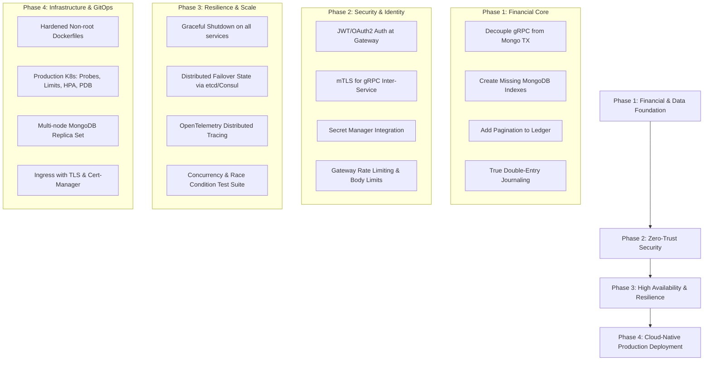

# Production-Grade Readiness Audit & Gap Analysis

**Project**: Global Multi-Currency Digital Wallet & Ledger Service  
**Date**: September 2026  
**Status**: **NOT PRODUCTION READY** (Prototype / Advanced Architectural Demonstration)

---

## 1. Executive Summary & Verdict

### Verdict: **FAIL (Not Production-Ready)**

While this repository demonstrates strong core software engineering concepts—such as gRPC inter-service communication, Protobuf v3 contracts, MongoDB ACID multi-document transactions, and an asynchronous logging architecture with transactional outbox and local file spooling—**the system does not yet maintain production-grade standards for a financial banking application**.

The repository author has acknowledged this boundary in [SECURITY.md](file:///c:/workarea/personal/After-equifax/global-wallet-microservices/SECURITY.md):
> *"This repository is a demonstration and learning project. The default Docker Compose and local Go instructions are development configurations, not production deployment configurations."*

For a system handling digital money transfers and immutable audit ledgers, failure in production can result in balance discrepancies, financial fraud, regulatory violations (e.g., PCI-DSS, SOC 2, ISO 27001), catastrophic data loss, and severe downtime.

---

## 2. Production Readiness Scorecard

| Dimension | Rating | Primary Concern |
|---|:---:|---|
| **1. Financial Integrity & Ledger Consistency** | 🔴 **CRITICAL** | Synchronous gRPC network call inside MongoDB transaction; pseudo double-entry; missing FX engine. |
| **2. Security, Authentication & Authorization** | 🔴 **CRITICAL** | Zero AuthN/AuthZ at API Gateway; plaintext HTTP/gRPC (no TLS/mTLS); public `/cluster/failover`. |
| **3. High Availability, Failover & Consensus** | 🔴 **CRITICAL** | In-memory failover routing at gateway; single-node MongoDB SPOF; no real multi-region separation. |
| **4. Database Performance & Indexing** | 🔴 **HIGH** | Missing indexes on `ledger_entries` (COLLSCAN on every transfer); unpaginated queries (OOM risk); no TTL index. |
| **5. Resilience, Fault Tolerance & Lifecycle** | 🔴 **HIGH** | No graceful shutdown on core services; no circuit breakers or rate limiters; missing standard gRPC health probes. |
| **6. Containerization & Kubernetes Orchestration**| 🔴 **HIGH** | Containers run as root; k8s manifests lack resource limits, probes, HPA, PDB, Ingress, and Secrets. |
| **7. Observability & Tracing** | 🟡 **MEDIUM** | Good logging/outbox stack; but lacks OpenTelemetry distributed tracing; core services omit Prometheus metrics. |
| **8. Test Engineering & Quality Assurance** | 🔴 **HIGH** | Test coverage < 15%; zero concurrent race tests; no automated integration, load, or chaos tests. |

---

## 3. Comprehensive Gap Catalog & Required Remediations

```
Severity Levels:
  🔴 CRITICAL : Immediate blocker for production deployment; risks financial loss, security breach, or data corruption.
  🟠 HIGH     : Essential operational, resilience, or performance requirement for stable production.
  🟡 MEDIUM   : Architectural improvement required for production observability, maintainability, and scalability.
  🟢 LOW      : Code hygiene, documentation, and operational polish.
```

---

### Pillar 1: Financial & Domain Integrity (Core Banking)

#### GAP-FIN-01 [🔴 CRITICAL]: Network Call Inside MongoDB ACID Transaction
- **Location**: [cmd/wallet-service/main.go#L340-L363](file:///c:/workarea/personal/After-equifax/global-wallet-microservices/cmd/wallet-service/main.go#L340-L363)
- **Current State**:
  In `TransferFunds`, the synchronous gRPC call `s.ledgerClient.RecordTransaction(ledgerCtx, ...)` is executed **inside** the `session.WithTransaction(ctx, ...)` closure while locks on both source and destination wallet records are actively held.
- **Production Risks**:
  1. **Transaction Locking & Latency Cascades**: Network latency or downstream hiccups in `ledger-service` block MongoDB document locks, quickly exhausting the MongoDB connection pool.
  2. **Phantom / Inconsistent State on Retries**: MongoDB’s `WithTransaction` automatically retries on transient errors (e.g. `TransientTransactionError` or write conflicts). A retry re-executes `s.ledgerClient.RecordTransaction`, creating duplicate attempts or conflicting states.
  3. **Dual-Write Vulnerability (Split-State)**: If `wallet-service` commits successfully but the network connection breaks right before the commit confirmation, or if `ledger-service` commits to its database and `wallet-service` subsequently aborts due to a write conflict, the ledger and wallet balances become permanently inconsistent.
- **Expected Production Standard**:
  - Decouple the cross-service call from the database transaction.
  - Implement the **Transactional Outbox Pattern** or a **Saga Orchestrator** (e.g. Temporal, Cadence, or Kafka/RabbitMQ-backed Saga).
  - The wallet debit/credit and an outbox record (`ledger_record_pending`) must be committed atomically in MongoDB. An asynchronous relay then delivers the ledger record with at-least-once delivery, and `ledger-service` processes it idempotently.

#### GAP-FIN-02 [🔴 CRITICAL]: Pseudo "Double-Entry" Bookkeeping
- **Location**: [cmd/ledger-service/main.go#L59-L68](file:///c:/workarea/personal/After-equifax/global-wallet-microservices/cmd/ledger-service/main.go#L59-L68)
- **Current State**:
  `LedgerDocument` simply stores `source_wallet_id`, `destination_wallet_id`, and `amount` as an audit log entry.
- **Production Risks**:
  - Does not satisfy GAAP/IFRS financial accounting or regulatory standards.
  - No chart of accounts (Assets, Liabilities, Equity, Expense, Revenue).
  - No balanced debit and credit legs: Cannot prove $\sum \text{Debits} == \sum \text{Credits}$ across the ledger.
  - Inability to handle fees, commissions, merchant settlements, or multi-party split payouts.
- **Expected Production Standard**:
  - Implement true double-entry bookkeeping:
    - Every transaction produces a **Journal Entry** with at least two balanced **Journal Postings** (Leg 1: `DEBIT` Source Wallet Liability, Leg 2: `CREDIT` Destination Wallet Liability).
    - Immutable ledger entries with incremental sequence numbers or cryptographic hash chaining (prevents audit tampering).
    - Daily/periodic automated reconciliation jobs checking trial balance equilibrium.

#### GAP-FIN-03 [🟠 HIGH]: Missing Multi-Currency FX Engine
- **Location**: [cmd/wallet-service/main.go#L293-L309](file:///c:/workarea/personal/After-equifax/global-wallet-microservices/cmd/wallet-service/main.go#L293-L309)
- **Current State**:
  The system rejects transfers if the source currency does not match the destination wallet currency (`Destination wallet not found or currency mismatch`).
- **Production Risks**:
  - System is named "Global Multi-Currency Wallet", but cannot execute any cross-currency transactions.
- **Expected Production Standard**:
  - Integrate an FX (Foreign Exchange) rate engine with fixed-rate quotes (quote ID with a 30–60 second validity window).
  - Support multi-currency atomic exchange legs in transfers (Debit USD, Credit EUR at locked exchange rate with fee deduction).

#### GAP-FIN-04 [🟠 HIGH]: Money Representation & Decimal Scale
- **Location**: [proto/wallet/wallet.proto](file:///c:/workarea/personal/After-equifax/global-wallet-microservices/proto/wallet/wallet.proto) & [cmd/wallet-service/main.go#L66-L71](file:///c:/workarea/personal/After-equifax/global-wallet-microservices/cmd/wallet-service/main.go#L66-L71)
- **Current State**:
  `Amount` uses `int64 Units` without specifying fractional minor units or currency precision scale.
- **Production Risks**:
  - Cryptocurrencies (e.g. BTC with $10^8$ satoshis, ETH with $10^{18}$ wei) and fiat currencies with non-2 decimals (JPY=0, BHD/KWD=3, USD/EUR=2) will suffer precision confusion or integer overflow if scale is not strictly defined per ISO-4217.
- **Expected Production Standard**:
  - Standardize Protobuf money type on Google's `google.type.Money` or define explicit fields: `currency_code` (ISO-4217), `units` (whole units), `nanos` (fractional units $10^{-9}$), or use an integer minor units representation with an explicit `currency_scale` dictionary.

#### GAP-FIN-05 [🟡 MEDIUM]: Lack of Account Status, Limits & Overdraft Controls
- **Location**: [cmd/wallet-service/main.go#L66-L71](file:///c:/workarea/personal/After-equifax/global-wallet-microservices/cmd/wallet-service/main.go#L66-L71)
- **Current State**:
  Wallets only contain `_id`, `currency`, `balance`, and `updated_at`.
- **Expected Production Standard**:
  - Add wallet account status (`PENDING_KYC`, `ACTIVE`, `FROZEN`, `SUSPENDED`, `CLOSED`).
  - Add transaction velocity limits (e.g. max $5,000/day, max 10 transfers/hour).
  - Enforce explicit account ownership / tenant ID (`owner_id`, `tenant_id`) for multi-tenant isolation.

---

### Pillar 2: Security, Authentication & Zero-Trust

#### GAP-SEC-01 [🔴 CRITICAL]: Complete Absence of Authentication & Authorization (AuthN / AuthZ)
- **Location**: [cmd/api-gateway/main.go#L432-L445](file:///c:/workarea/personal/After-equifax/global-wallet-microservices/cmd/api-gateway/main.go#L432-L445)
- **Current State**:
  All REST endpoints (`/api/v1/wallets`, `/api/v1/transfers`, `/api/v1/ledger`, `/api/v1/cluster/failover`) are completely public and unauthenticated.
- **Production Risks**:
  - Any anonymous actor can drain wallets, create fraudulent accounts, read private transaction history, or trigger cluster failovers.
- **Expected Production Standard**:
  - Implement JWT / OAuth2 / OpenID Connect authentication at the API Gateway.
  - Implement fine-grained RBAC/ABAC authorization:
    - User scopes: `wallet:read`, `wallet:transfer`.
    - Admin/Operations scopes: `cluster:admin`, `ledger:audit`.
  - Validate that the authenticated subject (`sub`) matches `source_wallet.owner_id` (prevent IDOR attacks).

#### GAP-SEC-02 [🔴 CRITICAL]: Insecure gRPC Transport & Lack of mTLS
- **Location**: [cmd/api-gateway/main.go#L404-L420](file:///c:/workarea/personal/After-equifax/global-wallet-microservices/cmd/api-gateway/main.go#L404-L420) & [cmd/wallet-service/main.go#L481](file:///c:/workarea/personal/After-equifax/global-wallet-microservices/cmd/wallet-service/main.go#L481)
- **Current State**:
  All gRPC dials use `grpc.WithTransportCredentials(insecure.NewCredentials())`.
- **Production Risks**:
  - Internal network traffic is cleartext; vulnerable to packet sniffing, man-in-the-middle (MITM) attacks, and unauthorized pod-to-pod impersonation.
- **Expected Production Standard**:
  - Implement mutual TLS (mTLS) for all gRPC connections with rotated x509 certificates (e.g. HashiCorp Vault, cert-manager, or a service mesh like Istio / Linkerd).

#### GAP-SEC-03 [🔴 CRITICAL]: Unauthenticated Public Failover Trigger
- **Location**: [cmd/api-gateway/main.go#L332-L352](file:///c:/workarea/personal/After-equifax/global-wallet-microservices/cmd/api-gateway/main.go#L332-L352)
- **Current State**:
  `POST /api/v1/cluster/failover` can be invoked by anyone without authentication, audit trail, or authorization check.
- **Expected Production Standard**:
  - Restrict failover operations to authorized SRE/DevOps identities with hardware MFA / cryptographic signature.
  - In automated architectures, failover should be driven by health checks and consensus leader election, not manual HTTP endpoints.

#### GAP-SEC-04 [🟠 HIGH]: Hardcoded Secrets & Cleartext DB Credentials
- **Location**: [docker-compose.yml](file:///c:/workarea/personal/After-equifax/global-wallet-microservices/docker-compose.yml), [docker-compose.rabbitmq.yml](file:///c:/workarea/personal/After-equifax/global-wallet-microservices/docker-compose.rabbitmq.yml), [docker-compose.monitoring.yml](file:///c:/workarea/personal/After-equifax/global-wallet-microservices/docker-compose.monitoring.yml)
- **Current State**:
  Credentials like `guest:guest`, `wallet_erlang_secret_change_me`, and `GF_SECURITY_ADMIN_PASSWORD=admin` are committed in plain text in repository files.
- **Expected Production Standard**:
  - Inject secrets at runtime using Kubernetes Secrets / HashiCorp Vault / AWS Secrets Manager.
  - Enable MongoDB authentication (`SCRAM-SHA-256`) and TLS encryption.

#### GAP-SEC-05 [🟠 HIGH]: Missing API Gateway Defense-in-Depth
- **Location**: [cmd/api-gateway/main.go#L10-L13](file:///c:/workarea/personal/After-equifax/global-wallet-microservices/cmd/api-gateway/main.go#L10-L13)
- **Current State**:
  - No Rate Limiting (DoS vulnerability).
  - No Request Body Size Limits (`http.MaxBytesReader` not used; memory exhaustion risk).
  - No Security Headers (`HSTS`, `X-Content-Type-Options`, `Content-Security-Policy`).
  - No CORS policy configuration.
- **Expected Production Standard**:
  - Implement a distributed rate limiter (e.g. Redis token bucket or Envoy rate limit).
  - Restrict request body size (e.g. `http.MaxBytesReader(w, r.Body, 1<<20)` for 1MB max).
  - Attach standard security headers via middleware.

---

### Pillar 3: High Availability, Failover & Consensus

#### GAP-HA-01 [🔴 CRITICAL]: In-Memory Stateful Failover at API Gateway
- **Location**: [cmd/api-gateway/main.go#L25-L27](file:///c:/workarea/personal/After-equifax/global-wallet-microservices/cmd/api-gateway/main.go#L25-L27) & [cmd/api-gateway/main.go#L338-L346](file:///c:/workarea/personal/After-equifax/global-wallet-microservices/cmd/api-gateway/main.go#L338-L346)
- **Current State**:
  Failover state (`activeTarget = "PRIMARY" | "STANDBY"`) is stored in an in-memory variable protected by `sync.RWMutex` inside a single process.
- **Production Risks**:
  1. **Multi-Replica Inconsistency**: In Kubernetes or any scaled production deployment with multiple API Gateway replicas, invoking `/cluster/failover` only changes the routing on the single pod that received the HTTP request. The other replicas continue sending traffic to PRIMARY.
  2. **State Loss on Restart**: If the API Gateway pod restarts or crashes, it automatically resets to `PRIMARY`, silently reverting any manual failover.
- **Expected Production Standard**:
  - Shared routing state must be stored in a distributed coordination store (e.g., Consul KV, etcd, Redis) with pub/sub change notifications, or handled natively via Kubernetes Service mesh (weighted traffic shifting, Canary/Blue-Green routing via Istio/Gateway API).

#### GAP-HA-02 [🔴 CRITICAL]: Simulated Multi-Region on a Single Database
- **Location**: [docker-compose.yml#L11](file:///c:/workarea/personal/After-equifax/global-wallet-microservices/docker-compose.yml#L11), [docker-compose.yml#L31](file:///c:/workarea/personal/After-equifax/global-wallet-microservices/docker-compose.yml#L31), [docker-compose.yml#L55](file:///c:/workarea/personal/After-equifax/global-wallet-microservices/docker-compose.yml#L55)
- **Current State**:
  `wallet-primary` and `wallet-standby` are advertised as `us-east-1` and `eu-west-1`, but both connect to the exact same local MongoDB instance. Furthermore, `wallet-standby` does NOT check `IS_ACTIVE` in its RPC handlers—it will happily execute writes directly.
- **Production Risks**:
  - If the database fails, both "regions" fail simultaneously.
  - Standby does not protect against regional data plane outages.
  - Risk of split-brain writes if both instances receive traffic.
- **Expected Production Standard**:
  - True multi-region deployment requires dedicated regional database replicas or cross-region replica sets with Raft/Paxos consensus.
  - Standby instances must enforce read-only fences or reject writes when `IS_ACTIVE=false`.

#### GAP-HA-03 [🔴 CRITICAL]: Single Point of Failure Database Deployment
- **Location**: [docker-compose.mongodb.yml#L8](file:///c:/workarea/personal/After-equifax/global-wallet-microservices/docker-compose.mongodb.yml#L8) & [k8s/02-mongodb.yaml#L8](file:///c:/workarea/personal/After-equifax/global-wallet-microservices/k8s/02-mongodb.yaml#L8)
- **Current State**:
  MongoDB is deployed as a single-replica set member (`replicas: 1`).
- **Production Risks**:
  - Any node restart, pod eviction, or disk failure halts the entire platform.
- **Expected Production Standard**:
  - Production MongoDB must use a minimum 3-node replica set (Primary + 2 Secondaries) across independent Availability Zones, or a managed service (MongoDB Atlas, AWS DocumentDB).

---

### Pillar 4: Database Design, Indexing & Query Scalability

#### GAP-DB-01 [🔴 HIGH]: Missing Critical Indexes on `ledger_entries` (COLLSCAN)
- **Location**: [cmd/ledger-service/main.go#L91](file:///c:/workarea/personal/After-equifax/global-wallet-microservices/cmd/ledger-service/main.go#L91) & [cmd/ledger-service/main.go#L170-L177](file:///c:/workarea/personal/After-equifax/global-wallet-microservices/cmd/ledger-service/main.go#L170-L177)
- **Current State**:
  The `ledger_entries` collection has no index on `idempotency_key`, `source_wallet_id`, `destination_wallet_id`, or `timestamp`.
- **Production Risks**:
  - Every single transfer transaction executes `col.FindOne(ctx, bson.M{"idempotency_key": req.IdempotencyKey})`. Without an index, this triggers a **full collection scan (COLLSCAN)** across every ledger entry ever recorded.
  - As ledger entries grow past tens of thousands of records, transfer latency increases linearly, leading to database lock starvation and timeouts.
- **Expected Production Standard**:
  Create the required compound and unique indexes at startup or via migration:
  ```go
  // 1. Unique index for idempotency:
  {Keys: bson.D{{Key: "idempotency_key", Value: 1}}, Options: options.Index().SetUnique(true)}
  // 2. Query index for wallet transaction history:
  {Keys: bson.D{{Key: "source_wallet_id", Value: 1}, {Key: "timestamp", Value: -1}}}
  {Keys: bson.D{{Key: "destination_wallet_id", Value: 1}, {Key: "timestamp", Value: -1}}}
  ```

#### GAP-DB-02 [🔴 HIGH]: Unbounded Queries & Lack of Pagination
- **Location**: [cmd/ledger-service/main.go#L177-L200](file:///c:/workarea/personal/After-equifax/global-wallet-microservices/cmd/ledger-service/main.go#L177-L200)
- **Current State**:
  `GetLedgerEntries` fetches all records matching the wallet ID into memory at once without `Limit` or cursor paging.
- **Production Risks**:
  - A wallet with 50,000 transactions will load all records into service memory, causing out-of-memory (OOM) crashes, slow response times, and exceeding the 4MB default gRPC message limit.
- **Expected Production Standard**:
  - Implement cursor-based pagination (`limit`, `cursor`/`page_token`, `sort` by timestamp descending).

#### GAP-DB-03 [🟠 HIGH]: Unbounded Storage in `idempotency_records`
- **Location**: [cmd/wallet-service/main.go#L73-L77](file:///c:/workarea/personal/After-equifax/global-wallet-microservices/cmd/wallet-service/main.go#L73-L77)
- **Current State**:
  `idempotency_records` stores keys with `created_at`, but has no TTL index.
- **Production Risks**:
  - Millions of idempotency records accumulate permanently, consuming storage and index RAM.
- **Expected Production Standard**:
  - Create a MongoDB TTL index on `created_at` (e.g. expire after 7–30 days depending on compliance):
  ```go
  opts := options.Index().SetExpireAfterSeconds(86400 * 30) // 30 days
  col.Indexes().CreateOne(ctx, mongo.IndexModel{Keys: bson.D{{Key: "created_at", Value: 1}}, Options: opts})
  ```

#### GAP-DB-04 [🟠 HIGH]: Missing Connection Pool Tuning
- **Location**: [pkg/db/mongo.go#L34-L36](file:///c:/workarea/personal/After-equifax/global-wallet-microservices/pkg/db/mongo.go#L34-L36)
- **Current State**:
  `ConnectWithRetry` sets `ServerSelectionTimeout(3 * time.Second)` but does not configure `MaxPoolSize`, `MinPoolSize`, `MaxConnIdleTime`, or socket timeouts.
- **Expected Production Standard**:
  - Explicitly configure connection pool parameters based on concurrency requirements (e.g., `SetMaxPoolSize(100)`, `SetMinPoolSize(10)`, `SetMaxConnIdleTime(5 * time.Minute)`).

---

### Pillar 5: Resilience, Reliability & Lifecycle

#### GAP-REL-01 [🔴 HIGH]: Missing Graceful Shutdown on Core Services
- **Location**: [cmd/api-gateway/main.go#L450-L452](file:///c:/workarea/personal/After-equifax/global-wallet-microservices/cmd/api-gateway/main.go#L450-L452), [cmd/wallet-service/main.go#L532](file:///c:/workarea/personal/After-equifax/global-wallet-microservices/cmd/wallet-service/main.go#L532), [cmd/ledger-service/main.go#L273](file:///c:/workarea/personal/After-equifax/global-wallet-microservices/cmd/ledger-service/main.go#L273)
- **Current State**:
  Servers block directly on `http.ListenAndServe` or `grpcServer.Serve(lis)`. No OS signal interception (`SIGTERM`, `SIGINT`).
- **Production Risks**:
  - In Kubernetes pod restarts or deployments, in-flight transactions are abruptly terminated, causing dropped client requests and incomplete operations.
- **Expected Production Standard**:
  - Listen for `syscall.SIGTERM` / `os.Interrupt`.
  - On signal, call `httpServer.Shutdown(ctx)` with a drain timeout (e.g. 15s) and `grpcServer.GracefulStop()`.

#### GAP-REL-02 [🔴 HIGH]: HTTP Server Vulnerable to Slowloris
- **Location**: [cmd/api-gateway/main.go#L450](file:///c:/workarea/personal/After-equifax/global-wallet-microservices/cmd/api-gateway/main.go#L450)
- **Current State**:
  Uses `http.ListenAndServe(":"+httpPort, nil)` with default zero (infinite) timeouts.
- **Production Risks**:
  - Susceptible to Slowloris attacks where clients open connections and stream bytes slowly, holding connections open until file descriptor exhaustion.
- **Expected Production Standard**:
  - Instantiate `&http.Server{ReadHeaderTimeout: 3*time.Second, ReadTimeout: 10*time.Second, WriteTimeout: 10*time.Second, IdleTimeout: 60*time.Second}`.

#### GAP-REL-03 [🟠 HIGH]: Missing Standard Health Probes
- **Location**: [cmd/api-gateway/main.go](file:///c:/workarea/personal/After-equifax/global-wallet-microservices/cmd/api-gateway/main.go) & [cmd/wallet-service/main.go](file:///c:/workarea/personal/After-equifax/global-wallet-microservices/cmd/wallet-service/main.go)
- **Current State**:
  - API Gateway has no `/healthz` or `/readyz` endpoints.
  - Wallet and Ledger services do not implement the standard gRPC Health Checking Protocol (`grpc.health.v1.Health`).
- **Expected Production Standard**:
  - Implement `/healthz` (liveness: process is alive) and `/readyz` (readiness: DB connections established and healthy).
  - Register standard gRPC health service via `google.golang.org/grpc/health` so Kubernetes native gRPC probes can monitor container state.

#### GAP-REL-04 [🟡 MEDIUM]: Lack of Circuit Breaking & Exponential Backoff
- **Location**: [cmd/api-gateway/main.go#L244](file:///c:/workarea/personal/After-equifax/global-wallet-microservices/cmd/api-gateway/main.go#L244)
- **Current State**:
  Downstream gRPC calls use simple static timeouts without circuit breaking or retries.
- **Expected Production Standard**:
  - Integrate a circuit breaker (e.g. `sony/gobreaker` or Envoy mesh) to fast-fail traffic when a downstream dependency is degraded, preventing cascade failures.

---

### Pillar 6: Observability, Metrics & Tracing

#### GAP-OBS-01 [🟠 HIGH]: Absence of OpenTelemetry Distributed Tracing
- **Location**: [pkg/observability/context.go](file:///c:/workarea/personal/After-equifax/global-wallet-microservices/pkg/observability/context.go)
- **Current State**:
  Tracing is implemented via custom `AssociationID` metadata headers and stdout `log.Printf("[TRACE] ...")`.
- **Production Risks**:
  - Cannot trace requests end-to-end across distributed nodes in standard APM tooling (Jaeger, Tempo, Datadog, Honeycomb).
  - Lacks W3C TraceContext compatibility (`traceparent`, `tracestate`).
- **Expected Production Standard**:
  - Integrate the official OpenTelemetry Go SDK (`go.opentelemetry.io/otel`).
  - Automatically propagate trace context across HTTP and gRPC using standard OTel interceptors.

#### GAP-OBS-02 [🟡 MEDIUM]: Core Services Missing Prometheus Metrics
- **Location**: [cmd/wallet-service/main.go](file:///c:/workarea/personal/After-equifax/global-wallet-microservices/cmd/wallet-service/main.go), [cmd/ledger-service/main.go](file:///c:/workarea/personal/After-equifax/global-wallet-microservices/cmd/ledger-service/main.go), [monitoring/prometheus.yml](file:///c:/workarea/personal/After-equifax/global-wallet-microservices/monitoring/prometheus.yml)
- **Current State**:
  Neither `wallet-service` nor `ledger-service` expose `/metrics` or export business/RPC metrics. Only `api-gateway` and `logging-service` have `/metrics`.
- **Expected Production Standard**:
  - Serve a management HTTP server on port `:9090` in all services exposing standard Prometheus metrics (gRPC request latency histogram, in-flight RPCs, error rates, database connection pool stats).

---

### Pillar 7: Containerization, Kubernetes & DevOps

#### GAP-OPS-01 [🔴 HIGH]: Containers Run as Root User
- **Location**: [Dockerfile#L30-L59](file:///c:/workarea/personal/After-equifax/global-wallet-microservices/Dockerfile#L30-L59)
- **Current State**:
  In `Dockerfile`, stages 2–5 (`alpine:3.20`) do not specify a non-root user. Binaries run as UID 0 (`root`).
- **Production Risks**:
  - Violates container security best practices and fails Kubernetes security admission policies (Pod Security Standards / Restricted profile).
- **Expected Production Standard**:
  - Create an unprivileged user and switch to it:
  ```dockerfile
  RUN addgroup -S appgroup && adduser -S appuser -G appgroup
  USER appuser
  ```

#### GAP-OPS-02 [🔴 HIGH]: Non-Deterministic Docker Build Invalidation
- **Location**: [Dockerfile#L11-L23](file:///c:/workarea/personal/After-equifax/global-wallet-microservices/Dockerfile#L11-L23)
- **Current State**:
  The Dockerfile copies `go.mod` without `go.sum` before running `go mod tidy` in the build stage.
- **Production Risks**:
  - Inconsistent builds, non-reproducible artifacts, and potential supply-chain dependency drift.
- **Expected Production Standard**:
  - `COPY go.mod go.sum ./` followed by `RUN go mod download`, then copy source code.

#### GAP-OPS-03 [🔴 HIGH]: Kubernetes Manifests Fail Production Standards
- **Location**: [k8s/](file:///c:/workarea/personal/After-equifax/global-wallet-microservices/k8s/)
- **Current State**:
  1. **Image Tags**: Uses `image: wallet-system/...:latest` with `imagePullPolicy: IfNotPresent` (anti-pattern; production requires immutable semantic versions or image digest SHAs).
  2. **No Resource Requests/Limits**: Deployments omit `resources.requests` and `resources.limits` (CPU and Memory). Pods risk causing node starvation or being killed by Kubernetes OOM killer.
  3. **No Probes**: Zero `livenessProbe`, `readinessProbe`, or `startupProbe` configured on Go microservices.
  4. **No Security Context**: Missing `runAsNonRoot: true`, `readOnlyRootFilesystem: true`, `allowPrivilegeEscalation: false`.
  5. **No Autoscaling & Disruption Budget**: Lacks `HorizontalPodAutoscaler` (HPA) and `PodDisruptionBudget` (PDB).
  6. **No Ingress**: `api-gateway` is exposed directly via `NodePort: 30080` rather than an Ingress controller with TLS termination.
  7. **Missing Components**: `rabbitmq` and `logging-service` have no Kubernetes manifests in `k8s/`.

---

### Pillar 8: Test Engineering & Quality Assurance

#### GAP-QA-01 [🔴 HIGH]: Low Test Coverage & Missing Critical Concurrency Tests
- **Location**: [cmd/wallet-service/main_test.go](file:///c:/workarea/personal/After-equifax/global-wallet-microservices/cmd/wallet-service/main_test.go), [cmd/ledger-service/main_test.go](file:///c:/workarea/personal/After-equifax/global-wallet-microservices/cmd/ledger-service/main_test.go)
- **Current State**:
  - `wallet-service` unit tests only verify trivial input validation errors (identical wallets and missing fields).
  - `ledger-service` has only 1 test verifying invalid payload rejection.
  - Overall business logic test coverage is under 15%.
- **Missing Test Suites**:
  1. **Concurrency & Race Conditions**: No tests simulating 50+ concurrent transfers against the same wallet to verify that atomic debiting prevents negative balances.
  2. **Integration Tests**: No test container / ephemeral MongoDB tests verifying full end-to-end multi-document transaction rollbacks.
  3. **Chaos & Network Partition**: No tests verifying behavior when MongoDB drops or gRPC connections disconnect midway through a transfer.
  4. **Performance & Benchmarking**: No load testing (k6 / Locust) establishing baseline TPS and latency percentiles.

---

## 4. Prioritized Production Remediation Roadmap

To transition this platform from prototype to production grade, execution should follow these 4 structured phases:



### Phase 1: Core Financial & Persistence Hardening (Immediate Priority)
1. **Remove cross-service gRPC call from inside MongoDB transaction** in `cmd/wallet-service/main.go`. Use Transactional Outbox for ledger entry delivery.
2. **Add database indexes**: Unique index on `idempotency_key` and query indexes on `source_wallet_id`, `destination_wallet_id`, and `timestamp` in `ledger_entries`. Add TTL index on `idempotency_records`.
3. **Implement cursor pagination** on `GetLedgerEntries`.
4. **Enforce ISO-4217 currency scale** and explicit decimal representations.

### Phase 2: Security & Authentication Hardening
1. Add JWT/OIDC authentication middleware to `api-gateway`.
2. Secure gRPC communication using mutual TLS (mTLS).
3. Secure the `/cluster/failover` endpoint behind administrative RBAC.
4. Add rate limiting, request size bounds (`MaxBytesReader`), and security headers.
5. Move all passwords and tokens into external Secret stores.

### Phase 3: High Availability & Resilience
1. Implement graceful shutdown (`SIGTERM`/`SIGINT`) across `api-gateway`, `wallet-service`, and `ledger-service`.
2. Replace local in-memory failover routing with distributed coordination (Consul/etcd or service mesh routing).
3. Expose standard gRPC health checks (`grpc.health.v1`) and Prometheus metrics on all services.
4. Replace custom logging traces with OpenTelemetry W3C distributed tracing.
5. Write high-concurrency automated test suites (concurrent debit races, transaction rollbacks).

### Phase 4: Container & Kubernetes Production Hardening
1. Update `Dockerfile` to create and run as a non-root `appuser`.
2. Update `k8s/` manifests:
   - Add CPU and memory `requests` and `limits`.
   - Add `livenessProbe` and `readinessProbe` to all services.
   - Add `HorizontalPodAutoscaler` and `PodDisruptionBudget`.
   - Configure Kubernetes `Ingress` with TLS certificates.
   - Replace single-node MongoDB with a multi-node StatefulSet with persistent volume claims (`volumeClaimTemplates`) or managed DB.
   - Add manifests for `rabbitmq` and `logging-service`.
